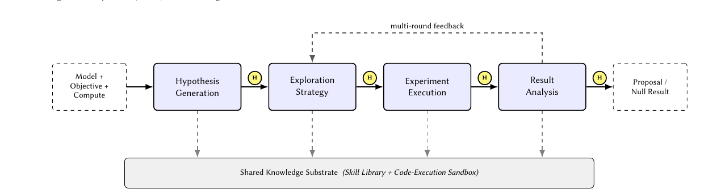
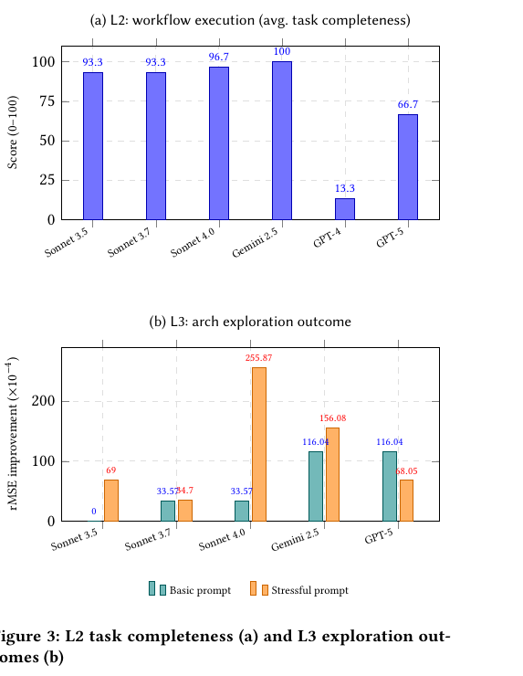

# Agentic ML Exploration (A-MLE) for Ads Ranking

**Paper:** [Agentic ML Exploration (A-MLE) for Ads Ranking (Gao et al., Meta, 2026)](https://arxiv.org/abs/2609.08248)

## Human Readable TL;DR
Think of a tireless team of junior researchers running lab experiments round the clock, with a senior scientist signing off at each step. The juniors read the lab notebooks, pick the next experiment, mix the chemicals, watch the reaction, and write up what happened -- good or bad. The senior only checks the plan before money is spent and the results before anything is published. That is A-MLE: one computer agent does the day-to-day grinding of ads-model improvement across dozens of models, while human engineers approve, correct, or stop it at each gate. In tests it finished many more full try-train-check cycles per week than people alone, and its best runs cut prediction error by about 2.6% with no loss in training speed.

## TL;DR
The contribution is Agentic ML Exploration (A-MLE), a system that raises ads-ranking progress by raising iteration throughput -- completed try-train-evaluate cycles per engineer-week -- instead of chasing a single better model shape. The method is one tool-using agent walking five stages (hypothesis generation, exploration strategy, experiment execution, result analysis, shared substrate) over a versioned skill library and sandboxed execution layer, with a human-in-the-loop (HITL, meaning a person reviews and approves) checkpoint at every stage boundary. Each session is fixed by a (model, objective, compute) triple and ends in a proposal or a documented null result. The key result on the lightweight benchmark model M* is +2.56% relative offline regression-error reduction with +0.42% training throughput for multi-source exploration, well above the +0.44% and +0.58% single-hypothesis baselines, plus 68% on the L1 tool-use bench versus 16% and 8% for generic setups.

---

## Problem & Motivation
Industrial ads ranking is not one model but a portfolio of dozens of differentiated models. Each model has its own goal (click, conversion, or view), surface, ad segment, data, features, architecture, and infrastructure limits.

One full iteration on one model -- from idea to tested result to launch proposal -- takes days to weeks of senior engineer attention. That span is a qualitative range stated in the paper, not a measured average. The manual loop has six phases: ideation and hypothesis generation, prioritization of candidates, implementation, training and failure recovery, evaluation triage, and proposal preparation.

Because the engineering pool is finite, only a small subset of model-by-technique pairs is ever tried. Proven techniques spread slowly, and the long tail of models gets little expert attention. That untested remainder is recoverable signal left on the table.

Earlier automation does not fix this. Automated machine learning (AutoML, software that automates parts of model building) and neural architecture search (NAS, automatic search for good neural-network shapes) assume a narrow fixed search space and one goal, while real ads work needs open-ended code-level changes judged on metric gain plus infrastructure feasibility, statistical significance, and launch readiness together. Data-science agents built for Kaggle-style academic benchmarks chase a leaderboard score on small public datasets, while industrial work needs costly training on large datasets and small reliable gains over mature baselines.

A-MLE therefore reframes the unit of optimization: improve the iteration loop itself, with an agent carrying hypotheses through planning, execution, analysis, and shared knowledge while humans review at stage boundaries.

---

## Main Original Ideas
1. **Iteration-throughput reframing.** Progress is treated as a function of how many complete try-train-evaluate cycles the team finishes per month, not of any single clever model idea. The system goal is more finished cycles per engineer-week, where a finished cycle ends in a proposal or a documented null result.
2. **Five-stage single-agent orchestration.** One tool-using LLM (Large Language Model, a large AI model trained on text and code) agent walks hypothesis generation, exploration strategy, experiment execution, and result analysis over a shared substrate. Every stage boundary is a HITL checkpoint with three options -- approve and continue, request changes, or stop -- which limits the blast radius of any single bad agent decision.
3. **Shared substrate with Track Record write-back.** Knowledge lives in long-lived versioned markdown trees in source control, split between a reusable skill library (model-state analyzers, training-efficiency analyzers, literature retrievers) and a code-execution sandbox (isolated edits, checks, builds, smoke tests, training launches). Sessions match techniques to models with eligibility annotations at start and commit new outcomes to the Track Record at end, so learning on one model transfers to the next.
4. **Rolling-baseline evaluation discipline.** Candidates are judged against a rolling baseline (a continuously updated reference setup, not a frozen snapshot that drifts out of date), with segment-level breakdowns to catch localized regressions and automatic re-runs when within-run variance is too high. Each session is parameterized by a (model, objective, compute) triple, so what counts as success and budget is fixed up front.
5. **Tiered L1/L2/L3 capability framework.** L1 tests tool availability with focused single-step questions, L2 tests autonomous workflow execution with multi-step submit-watch-recover-summarize tasks, and L3 tests open-ended exploration where the agent gets a model, an objective, and compute and must find the best improvement. This separates having the right tools from running the loop reliably from actually discovering gains.
6. **Harness-over-model finding.** Reliability is shown to come more from the orchestration harness (skill coverage, statistical rigor, execution resilience) than from base-model reasoning power. The authors predict better base models will close the hypothesis-quality gap faster than the harness gap, so investment belongs in the harness first.

---

## Key Findings
Headline L3 results on M* across two system generations (relative offline regression-error reduction; QPS, Queries Per Second, here means training throughput):

| Exploration | Rel. improvement | Train QPS impact |
|---|---|---|
| Single-hypothesis arch scale-up | +0.44% | neutral |
| Multi-round arch exploration | +0.58% | neutral |
| Multi-source (arch + efficiency) | +2.56% (+2.557% in text) | +0.42% |

The multi-source variant combines model-internal-state and training-efficiency hypothesis generators and sits substantially above the single-hypothesis baselines. NE (Normalized Entropy, a measure of prediction quality) and rMSE (root Mean Squared Error, a measure of calibration between predicted and observed rates) are the offline metric suite; significance is measured against the rolling baseline.

L1 tool-availability bench on M*: the domain-equipped A-MLE agent reaches 68% overall accuracy versus 16% for a generic ML agent with cross-portfolio tools but no domain knowledge and 8% for a generic LLM with no ML tooling. The largest gap is job-config modification, solved fully (100%) only by the domain-equipped setup while both generic setups score below 40%.

L2 autonomous workflow execution on M*: the domain-equipped agent completes all four anchor tasks end to end with high reliability -- (1) baseline refresh onto the latest training window, (2) variance test with duplicate runs, (3) config-change experiment cloning a baseline and doubling a layer width with side-by-side comparison, and (4) batch offline evaluation with aggregated rollups. Three differentiators explain this: an explicit waiting operator for multi-hour asynchronous jobs, telling infrastructure failures apart from genuine training divergence, and reliable summarization over noisy multi-run output.

Cross-LLM (Large Language Model) study with loop, skills, and prompts held fixed: L2 completeness scores are Gemini 2.5 at 100, Sonnet 4.0 at 96.7, Sonnet 3.5 and 3.7 at 93.3 each, GPT-5 at 66.7, and GPT-4 at 13.3. Weak models hallucinate workflow IDs or fail to wait for asynchronous jobs. On L3 architecture exploration under the basic prompt, Gemini 2.5 and GPT-5 are most aggressive at 116.04 x1e-4 rMSE gain while Sonnet models stay conservative. Under stressful competitive prompts the pattern flips: Sonnet 4.0 reaches 255.87 x1e-4 (about 2.6e-2), the best of any setup, while GPT-5 retreats to 68.05 x1e-4.

Qualitative finding -- throughput: end-to-end throughput was multiple times the manual baseline in completed iterations per engineer-week, while the semi-automated baseline showed only a smaller gain with weaker offline impact and slower convergence. Exact numbers are not disclosed. The paper reads this as evidence that chaining phases without engineer handoffs matters more than automating any single phase.

Qualitative finding -- training success: the share of agent-triggered runs finishing successfully after automated debugging and bounded retries meaningfully surpassed the baseline, with only a small minority still needing human attention. Exact numbers are not disclosed.

Qualitative finding -- proposal acceptance: agent-written proposals passed human review at a much higher rate than baseline, credited to better-grounded statistical analysis, cleaner documentation of negative results, and explicit segment-level breakdowns. Exact numbers are not disclosed.

Technique transfer pattern (Table 2, attempted counts bucketed as many = 8+ models, several = 3-7, few = 2 or fewer; passed gating = cleared human-review significance bar without rework): SSL (Self-Supervised Learning, pre-training on unlabeled data) many/majority, generic optimizer/loss tweaks many/mixed, embedding-based features several/majority, token-mixing architectures several/mixed, architecture scaling few/mixed. The strongest portfolio wins came from transferring already-validated techniques to structurally similar models, including long-tail models. The agent struggled on models whose baseline had recently changed, because hypotheses were calibrated to the older version.

---

## Suggestions & Future Directions
The authors give three future directions. First, more resilient execution: better separation of infrastructure noise from genuine training divergence, and more impact per model iteration.

Second, richer domain-specific hypothesis skills with deeper model understanding, so ideas fit fresh baselines instead of stale ones.

Third, the breadth-to-depth shift: extend agentic exploration from the current breadth regime of rapidly spreading proven techniques across many models into a depth regime where the agent helps design new architectures and pipelines, with the engineer as architect-in-chief and the agent as implementation and ablation partner.

The closing frame is A-MLE as a force multiplier for human iteration, with the largest gains on long-tail models that historically received the least senior attention.

- REA production counterpart: Ranking Engineer Agent with hibernate-and-wake execution, dual-source hypothesis engine, Validation→Combination→Exploitation planning, 2x accuracy / 5x output per the Mar 2026 Meta engineering article — full mapping in [[wiki/targeted|Targeted Analysis]].

---

## Authors & Institutions
First authors Gao et al., Meta Platforms, Menlo Park and New York. The paper has a 40-author list; the wiki pages read for this summary do not enumerate the first ten names, so they are not reproduced here to avoid adding claims beyond the wiki source.

## Figures

