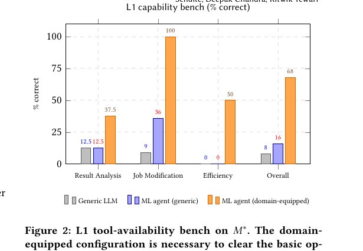

> [[../index|Wiki]] | [[../summary|Summary]] | [[../digest|Digest]]
# Experimental Setup and Tiered Evaluation
**In one sentence:** The paper tests A-MLE on a representative portfolio of anonymized production ads-ranking models M1..Mn plus a lightweight experimental model M* using a tiered L1/L2/L3 capability framework and five metric classes, with the headline result that multi-source exploration gives a +2.56% relative improvement with neutral training throughput (+0.42% QPS, where QPS means queries per second, here training throughput).
## Key points
- The model set spans click, conversion, and view objectives, different surfaces, and architecture families including DCN (Deep Cross Network, a model that learns feature crossings), DIN (Deep Interest Network, a model that learns from user interest history), and multi-tower models, with models anonymized as M1, M2, and so on plus one lightweight regression-objective experimental model M* used as the detailed benchmark, and baselines are the rolling baseline (the current reference training setup for each model) plus two methodological baselines sharing the same offline test suite: manual (senior engineers doing iterations by hand) and semi-automated (engineer still makes hypotheses but uses scripted helpers to launch runs and evaluations).
- The paper reports five metric classes: throughput (completed end-to-end iterations per engineer-week, where a completed iteration ends in a documented proposal or a documented null result), training success rate (share of agent-triggered training runs that finish successfully after automated debugging and retries without human help), proposal acceptance rate (share of agent-written proposals with statistically significant offline impact that pass human review without rework), technique coverage (distinct technique families surfaced across the portfolio in a fixed window), and offline model evaluation using NE (Normalized Entropy, a measure of prediction quality) and rMSE (root mean squared error, a measure of calibration between predicted and observed rates).
- The evaluation uses a three-tier framework: L1 tool availability (focused single-step questions over training setup, evaluation, metric stores, and serving/training infrastructure to test whether the agent has the right tools and domain knowledge), L2 autonomous workflow execution (multi-step tasks that require submitting workflows, watching them, recovering from failures, and summarizing results to test whether the agent can run the loop reliably), and L3 open-ended exploration (give the agent a model, an objective, and compute and ask for the best improvement it can find, which is the regime the paper ultimately cares about).
- End-to-end throughput with A-MLE was multiple times the baseline in completed iterations per engineer-week, while the semi-automated baseline showed only a smaller improvement with weaker offline impact and slower convergence, which the paper reads as evidence that the main leverage comes from chaining phases together without engineer handoffs rather than from automating any single phase, and exact throughput numbers are not disclosed so this is reported as a qualitative finding.
- Training success rate meaningfully surpassed the baseline after the agent's automated debugging and bounded retry loop with only a small minority of runs still needing human attention when retries were capped to save resources, and agent-written proposals passed review at a much higher rate than baseline because reviewers cited better-grounded statistical analysis, cleaner documentation of negative results, and explicit segment-level breakdowns, and exact numbers for both rates are not disclosed so these are reported as qualitative findings.
- On the L1 bench on M*, the domain-equipped A-MLE agent reaches 68% overall accuracy versus 16% for a generic ML agent with cross-portfolio tools but no domain knowledge and 8% for a generic LLM (Large Language Model) with no ML tooling, with the largest gap on job-config modification where the domain-equipped agent solves all questions (100%) while both generic configurations score below 40%, confirming that domain skills dominate at this tier.
- At L2 the domain-equipped agent completes all four anchor tasks on M* end-to-end with high reliability — (1) baseline refresh onto the latest training window with train/eval metrics reported, (2) variance test with multiple duplicate runs and train/eval/QPS variance computed, (3) config-change experiment cloning a baseline, doubling a layer width, running both versions, and comparing side by side, and (4) batch offline evaluation across previously trained jobs with aggregated rollups — differentiated by three capabilities: (a) an explicit waiting operator that suspends the agent loop until an external event such as workflow completion and resumes cleanly, needed for multi-hour asynchronous jobs, (b) telling infrastructure failures apart from genuine training divergence and retrying without operator help, and (c) reliable summarization that survives noisy multi-run, multi-stage output.
- Headline L3 results on M* across two system generations are +0.44% relative offline regression-error reduction with neutral training QPS impact for single-hypothesis arch scale-up, +0.58% with neutral QPS impact for multi-round arch exploration, and +2.56% (reported as +2.557% in text) with +0.42% QPS for multi-source exploration combining model-internal-state and training-efficiency hypothesis generators, showing the multi-source variant substantially above the single-hypothesis baselines.
---
## Models and anonymization
The paper deploys A-MLE against a representative set of large-scale ads ranking models from a real industrial portfolio. The set is chosen to cover the main axes of variation: optimization objective (click vs. conversion vs. view), surface, and architecture family (DCN, i.e. Deep Cross Network, DIN, i.e. Deep Interest Network, and multi-tower designs). For external review, models are anonymized as M1, M2, and so on, hiding surface and product-line details. Several detailed studies use a single experimental ranking model called M*, which has a regression objective and a lightweight resource footprint, making it a practical benchmark substrate.
## Baselines: rolling + methodological
Rolling baseline means the current reference training setup of a given model, the metric values that candidate changes are compared against. Methodological baselines are operating points used to compare against A-MLE, and both share the same offline evaluation suite as A-MLE. The manual baseline is the prior operating point with senior ML (Machine Learning) engineers doing iterations themselves. The semi-automated baseline keeps the engineer in charge of hypothesis generation but uses scripted helpers for launching runs, evaluation, and similar steps.
## Five metric classes
- Throughput: completed end-to-end iterations per engineer-week, where a completed iteration ends in either a documented proposal or a documented null result.
- Training success rate: share of training runs the agent starts that finish successfully after automated debugging and retries, without needing human help.
- Proposal acceptance rate: share of agent-written proposals with statistically significant offline impact that pass human review without rework.
- Technique coverage: distinct technique families surfaced across the model portfolio over a fixed evaluation window.
- Offline model evaluation: a standard offline metric suite including NE (Normalized Entropy, a measure of prediction quality and informativeness) and rMSE (root mean squared error, a measure of calibration between predicted and observed rates).
## Reporting convention: relative improvements, rolling-baseline significance
All performance results are reported as relative improvements over the relevant baseline. Statistical significance is measured and reported against the rolling-baseline framework described in Section 4 of the paper.
## The L1-L2-L3 framework
To make evaluation tractable, tasks are organized into three tiers drawn from the internal benchmark design. L1 is tool availability: focused single-step questions over a model's training setup, evaluation strategy, metric stores, and serving and training infrastructure, testing whether the agent has the right tools and domain knowledge. L2 is autonomous workflow execution: multi-step tasks that require submitting workflows, watching them, recovering from infrastructure failures, and summarizing results, testing whether the agent can reliably run the iteration loop. L3 is open-ended exploration: the agent gets a model, an objective, and compute and must surface the best improvement it can find, which is the regime the paper ultimately cares about.
## 6.1 Throughput
Across the evaluation window, A-MLE delivered multiple times the productivity in completed iterations per engineer-week compared with the baseline from Section 5. The semi-automated baseline showed a smaller improvement in throughput with weaker offline impact and a longer iteration cycle to reach convergence. The paper concludes that the main source of leverage is not automating any single phase but the agent's ability to chain phases without engineer-mediated handoffs. Exact throughput numbers are not disclosed, so this is a qualitative finding.
## 6.2 Training success
The share of A-MLE-triggered runs that completed successfully, after the agent's automated debugging and bounded re-run loop, meaningfully surpassed the Section 5 baseline. A small minority of runs still needed human attention when the agent failed to recover within its retry limits, which are capped to keep training-resource use efficient. Exact success-rate numbers are not disclosed, so this is a qualitative finding.
## 6.3 Proposal acceptance
A-MLE-written proposals passed review criteria at a much higher rate than the Section 5 baseline. Reviewers cited three differentiating factors: better-grounded statistical analysis, cleaner documentation of negative results, and explicit segment-level decomposition. Exact acceptance-rate numbers are not disclosed, so this is a qualitative finding.
## 6.4 L1 bench
Figure 2 reports the L1 capability bench on M*, comparing three setups: a generic LLM with no ML tooling, a generic ML agent with cross-portfolio tools but no domain knowledge, and the domain-equipped A-MLE setup. The domain-equipped agent reaches 68% overall accuracy versus 16% for the generic ML agent and 8% for the generic LLM. The largest gap is on job-config modification, where the domain-equipped agent solves all questions while the generic setups score below 40%. The paper reads this as confirmation that domain skills, not raw LLM capability, dominate at the tool-availability tier.

## 6.5 L2 tasks and the three differentiators
At the workflow-execution tier, the agent is tested on multi-step tasks that require submitting training workflows, watching asynchronous completions, recovering from infrastructure failures, and summarizing results. Four anchor tasks on M* define this bench: (1) a baseline refresh, where the agent refreshes a baseline workflow onto the latest available training window and reports train/eval metrics; (2) a variance test, where the agent submits multiple duplicate runs of the same baseline and computes train/eval/QPS variance across them; (3) a config-change experiment, where the agent clones a baseline, applies a structured architectural edit such as doubling a layer width, runs both versions to completion, and produces a side-by-side metric comparison; and (4) a batch offline evaluation, where the agent schedules offline-evaluation runs across a set of previously trained jobs and aggregates the resulting metric rollups for side-by-side comparison. The domain-equipped A-MLE setup completes all four end to end with high reliability. Three capabilities separate it from a single-turn LLM loop: (a) an explicit waiting operator that lets the agent suspend its own loop until an external event such as workflow completion or eval availability happens and then resume cleanly, which is needed to support multi-hour asynchronous training jobs; (b) the ability to tell infrastructure failures apart from genuine training divergence and retry without operator help; and (c) reliable summarization that survives the noise of multi-run, multi-stage output. Cross-LLM variation on these tasks is deferred to Section 6.7.
## 6.6 L3 headline outcomes with Table 1
At the open-ended exploration tier, A-MLE delivered measurable offline improvements on a majority of evaluated models. Table 1 summarizes representative headline results on M* across two generations of the system: a single-hypothesis arch scale-up exploration and a multi-source exploration that combines hypothesis generators (model-internal-state analyzers and training-efficiency analyzers). The multi-source variant gives a +2.557% relative improvement on the regression objective with neutral training throughput (+0.42% QPS), substantially above the single-hypothesis baseline.
| Exploration | Rel. improvement | Train QPS impact |
|---|---|---|
| Single-hypothesis arch scale-up | +0.44% | neutral |
| Multi-round arch exploration | +0.58% | neutral |
| Multi-source (arch + efficiency) | +2.56% | +0.42% |
Improvements are relative offline regression-error reductions, and QPS impact reports change in training throughput, where QPS means queries per second.
**Covers:** Paper Section 5 plus Sections 6.1-6.6.
