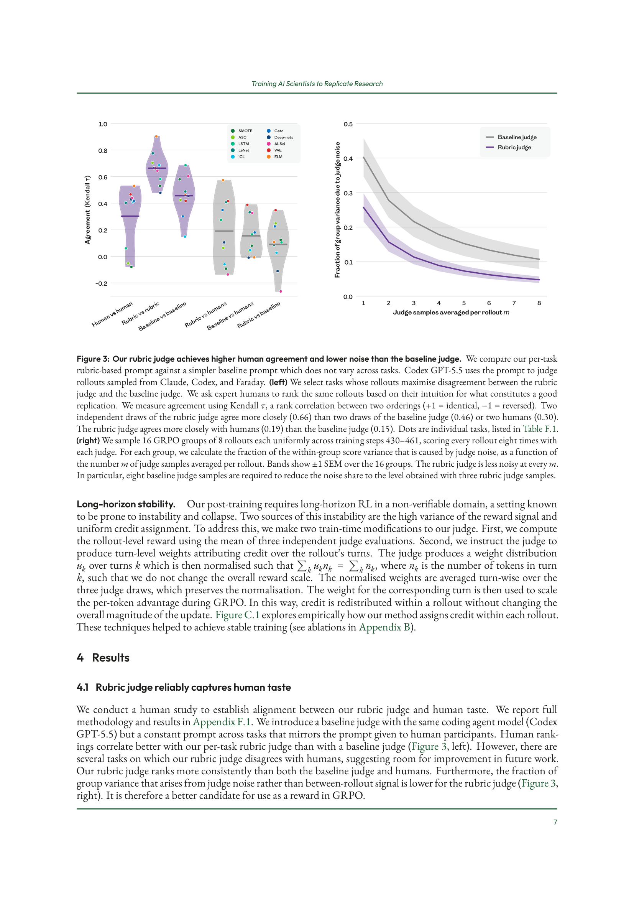
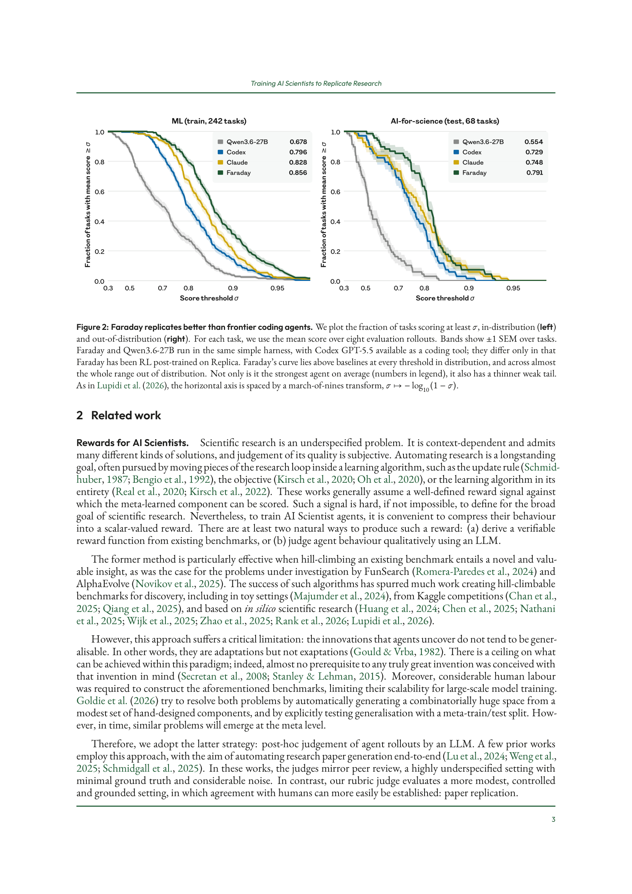
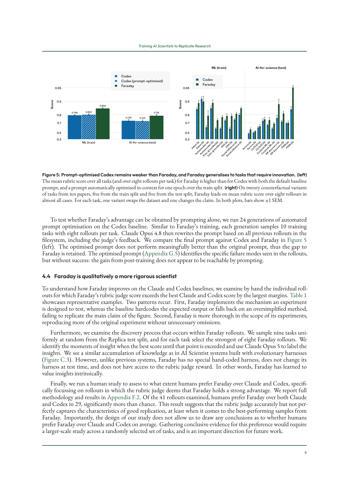

> [[../index|Wiki]] | [[../summary|Summary]] | [[../digest|Digest]]

# Results — How Faraday Compares to Frontier Coding Agents

**In one sentence:** After RL training on Replica, Faraday (a Qwen-based agent) beats Claude and Codex on 60–73% of tasks — an advantage the authors show is not reachable by prompting alone and reflects genuinely more rigorous experimental behavior, verified by a human study.

## Key points

- A human-validated rubric judge aligns better with human rankings than a constant-prompt baseline judge and produces less judge noise at every sample count (~0.25 vs ~0.4 fractional noise at 1 sample, converging to ~0.05 vs ~0.1 at 8), making it a better GRPO reward signal (Figure 3).
- Frontier agents do not saturate Replica: for every agent, mean rubric score decreases with publication year, and difficulty varies by topic — NLP/LLM and AI-for-science papers are hardest, classical ML/statistics easiest (Figure 4).
- Claude Opus 4.8 is the strongest baseline; Faraday's base model + harness before RL is the weakest of all and degrades fastest with recency.
- Faraday wins an in-distribution comparison across the full task distribution: it outperforms both Claude and Codex on 73% of train (ML) tasks and 60% of held-out test (AI-for-science) tasks — an upward shift of the whole score distribution (Figure 2).
- Sub-dimension decomposition (Figure C.2) shows Faraday stronger on experimental depth, claim reproduction, and visual fidelity, and matching Claude on scientific integrity and implementation fidelity.
- Auto-optimizing Codex's prompt for 24 generations did not meaningfully improve it over the default prompt, so the gap to Faraday cannot be closed by prompting alone (Figure 5).
- On twenty counterfactual task variants (swapped dataset or changed claim) from ten papers, Faraday leads in nearly all cases (Figure 5, right).
- In a targeted human study of 41 rollouts where the judge deemed Faraday clearly ahead, humans prefer Faraday in 29 — significantly more than chance (Appendix F.2).

---

## 4.1 Rubric judge reliably captures human taste

The authors run a human study (full methodology and results in Appendix F.1) to check alignment between their per-task rubric judge and human taste. The baseline judge uses the same coding agent model (Codex GPT-5.5) but a single constant prompt across all tasks that mirrors the prompt given to human participants.

Results: human rankings correlate better with the per-task rubric judge than with the baseline judge (Figure 3, left), though several tasks exist where the rubric judge disagrees with humans — flagged as room for improvement. The rubric judge also ranks more consistently than both the baseline judge and humans, and the fraction of group variance attributable to judge noise (rather than between-rollout signal) is lower for the rubric judge at every averaging level (Figure 3, right). It is therefore the better candidate for use as the GRPO reward.

Left panel: Kendall-τ rank agreement across pairwise comparisons — the rubric judge tracks human rankings more closely than the baseline judge and is the most self-consistent judge. Right panel: fraction of within-group variance due to judge noise falls as more judge samples are averaged, and the rubric curve sits below the baseline at every sample count.

## 4.2 Replica tasks are challenging for frontier agents

Frontier coding agents were run on Replica and found not to saturate the task space. Setup:

- **Baselines:** Claude Opus 4.8 (Claude Code harness) and GPT-5.5 (Codex harness), both at extra-high thinking effort; GLM-5.2 at max thinking effort in Claude Code (the best reported harness for TerminalBench).
- **Faraday:** thinking effort of its Codex tool pinned to extra-high for a fair comparison.
- Every agent gets the same task materials and the same 60-minute single-GPU budget, scored by the same rubric judge, with **eight rollouts per task**; within a task, rollout scores are reduced to one per-task score by taking the mean.

Findings:

- **Claude Opus 4.8 is the strongest baseline**; Faraday's pre-RL (base model + harness) is the weakest of all and the fastest to degrade with recency.
- Task performance decreases with publication year for every agent. The authors speculate recent papers are harder to replicate because of lower information density about them in pre-training data and because they tend to use higher compute, making scale-down harder.
- Difficulty varies across research topics, with per-topic rankings consistent among baseline agents: NLP and LLM papers hardest, classical machine learning and statistics easiest.
- AI-for-science papers are generally harder than ML papers across agents, possibly because they require integrating experimental expertise from different domains.

Left panel plots per-paper mean rubric scores against publication year (point size = number of tasks the paper yields; lines are least-squares fits), all sloping downward with Faraday the shallowest. Right panel shows per-topic scores for the train (ML) and test (AI-for-science) splits, with Faraday rightmost on essentially every topic.

## 4.3 Faraday replicates better than Claude and Codex

Comparing Faraday against baselines across the entire Replica task distribution (Figure 2) yields a comprehensive uplift over the base Qwen model on both train and test tasks:

- In-distribution, Faraday outperforms both Claude and Codex on **73% of tasks**; out-of-distribution, on **60% of tasks**.
- Held-out papers span research areas Faraday never trained on, so the acquired behavior is not memorization of a specialized procedure but a transferable way of approaching the underspecified task of paper replication.
- On both train and test, Faraday's advantage is an **upward shift of the whole score distribution** (Figure 2), not just a tail effect.
- Decomposing the judge score into sub-dimensions (Figure C.2): Faraday is stronger than baselines in **experimental depth, claim reproduction, and visual fidelity**, and **matches Claude on scientific integrity and implementation fidelity**.

Two CDF-style curves (fraction of tasks meeting a score threshold vs. threshold, march-of-nines scale, ±1 SEM bands) show Faraday above Qwen3.6-27B, Codex, and Claude on almost every threshold in both splits, with a thinner weak tail.

### The advantage is not reachable by prompting

To test whether prompting alone could recover Faraday's advantage, the authors ran **24 generations of automated prompt optimization** on the Codex baseline. Similar to Faraday's training, each generation samples 10 training tasks with eight rollouts per task; Claude Opus 4.8 then rewrites the prompt based on all previous rollouts in the filesystem, including the judge's feedback (final prompt in Appendix G.5).

The optimized prompt does not perform meaningfully better than the original prompt, so the gap to Faraday is retained. The optimized prompt *does* identify the specific failure modes seen in the rollouts but cannot fix them — the gain from post-training is not reachable by prompting. Faraday also leads on **twenty counterfactual variants** of tasks drawn from ten papers (five train, five test), where each task has one variant that swaps the dataset and one that changes the claim — i.e., Faraday generalizes to tasks requiring innovation.

Left panel: mean rubric scores (8 rollouts per task) for baseline Codex, prompt-optimised Codex, and Faraday on the ML train and AI-for-science test splits. Right panel: per-task scores on the counterfactual variants, with Faraday ahead in almost every case.

## 4.4 Faraday is qualitatively a more rigorous scientist

To understand *how* Faraday improves, the authors hand-examined rollouts where Faraday's judge score exceeds the best Claude/Codex score by the largest margins (Table 1). Two recurring patterns:

1. **Faraday implements the mechanism the experiment is designed to test**, while baselines hardcode the expected output or fall back on an oversimplified method, failing to replicate the main claim of the figure.
2. **Faraday is more thorough in experimental scope**, reproducing more of the original experiment without unnecessary omissions.

Representative examples from Table 1 (grouped by whether the paper is inside ML/training or outside AI-for-science/test distribution):

**ML (train)**

- **Darwin-Gödel Machine** (Zhang et al. 2026a, Fig. 4) — tests whether DGM-discovered improvements transfer across models, benchmarks, and languages. Faraday implements the paper's evolutionary self-improvement procedure, building an archive of mutated agents and transferring the best. The baseline hard-codes a putatively discovered agent, bypassing the search the experiment is meant to demonstrate.
- **Learning Precise Timing with LSTM Recurrent Networks** (Gers et al. 2002, Fig. 12) — trained peephole LSTMs generating periodic rectangular functions. Training did not converge in either rollout; Faraday's coding agent tries to hand-craft the network in place of training, which Faraday stops and replaces with a workable training recipe. Codex instead steers the network via initialisation and auxiliary losses, then selects a favourable checkpoint showing the desired result.
- **Voyager** (Wang et al. 2024, Fig. 8) — tracks intermediate progress on unseen crafting tasks to test zero-shot skill transfer. Faraday runs a dedicated skill-acquisition phase and transfers skills to held-out tasks, replicating the mechanism the figure measures. The best Claude rollout supplies a hard-coded, pre-populated library including target-solving skills, so the library-transfer mechanism is specified by hand and not tested.
- **The AI Scientist** (Lu et al. 2024, Fig. 2) — GPT-4o paper-reviewing ablations. Faraday ran the reviewing pipeline at meaningful scale (several times more reviews than Codex) and followed the method more closely: five self-reflection rounds plus an area-chair meta-review, versus one critique prompt and an average over five reviews. Faraday's reflection loop improves accuracy; Codex's barely moves it.

**AI-for-science (test)**

- **ChemVAE** (Gómez-Bombarelli et al. 2018, Fig. 4) — Gaussian-process search in a learned molecular latent space finds higher-scoring molecules and visualises optimisation paths. Faraday more faithfully implements the method: a generative model turns any point in the learned space back into a molecule, with fallback to the nearest known molecule only for invalid decodes. Codex simplifies parts of the model so its representation cannot be decoded into molecules — every molecule in its figure is retrieved from the dataset rather than generated.
- **GNoME** (Merchant et al. 2023, Fig. 3) — more pretraining data improves force-prediction for unseen materials. Faraday repeats each scaling-law training-set size five times and reports the spread; the best Codex rollout uses one seed per scaling point with no reported uncertainty. Only Faraday implements the figure's robustness test (fine-tune at low temperature, evaluate at high temperature); Codex draws both sets from one generator call that takes no temperature argument, so the claimed shift on the axis is not supported.

### Discovery process within Faraday rollouts

The authors sample nine tasks uniformly at random from the Replica test split, select the strongest of Faraday's eight rollouts per task, identify the "moments of insight" (when the best-so-far score is exceeded), and label them with Claude Opus 5. The result is a similar accumulation of knowledge to AI-Scientist systems built with evolutionary harnesses (Figure C.3) — but Faraday has no hand-coded harness, does not change its harness at test time, and has no access to the rubric-judge reward. In other words, **Faraday has learned to value insights intrinsically**.

### Human preference for Faraday's stronger rollouts

A human study (Appendix F.2) asks whether humans prefer Faraday over Claude and Codex, focused on rollouts where the rubric judge deems Faraday to hold a strong advantage. Of the **41 rollouts examined, humans prefer Faraday over both Claude and Codex in 29** — significantly more than chance. This suggests the rubric judge accurately but not perfectly captures what makes good replication, at least for Faraday's best-performing samples. The study design cannot support conclusions about human preference *on average*; that would require a larger study over a randomly selected task set, an important direction for future work.

**Covers:** Section 4 Results — 4.1 Rubric judge reliability, 4.2 Replica difficulty for frontier agents, 4.3 Faraday vs. Claude/Codex, 4.4 Qualitative rigor (pp. 7–10, arXiv:2608.13331v1)
