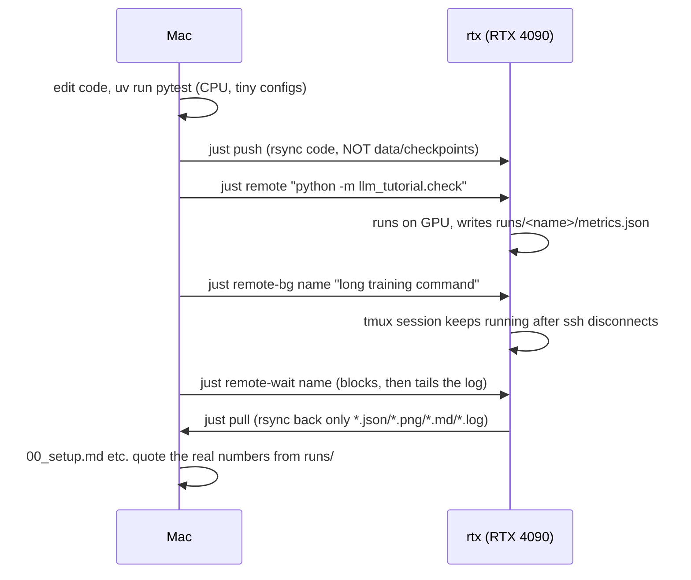

# 00 — Setup: two machines, one project, `just check`

**What you will learn**
- What `uv`, `just`, `ssh`, `rsync` and `tmux` do and why this tutorial uses all five
- What every file in `project/` is for
- How code moves Mac → `rtx` and results move `rtx` → Mac
- How the RTX 4090 is shared with Ollama, and what `just gpu-free` will and will not do
- How to run `just check` on both machines and read its output
- How to start a long job in the background with `just remote-bg` and watch it

## The tools we use

- **uv** is a fast Python package manager. It reads `pyproject.toml`, resolves exact versions
  into `uv.lock`, and creates an isolated virtual environment (`.venv/`) so this tutorial's
  packages never clash with anything else on the machine. `uv sync` installs from the lock file;
  `uv run <cmd>` runs a command inside that environment without you having to "activate" it.
- **just** is a command runner — a thin layer over shell commands, similar to `make` but with
  simpler syntax. Instead of remembering a long `ssh`/`rsync` incantation you type `just push` or
  `just check`. Run `just` with no arguments (or `just --list`) to see every recipe with its
  one-line comment.
- **ssh** (Secure Shell) opens an encrypted remote terminal on another machine. We never type the
  GPU box's IP address or password — `~/.ssh/config` defines an alias, `rtx`, so `ssh rtx` (or
  `just remote "..."`) just works.
- **rsync** copies files between machines, but only the ones that changed (unlike `scp`, which
  copies everything every time). `just push` and `just pull` are both `rsync` commands with
  different include/exclude rules.
- **tmux** (terminal multiplexer) runs a program inside a session that keeps living after you
  disconnect. Training a model can take hours; if you just `ssh`'d in and ran the training command
  directly, closing your laptop lid would kill it. `just remote-bg` starts the job inside a named
  tmux session instead, so it survives.

## Why two machines, and what lives where

This table is copied from `index.md` (the parent contract — never edit it here):

| setting | value |
|---|---|
| Mac (where you edit, run tests, keep git) | this repository, `~/.ai/knowledge/research_topics/training_and_self_evolution/tutorials/llm_training/project` |
| GPU box | ssh alias `rtx` (`~/.ssh/config`), Ubuntu 24.04, **RTX 4090 24 GB** (GPU 0; a GTX 1080 Ti 11 GB is GPU 1 and is not used), 62 GB RAM, 32 cores, CUDA driver 580 |
| project directory on `rtx` | `~/projects/llm_training` (mirror of `project/`, kept in sync with `just push`) |
| checkpoints / datasets / HF cache on `rtx` | `~/projects/llm_training/runs/` and `~/.cache/huggingface` (never synced back) |
| Ollama on `rtx` | systemd service, pinned to the 4090, `OLLAMA_CONTEXT_LENGTH=98304`; `qwen3.8:27b` takes ~17 GB of VRAM while loaded |
| Python | 3.12 via `uv` on both machines; CPU-only `torch` on the Mac, CUDA `torch` on `rtx` |

The Mac has no GPU, so it cannot train anything — but it is where you write and unit-test code,
because editing and `git` are much nicer here. `rtx` has the only GPU, but nobody wants to hand-edit
files over `ssh`, and its disk is not backed up by git. So the workflow is: **write and test on the
Mac, run on `rtx`, pull only the small result files back.** Checkpoints (gigabytes) and datasets
stay on `rtx` forever.

## The files in `project/`

```
project/
├── pyproject.toml          # dependency list read by uv (torch, transformers, trl, peft, ...)
├── uv.lock                  # exact resolved versions, committed so both machines match
├── .env.template             # documents every variable just/*.py needs
├── .env                       # your real values, copied from .env.template (gitignored)
├── .gitignore                  # keeps .venv/, .env, data/ and checkpoints out of git
├── justfile                     # short commands: sync, push, pull, remote, check, gpu-free, ...
├── src/llm_tutorial/
│   ├── __init__.py
│   ├── config.py               # load_yaml(), RunPaths, write_metrics() — every later chapter uses these
│   ├── gpu.py                   # runs on rtx: gpu status, and "wait until the GPU is free"
│   └── check.py                  # connectivity/speed check, --cpu on the Mac, full on rtx
├── tests/
│   └── test_00_setup.py           # CPU-only tests for gpu.py parsing, config.py, check.py --cpu
└── runs/                            # pulled-back results only (metrics.json, samples.md, loss.png)
```

### `.env`

```bash
RTX_HOST=rtx                              # ssh alias from ~/.ssh/config
RTX_PROJECT_DIR=/home/sergii/projects/llm_training
RTX_UV=/home/sergii/.local/bin/uv
OLLAMA_URL=http://127.0.0.1:11435         # tunnel to rtx (fallback http://localhost:11434)
OLLAMA_MODEL=qwen3.8:27b
HF_HOME=/home/sergii/.cache/huggingface   # on rtx
```

`RTX_UV` matters because a non-interactive `ssh` command does not read the same `PATH` as an
interactive shell — `uv` is installed at `~/.local/bin/uv` on `rtx`, but running plain `uv` over
`ssh` gives `command not found`. The justfile always uses the full path (or a recipe that first
runs `. .venv/bin/activate`, which puts the venv's own `python`/tools on `PATH` for that one
command).

`justfile` starts with `set dotenv-load := true`, so every recipe automatically has these
variables available as `$RTX_HOST`, `$RTX_PROJECT_DIR`, etc. — no need to `source .env` yourself.

## The push → remote → pull loop



- `just push` — `rsync -az --delete` from `project/` to `$RTX_HOST:$RTX_PROJECT_DIR/`, excluding
  `.venv`, `runs`, `data`, `.git`, `__pycache__`, `.pytest_cache`. `--delete` means files removed
  on the Mac are removed on `rtx` too, so the two copies never drift.
- `just remote "cmd"` — opens one `ssh` connection, `cd`s into the project, activates the venv,
  and runs `cmd`. Short-lived commands only.
- `just remote-bg name "cmd"` — same, but wraps `cmd` in `tmux new-session -d -s <name>` so it
  survives a dropped connection, and pipes its output through `tee runs/logs/<name>.log`.
- `just remote-log name` / `just remote-wait name` / `just remote-kill name` — tail the log,
  block until the tmux session ends then tail the last lines, or kill the session.
- `just pull` — `rsync` from `$RTX_HOST:$RTX_PROJECT_DIR/runs/` to the local `runs/`, but only
  `*.json`, `*.png`, `*.md`, `*.log` (via `--include`/`--exclude` pairs and `--prune-empty-dirs`).
  Checkpoints (`.safetensors`, optimizer state) are gigabytes and never leave `rtx`.

## GPU sharing with Ollama

`qwen3.8:27b` runs as a systemd-managed Ollama service on `rtx` and other tools (this knowledge
base's own tutorials, other sessions) can be actively chatting with it at any moment — it is not
"yours" just because you are the one training a model today. `gpu.py`'s `free()` function
(exposed as `just gpu-free`) is the rule-follower:

1. It reads GPU 0's utilisation and memory every 5 seconds (`nvidia-smi
   --query-gpu=utilization.gpu,memory.used --format=csv,noheader,nounits`).
2. If utilisation is **≥ 10%**, someone is actively generating — it prints `GPU busy (Ollama
   serving another client), waiting...` and keeps polling. It never stops a model that is in use.
3. If utilisation stays **< 10% for `idle_seconds` (default 60s)** and a model is still loaded
   (`ollama ps` shows a row), it asks Ollama itself to unload it — `ollama stop <model>` — which
   just evicts it from VRAM; the next chat request reloads it automatically. It never touches
   `~/.ollama`, the systemd unit, or any process directly.
4. Once free memory ≥ `min_free_gb` (default 20 GB) it prints the number and exits 0. If the GPU
   is still busy after `max_wait_minutes` (default 360) it exits 1 — that is a signal to come back
   later, not a bug.

Chapter 00 itself does not need any of this — `just check`'s benchmark uses well under 1 GB — but
every later chapter that trains something calls `just gpu-free` first.

```python
# src/llm_tutorial/gpu.py (excerpt)
def parse_nvidia_smi(text: str, fields: list[str] | None = None) -> list[dict[str, str]]:
    """Parse `nvidia-smi --query-gpu=... --format=csv[,noheader]` output."""
    ...

@app.command()
def free(min_free_gb: float = 20, idle_seconds: int = 60, max_wait_minutes: int = 360) -> int:
    """Wait until the GPU has >= min_free_gb free, stopping an idle Ollama model if needed."""
    ...
```

`parse_nvidia_smi` and `parse_ollama_ps` are plain functions that take a string and return a list
of dicts / list of names — no subprocess calls inside them — precisely so `tests/test_00_setup.py`
can feed them canned `nvidia-smi`/`ollama ps` output and check the parsing without a GPU.

## Running `just check` on both machines

On the Mac (no GPU — this is the expected, healthy result):

```
$ uv run python -m llm_tutorial.check --cpu
python: 3.12.13
torch: 2.13.0
transformers: 5.16.1
trl: 1.12.0
peft: 0.20.0
torch.cuda.is_available(): False
```

On `rtx`, run for real while writing this chapter. At that moment `qwen3.8:27b` was **loaded and
actively being used by someone else** (`nvidia-smi` showed 93–96% utilisation and 23/24.5 GB
used) — exactly the shared-GPU situation this chapter warns about. `just check` does not call
`gpu-free`, so it ran anyway with the ~0.7 GB that remained:

```
$ python -m llm_tutorial.check
python: 3.12.3
torch: 2.13.0+cu130
transformers: 5.16.1
trl: 1.12.0
peft: 0.20.0
torch.cuda.is_available(): True
GPU: NVIDIA GeForce RTX 4090
memory: 0.7 GB free / 23.5 GB total
bf16 4096x4096 matmul: 26.3 TFLOP/s
fla importable: True
```

The 26.3 TFLOP/s is real, but it is **not** the card's real speed — an idle 4090 does
150–165 TFLOP/s on this exact benchmark. The number here is low because the benchmark was
competing for the same streaming multiprocessors as someone else's live inference request; later
chapters that actually train will run `just gpu-free` first and expect the higher number. This is
the honest, measured number for this moment, not an invented one.

`just gpu-status` at the same time:

```
$ nvidia-smi --query-gpu=index,name,memory.used,memory.total,utilization.gpu --format=csv; ollama ps
index, name, memory.used [MiB], memory.total [MiB], utilization.gpu [%]
0, NVIDIA GeForce RTX 4090, 22995 MiB, 24564 MiB, 93 %
1, NVIDIA GeForce GTX 1080 Ti, 8 MiB, 11264 MiB, 0 %
NAME           ID              SIZE     PROCESSOR    CONTEXT    UNTIL
qwen3.8:27b    5f86f5def443    17 GB    100% GPU     73728      4 minutes from now
```

`just` itself was already installed on `rtx` at `~/.local/bin/just` from earlier work in this
knowledge base; if it were not, the install is one line:

```bash
curl --proto '=https' --tlsv1.2 -sSf https://just.systems/install.sh | bash -s -- --to ~/.local/bin
```

installing it there means the exact same `justfile` recipes (`just check`, `just gpu-status`, ...)
work whether you are typing them from the Mac over `ssh` or logged into `rtx` directly.

## A first `just remote-bg` job

Before trusting a real multi-hour training job to survive a dropped connection, prove the
mechanism with something short — five 5-second `nvidia-smi` samples:

```bash
just remote-bg name="smoke" cmd="nvidia-smi -l 5 -c 6"
just remote-log name="smoke"      # tail the log while it runs
just remote-wait name="smoke"     # blocks until the tmux session ends, then tails it
```

`remote-wait` polls `tmux has-session -t smoke` every 30 seconds on `rtx` and returns as soon as
the session is gone — so you never need to guess how long a job will take.

## Troubleshooting

| symptom | cause | fix |
|---|---|---|
| `bind [127.0.0.1]:8888: Address already in use` / `Could not request local forwarding` when running `just push` or `just pull` | the `rtx` ssh alias has `LocalForward` entries for other tunnels (e.g. Jupyter) that are already bound in this terminal session | harmless for `rsync` itself — the transfer still completes; if you need a clean connection, use `ssh -o ClearAllForwardings=yes rtx '...'` as the `justfile`'s `remote*` recipes already do |
| `uv: command not found` when running a command on `rtx` over ssh | non-interactive ssh sessions do not source the same shell profile as an interactive login, so `~/.local/bin` may be missing from `$PATH` | always use the full path (`$RTX_UV`) or activate the venv first (`. .venv/bin/activate`), as every `justfile` recipe does |
| `just gpu-free` waits far longer than `idle_seconds` | someone else is actively generating with Ollama (utilisation stays ≥ 10%) — this is by design, it will not stop a busy model | check `just gpu-status`; if `ollama ps` shows recent activity, wait and retry, or reduce your own job's memory needs |
| a `just remote-bg` session seems to have vanished | the command inside it crashed or finished very fast, so `tmux has-session` returns false immediately | `just remote-log name` — the log file is written until the process exits, even after the tmux session is gone |
| `UserWarning: ... GTX 1080 Ti ... is not compatible with the current PyTorch installation` when running `check` on `rtx` | this `torch` build only ships CUDA kernels for compute capability ≥ 7.5; the second GPU (1080 Ti, CC 6.1) is unsupported and unused anyway | harmless — GPU 0 (the RTX 4090, CC 8.9) is what every script targets; ignore the warning |

## Exercises

1. Run `just gpu-status` yourself and compare the utilisation number to what this chapter
   recorded — is Ollama busy right now?
2. Add a new `just` recipe, `remote-df`, that prints `df -h $RTX_PROJECT_DIR` on `rtx`, following
   the same `ClearAllForwardings` pattern as `remote`.
3. Read `gpu.py`'s `free()` function and explain, in your own words, what would happen if
   `idle_seconds=0` — why does the default use 60 instead?
4. `write_metrics()` merges dictionaries with `dict.update()`, so a later call with the same key
   overwrites the earlier value. Write a two-line test (beyond the ones already in
   `tests/test_00_setup.py`) that proves this for a key that changes type (e.g. `int` → `str`).

Next: [01_concepts.md](01_concepts.md) — what an LLM actually computes, and every piece of the
Qwen3.5/3.8 architecture we will build in `project/`.
