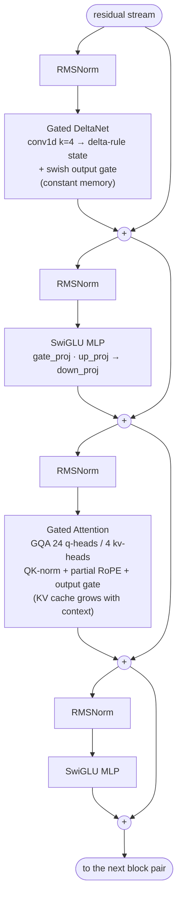
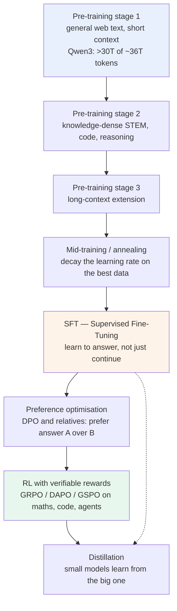

# 01 — Concepts: what a language model is, what Qwen3.5/3.8 is made of, and what training costs

Previous: [00_setup.md](00_setup.md) · Next: [02_tokenizer_and_data.md](02_tokenizer_and_data.md)

## What you will learn

- What an **LLM** (Large Language Model — a neural network that predicts the next token of text) actually computes, and how a probability becomes a word
- Every component of the Qwen3.5/Qwen3.8 architecture, one at a time: what it is, why it exists, how many parameters it costs
- Why 3 out of every 4 layers of Qwen3.8 are *not* normal attention, and what that buys
- The stages of the modern training pipeline (pre-training → mid-training → SFT → preference optimisation → RL) and what each one changes
- How to compute a training budget with 6·N·D, and why 27B from scratch is 2,800 years on our GPU while our 110M model is 4 hours
- How much memory training needs, and what LoRA and QLoRA change

Everything in this chapter runs on the Mac, on the CPU, in seconds. No GPU, no weights downloaded.

---

## 1. What an LLM does

A language model does exactly one thing: **given a sequence of tokens, predict a probability for every possible next token.** That is all. Chat, translation, code and "reasoning" are all built on top of this one operation.

A **token** is a piece of text — usually a common word, a word fragment, or a piece of punctuation. The model never sees letters; it sees integers. Splitting text into tokens is the job of the **tokenizer** (chapter 02). Here is the real Qwen tokenizer at work:

```python
from transformers import AutoTokenizer
tok = AutoTokenizer.from_pretrained("Qwen/Qwen3.5-0.8B")
ids = tok("The capital of France is")["input_ids"]
```

```
text  : 'The capital of France is'
ids   : [760, 6511, 314, 9338, 369]
pieces: ['The', ' capital', ' of', ' France', ' is']
vocab : 248077
```

Five words, five tokens, five integers. The model turns those five integers into a list of 248,320 numbers — one **logit** (an unnormalised score) per token in the vocabulary. A `softmax` turns the logits into probabilities that sum to 1.

Choosing the actual next token from those probabilities is **sampling**, and it has two dials:

- **Temperature `T`** divides the logits before the softmax. `T < 1` sharpens the distribution (more predictable), `T > 1` flattens it (more surprising), `T → 0` is "always take the most likely token" (greedy).
- **Top-p** (also called nucleus sampling) keeps only the smallest set of tokens whose probabilities add up to `p`, then re-normalises and samples from that set. It throws away the long tail of nonsense.

With five candidate next tokens and made-up logits `[9.0, 5.5, 4.0, 3.5, 2.0]`:

```
T=1.0:  Paris=0.960   the=0.029   a=0.006   located=0.004   Lyon=0.001
T=0.7:  Paris=0.992   the=0.007   a=0.001   located=0.000   Lyon=0.000
T=2.0:  Paris=0.741   the=0.129   a=0.061   located=0.047   Lyon=0.022
top-p 0.9 keeps: [' Paris']
```

Training is the mirror image of this. You take real text, and for every position you push the probability of the token that *actually came next* up. The loss is the **cross-entropy**: the average of `−log p(correct token)`. A model that knows nothing spreads its probability evenly over the vocabulary, so its loss starts at `ln(vocab_size)` — for our 32,000-token vocabulary, `ln(32000) ≈ 10.37`. Chapter 03 checks exactly that number as the first sanity test of a fresh model.

---

## 2. The Qwen3.5 / Qwen3.8 architecture, piece by piece

Between the input tokens and the output logits sits a stack of identical-looking blocks. In Qwen3.8-27B there are 64 of them. Every block reads from and writes back to one shared vector per token, called the **residual stream**.

You can inspect any of these models yourself without downloading a single weight:

```bash
cd project
just anatomy                                               # our 110M config
just anatomy config="--from-hub Qwen/Qwen3.8-27B"          # downloads config.json only (~2 kB)
```

`describe` builds the model on PyTorch's `meta` device — the module tree and every parameter *shape* exist, but no memory is allocated and no weight is initialised. That is why a 27B model can be dissected on a laptop in under a second.

### 2.1 Token embeddings

**What it is.** A lookup table with one row per vocabulary entry: `embed_tokens.weight`, shape `vocab_size × hidden_size`. Token id 9338 ("France") becomes row 9338, a vector of `hidden_size` numbers.

**Why it exists.** Integers have no meaning to a neural network — 9338 is not "bigger" than 6511 in any useful sense. The embedding table gives every token a learned position in a continuous space where "France" and "Germany" end up close together.

**Cost.** `248,320 × 5,120 = 1,271,398,400` parameters in Qwen3.8-27B — nearly 1.3 billion parameters that do no computation at all, only lookup. This is why people quote **non-embedding parameters** when comparing model sizes.

### 2.2 RMSNorm and pre-norm

**What it is.** **RMSNorm** (Root Mean Square normalisation) rescales a vector so its root-mean-square length is 1, then multiplies it element-wise by a learned gain vector of `hidden_size` numbers. That gain vector is the only parameter.

**Why it exists.** Deep stacks of layers make activations drift towards very large or very tiny values, and both break training. Normalising at the entrance of every sub-layer keeps the numbers in a sane range. Qwen uses **pre-norm**: normalise *before* the attention and before the MLP, and add the sub-layer's output straight back into the residual stream. That leaves an unobstructed path from the first layer to the last, which is what makes 64-layer stacks trainable at all. RMSNorm is a cheaper cousin of LayerNorm — it skips the mean-subtraction step.

**Cost.** `hidden_size` per norm; `5,120 × 2 × 64 = 655,360` for all of Qwen3.8-27B's block norms. Negligible, and critical.

### 2.3 RoPE, and partial RoPE

**What it is.** **RoPE** (Rotary Position Embedding) injects "where in the sentence am I" by *rotating* pairs of numbers inside each attention head's query and key vectors by an angle proportional to the token's position. It has **no parameters at all** — it is pure arithmetic controlled by one number, `rope_theta`.

**Why it exists.** Attention by itself is order-blind: shuffle the tokens and the result is the same. Rotation is a neat trick because the dot product between a query at position *i* and a key at position *j* ends up depending only on the *distance* `i − j`, which generalises to sequence lengths never seen during training.

**Partial RoPE.** Qwen3.8-27B sets `partial_rotary_factor: 0.25` — only a quarter of each 256-dimensional head (64 dimensions) is rotated; the rest carries position-independent content. Together with a large `rope_theta` of `1e7` (instead of the classic `1e4`), this is what supports a `max_position_embeddings` of **262,144** tokens.

### 2.4 Gated Attention (the "full attention" layers)

Every 4th layer of Qwen3.8 is a classic attention layer, with three modern additions.

**What attention is.** Each token produces a **query**, and every token produces a **key** and a **value**. The query is compared (dot product) against all keys at or before the current position, the scores are softmaxed into weights, and the values are mixed with those weights. In one sentence: *every token looks back over the whole context and pulls in what it needs.*

**GQA — Grouped-Query Attention.** Qwen3.8-27B has 24 query heads but only **4** key/value heads: groups of 6 query heads share one key/value head. The reason is the **KV cache** — during generation the keys and values of every past token are kept in GPU memory so they are not recomputed. Fewer KV heads means a proportionally smaller cache. You can see it in the printout: `q_proj` is `12288×5120` while `k_proj` and `v_proj` are only `1024×5120` each.

**QK-norm.** `q_norm` and `k_norm` are RMSNorms applied to each head's query and key *before* the dot product (256 parameters each). They stop the attention logits from exploding, a known instability in large models.

**The output gate** — the "Gated" in Gated Attention (`attn_output_gate: true`). A second projection produces a sigmoid gate that multiplies the attention output element-wise, letting the layer decide *how much* of what it retrieved to write back into the residual stream. This is why `q_proj` in the printout is `12288×5120` and not `6144×5120`: `24 heads × 256 dims = 6144`, doubled because the same matrix also produces the gate.

**Cost per full-attention layer in 27B:** `1,006,632,960 / 16 ≈ 62.9M` for `q_proj` (+gate), `5.2M` each for `k_proj`/`v_proj`, `31.5M` for `o_proj`.

### 2.5 Gated DeltaNet (the "linear attention" layers) — 3 of every 4

**What it is.** Instead of keeping every past key and value, a Gated DeltaNet layer keeps a **fixed-size matrix of memory** and updates it once per token. Each token writes a small correction into that memory (a "delta") and reads from it. A learned forget gate (`A_log`, `dt_bias`) decides how fast old content decays. In front of the projections sits a short **causal 1-D convolution** with kernel size 4 (`linear_conv_kernel_dim: 4`) — a cheap local mixer that lets each token also see the 3 tokens immediately before it. `output_gate_type: swish` gates the layer's output the same way the attention layer does.

**Why it exists.** Full attention costs time proportional to the *square* of the sequence length, and its KV cache grows linearly with every token generated. A recurrent state does not grow: it is the same size at token 10 and at token 200,000. That is what makes a 262,144-token context affordable.

**Why 3 out of 4 and not 4 out of 4?** A fixed-size memory has to forget something. Full attention forgets nothing — it can retrieve any earlier token exactly. Qwen3.5/3.8 use the hybrid pattern `linear, linear, linear, full` (`full_attention_interval: 4`) so most layers are cheap and constant-memory, while every fourth layer can still do exact long-range lookup. The `layer_types` list in the config is literally that pattern.

**Cost in 27B:** 48 value heads and 16 key heads of dimension 128 → `in_proj_qkv` is `10240×5120` (52.4M per layer), `in_proj_z` (the gate) and `out_proj` `6144×5120` (31.5M each).

### 2.6 The SwiGLU MLP

**What it is.** After the token-mixing sub-layer, every token is processed independently by a two-layer feed-forward network: `down_proj(silu(gate_proj(x)) * up_proj(x))`. Three matrices, not two — `gate_proj` and `up_proj` both read the residual stream, `silu` (a smooth ReLU) is applied to one of them, and the two are multiplied element-wise before `down_proj` writes the result back. That multiplicative structure is the **GLU** (Gated Linear Unit); with `silu` it is called **SwiGLU**.

**Why it exists.** Attention moves information *between* tokens; the MLP is where information is *processed*. It is also where most of the model's knowledge is stored.

**Cost.** With `hidden 5120` and `intermediate 17408`, that is `3 × 5120 × 17408 = 267.4M` parameters **per layer**, times 64 layers = **17.1 billion** — about **two thirds of the whole 27B model**.

### 2.7 The LM head, tied or untied

**What it is.** The final RMSNorm, then a matrix `hidden_size × vocab_size` that turns the last residual vector into one logit per vocabulary entry.

**Tied vs untied.** `tie_word_embeddings: true` means the LM head *reuses the embedding table* (transposed), saving a whole `vocab × hidden` matrix. Small models tie (Qwen3.5-0.8B, Qwen3.5-4B, and our 110M model), because for them the embedding table is a huge fraction of the total. Qwen3.8-27B does **not** tie: it pays 1.27B extra parameters for an independent output matrix, which is worth it when the rest of the model is 24B anyway.

### 2.8 One block pair, drawn



Qwen3.8-27B repeats this picture 16 times (3 linear-attention blocks + 1 full-attention block, ×16 = 64 layers). Our 110M model repeats it 3 times.

### 2.9 Our 110M model, printed for real

`project/configs/tiny_qwen35_110m.yaml` is the same architecture, shrunk:

```yaml
model:
  arch: qwen3_5            # Qwen3_5TextConfig
  vocab_size: 32000
  hidden_size: 768
  intermediate_size: 2048
  num_hidden_layers: 12
  num_attention_heads: 12
  num_key_value_heads: 2
  head_dim: 64
  linear_num_value_heads: 12
  linear_num_key_heads: 6
  linear_key_head_dim: 64
  linear_value_head_dim: 64
  full_attention_interval: 4
  tie_word_embeddings: true
  max_position_embeddings: 2048
  rms_norm_eps: 1.0e-6
```

```
$ just anatomy
         configs/tiny_qwen35_110m.yaml (Qwen3_5TextConfig, meta device)
┏━━━━━━━━━━━━━━━━━━━━━━━━━━━━━━━━━━━━━━━━━━━━━━━━━━━━━━━┳━━━━━━━━━━━┳━━━┳━━━━━━━━━━━━┓
┃ module                                                ┃     shape ┃ × ┃ parameters ┃
┡━━━━━━━━━━━━━━━━━━━━━━━━━━━━━━━━━━━━━━━━━━━━━━━━━━━━━━━╇━━━━━━━━━━━╇━━━╇━━━━━━━━━━━━┩
│ model.embed_tokens.weight                             │ 32000×768 │ 1 │ 24,576,000 │
│ model.layers.{linear}.linear_attn.dt_bias             │        12 │ 9 │        108 │
│ model.layers.{linear}.linear_attn.A_log               │        12 │ 9 │        108 │
│ model.layers.{linear}.linear_attn.conv1d.weight       │  1536×1×4 │ 9 │     55,296 │
│ model.layers.{linear}.linear_attn.norm.weight         │        64 │ 9 │        576 │
│ model.layers.{linear}.linear_attn.out_proj.weight     │   768×768 │ 9 │  5,308,416 │
│ model.layers.{linear}.linear_attn.in_proj_qkv.weight  │  1536×768 │ 9 │ 10,616,832 │
│ model.layers.{linear}.linear_attn.in_proj_z.weight    │   768×768 │ 9 │  5,308,416 │
│ model.layers.{linear}.linear_attn.in_proj_b.weight    │    12×768 │ 9 │     82,944 │
│ model.layers.{linear}.linear_attn.in_proj_a.weight    │    12×768 │ 9 │     82,944 │
│ model.layers.{linear}.mlp.gate_proj.weight            │  2048×768 │ 9 │ 14,155,776 │
│ model.layers.{linear}.mlp.up_proj.weight              │  2048×768 │ 9 │ 14,155,776 │
│ model.layers.{linear}.mlp.down_proj.weight            │  768×2048 │ 9 │ 14,155,776 │
│ model.layers.{linear}.input_layernorm.weight          │       768 │ 9 │      6,912 │
│ model.layers.{linear}.post_attention_layernorm.weight │       768 │ 9 │      6,912 │
│ model.layers.{full}.self_attn.q_proj.weight           │  1536×768 │ 3 │  3,538,944 │
│ model.layers.{full}.self_attn.k_proj.weight           │   128×768 │ 3 │    294,912 │
│ model.layers.{full}.self_attn.v_proj.weight           │   128×768 │ 3 │    294,912 │
│ model.layers.{full}.self_attn.o_proj.weight           │   768×768 │ 3 │  1,769,472 │
│ model.layers.{full}.self_attn.q_norm.weight           │        64 │ 3 │        192 │
│ model.layers.{full}.self_attn.k_norm.weight           │        64 │ 3 │        192 │
│ model.layers.{full}.mlp.gate_proj.weight              │  2048×768 │ 3 │  4,718,592 │
│ model.layers.{full}.mlp.up_proj.weight                │  2048×768 │ 3 │  4,718,592 │
│ model.layers.{full}.mlp.down_proj.weight              │  768×2048 │ 3 │  4,718,592 │
│ model.layers.{full}.input_layernorm.weight            │       768 │ 3 │      2,304 │
│ model.layers.{full}.post_attention_layernorm.weight   │       768 │ 3 │      2,304 │
│ model.norm.weight                                     │       768 │ 1 │        768 │
└───────────────────────────────────────────────────────┴───────────┴───┴────────────┘
total parameters      : 108,572,568  (108.57M)
embedding parameters  : 24,576,000
non-embedding         : 83,996,568
tie_word_embeddings   : True
layer_types (12) : LLLF LLLF LLLF
  L = linear_attention (Gated DeltaNet), F = full_attention
```

Note there is no `lm_head.weight` row: the embeddings are tied, so the same 24.6M-parameter table is used twice.

### 2.10 The four models side by side

All numbers below come from `just anatomy` runs (config only, no weights) and are stored in `project/runs/01_concepts/metrics.json`:

| | tiny-qwen35-110m | Qwen3.5-0.8B | Qwen3.5-4B | Qwen3.8-27B |
|---|---|---|---|---|
| total parameters | 108,572,568 | 752,393,024 | 4,205,751,296 | 26,895,998,464 |
| non-embedding | 83,996,568 | 498,113,344 | 3,570,052,096 | 24,353,201,664 |
| embedding (+ head) | 24,576,000 | 254,279,680 | 635,699,200 | 2,542,796,800 |
| layers | 12 (9 L + 3 F) | 24 (18 L + 6 F) | 32 (24 L + 8 F) | 64 (48 L + 16 F) |
| hidden size | 768 | 1,024 | 2,560 | 5,120 |
| intermediate (SwiGLU) | 2,048 | 3,584 | 9,216 | 17,408 |
| query / KV heads, head dim | 12 / 2 × 64 | 8 / 2 × 256 | 16 / 4 × 256 | 24 / 4 × 256 |
| vocabulary | 32,000 | 248,320 | 248,320 | 248,320 |
| tied embeddings | yes | yes | yes | **no** |
| max context | 2,048 | 262,144 | 262,144 | 262,144 |

Two things to notice. First, the pattern `LLLF` is identical in all four — the architecture really is the same, only wider and deeper. Second, at 0.8B the shared vocabulary table is **34 %** of all parameters, while at 27B a single copy of it is **4.7 %**: a 248k-entry vocabulary is a fixed tax that only big models can afford comfortably — which is exactly why our 110M model gets its own 32k tokenizer in chapter 02.

If the Gated DeltaNet kernels are unavailable on some machine, `project/configs/tiny_qwen3_110m_dense.yaml` is the fallback: the same sizes in the plain dense-attention `Qwen3` architecture, 97,734,912 parameters, all 12 layers full attention.

---

## 3. Thinking mode and the chat template

A pretrained model only continues text. To make it answer questions you wrap the conversation in special tokens — the **chat template** — so the model can tell who said what. Qwen uses `<|im_start|>role\ncontent<|im_end|>`. Modern Qwen models additionally produce a **thinking block**: everything between `<think>` and `</think>` is the model's scratch work, and only what comes *after* `</think>` is the answer shown to the user. Reinforcement learning on verifiable problems (section 4) is what teaches a model to use that scratchpad well.

Qwen3.8-27B exposes two switches through its template. Here is the real output of `tokenizer.apply_chat_template` for the message "2+2?":

```
default                : '<|im_start|>system\nReasoning effort is set to xhigh. Please think carefully through the task, ...<|im_end|>\n<|im_start|>user\n2+2?<|im_end|>\n<|im_start|>assistant\n<think>\n'
enable_thinking=False  : '<|im_start|>user\n2+2?<|im_end|>\n<|im_start|>assistant\n<think>\n\n</think>\n\n'
reasoning_effort="low" : '<|im_start|>system\nReasoning effort is set to low. Keep your thinking brief and focused, ...<|im_end|>\n<|im_start|>user\n2+2?<|im_end|>\n<|im_start|>assistant\n<think>\n'
```

So `enable_thinking=False` does not remove a capability — it *pre-fills an empty think block* so the model has nothing left to do but answer, and `reasoning_effort` is simply an injected system instruction. Thinking is on at `xhigh` by default, which is why `qwen3.8:27b` often deliberates at length over trivial questions. Chapter 05 uses these templates for real when we turn our own model into an assistant.

---

## 4. The modern training pipeline



**Pre-training** is where essentially all knowledge and language ability come from, and it eats essentially all the compute. Qwen3 was trained on ~36 trillion tokens across 119 languages (arXiv 2505.09388), in three stages: over 30T tokens of general web text at 4K context; then a knowledge-dense mixture weighted towards science, mathematics and code; then a long-context stage that stretches the usable window. The objective never changes — it is next-token prediction the whole way. → **chapter 04**.

**Mid-training / annealing** is the tail of pre-training: the learning rate is decayed to near zero while feeding the highest-quality data available. Empirically the model gains a surprising amount in this short phase, because the last few percent of a schedule is where weights actually settle. → **chapter 04** (our WSD schedule).

**SFT — Supervised Fine-Tuning** shows the model conversations written the way we want it to reply, and trains next-token prediction *only on the assistant's tokens*. This is what converts a text-completer into something that answers a question instead of inventing three more questions. It is cheap: tens of thousands of examples, not trillions of tokens. → **chapter 05**.

**Preference optimisation** fixes what SFT cannot express: for the same prompt, here is a better answer and a worse one. **DPO** (Direct Preference Optimization) turns that pair into a loss directly on the model, with no separate reward model and no reinforcement-learning loop — it simply raises the probability of the chosen answer relative to the rejected one, anchored against a frozen copy of the model so it does not drift. Relatives (IPO, KTO, ORPO, SimPO) vary the anchoring and the loss shape. → **chapter 06**.

**RL with verifiable rewards** is the newest stage and the one behind "reasoning" models. The model generates several answers to the same problem, an automatic checker scores them (is the final number right? does the code pass the tests?), and the model is pushed towards the answers that scored well. **GRPO** (Group Relative Policy Optimization) is the workhorse: it drops the separate value network of PPO and instead judges each answer against the *average* of the group of answers sampled for the same prompt. **DAPO** and **GSPO** are refinements that fix known instabilities — DAPO with asymmetric clipping and dynamic sampling of prompts that are neither always-right nor always-wrong, GSPO by computing the importance ratio at the sequence level instead of per token. → **chapter 06**.

**Distillation** is how small models get good. Rather than repeating the whole pipeline at every size, the small model is trained to match the big model's output distribution or its generated answers — Qwen3's small dense models were made this way ("strong-to-weak distillation"). → touched on in **chapter 10**.

**What Qwen actually published.** For Qwen3 the numbers above are documented in the technical report. For **Qwen3.8** they are not: the model card says only that it uses "early fusion training on trillions of multimodal tokens" — text and images trained together from the start, rather than bolting a vision encoder onto a finished text model — and that reinforcement learning was "scaled across million-agent environments". Treat those as qualitative statements; no token counts or stage boundaries have been released.

---

## 5. The compute and memory budget

### 5.1 6·N·D

The standard estimate for training compute is

> **FLOPs ≈ 6 × N × D**, where N = parameters and D = training tokens.

Two of the six floating-point operations per parameter per token are the forward pass (one multiply and one add per weight), and four are the backward pass (gradients with respect to the layer inputs, and with respect to the weights).

One RTX 4090 peaks at about **165 TFLOP/s** in bf16. Nobody reaches peak; the fraction you actually achieve is the **MFU** (Model FLOPs Utilisation), and 40 % is a good real-world number for a well-tuned single-GPU run. So the sustained rate is `165e12 × 0.4 = 66 TFLOP/s`.

```
$ just budget
                           training compute at 165 TFLOP/s peak × 40% MFU
┏━━━━━━━━━━━━━━━━━━━━━━━━━━━━━━━━━━━┳━━━━━━━━━━┳━━━━━━━━━━┳━━━━━━━━━━━━━┳━━━━━━━━━━━━━━┳━━━━━━━━━━━━┓
┃ model / token budget              ┃ N params ┃ D tokens ┃ 6·N·D FLOPs ┃   4090-hours ┃ 4090-years ┃
┡━━━━━━━━━━━━━━━━━━━━━━━━━━━━━━━━━━━╇━━━━━━━━━━╇━━━━━━━━━━╇━━━━━━━━━━━━━╇━━━━━━━━━━━━━━╇━━━━━━━━━━━━┩
│ Qwen3.8-27B, full pre-training    │   27.00B │   36.00T │    5.83e+24 │ 24,545,454.5 │   2,800.07 │
│ Qwen3.8-27B, 1T tokens            │   27.00B │    1.00T │    1.62e+23 │    681,818.2 │      77.78 │
│ Qwen3.5-4B, 1T tokens             │    4.00B │    1.00T │    2.40e+22 │    101,010.1 │      11.52 │
│ our tiny-qwen35-110m, 1.5B tokens │  108.60M │    1.50B │    9.77e+17 │          4.1 │       0.00 │
└───────────────────────────────────┴──────────┴──────────┴─────────────┴──────────────┴────────────┘
```

That is the whole argument of Part A in one table. Reproducing Qwen3.8-27B's pre-training on this GPU would take **2,800 years**. Even a heavily cut-down 1-trillion-token run is 78 years, and a 4B model on 1T tokens is still 11 years. Our 110M model on 1.5B tokens is **about 4 hours** — and the *procedure* is identical. (`index.md` quotes ~1,200 years for the same 27B run; it assumes an optimistic 1.5e14 FLOP/s sustained, i.e. ~90 % MFU. At a realistic 40 % you get the 2,800 above. Either way the answer is "no".)

Note also *why* the token budgets are what they are. The Chinchilla scaling result says compute is best spent at roughly **20 tokens per parameter**; modern models deliberately overshoot that (Qwen3: 36T tokens for models up to 32B) because inference cost, not training cost, dominates once a model ships. Our 1.5B tokens for 108.6M parameters is ≈14 tokens/parameter — slightly under Chinchilla, chosen to fit the run in an evening. Chapter 02 comes back to this.

### 5.2 Memory

Training memory is roughly:

| what | bytes per parameter (mixed precision) |
|---|---|
| weights (bf16) | 2 |
| gradients (bf16) | 2 |
| master weights (fp32 copy the optimizer updates) | 4 |
| Adam first moment `m` (fp32) | 4 |
| Adam second moment `v` (fp32) | 4 |
| **total** | **16** |

On top of that come **activations** — every intermediate tensor kept for the backward pass. Activations scale with batch size × sequence length × hidden size × layers, not with parameters, and they are the one term you control at runtime (smaller batch, gradient accumulation, gradient checkpointing).

```python
GB = 1024**3
for name, n in [("tiny-qwen35-110m", 108.6e6), ("Qwen3.5-4B", 4.21e9), ("Qwen3.8-27B", 26.9e9)]:
    print(f"{name:20s} full-training 16 B/param = {n*16/GB:8.1f} GB | "
          f"16-bit LoRA base = {n*2/GB:6.1f} GB | 4-bit QLoRA base = {n*0.55/GB:6.1f} GB")
```

```
tiny-qwen35-110m     full-training 16 B/param =      1.6 GB | 16-bit LoRA base =    0.2 GB | 4-bit QLoRA base =    0.1 GB
Qwen3.5-4B           full-training 16 B/param =     62.7 GB | 16-bit LoRA base =    7.8 GB | 4-bit QLoRA base =    2.2 GB
Qwen3.8-27B          full-training 16 B/param =    400.8 GB | 16-bit LoRA base =   50.1 GB | 4-bit QLoRA base =   13.8 GB
```

Our 110M model needs 1.6 GB of optimizer state — trivial on a 24 GB card, which is why we can train it fully and from scratch. Full fine-tuning of 27B needs 400 GB, i.e. five 80 GB datacentre GPUs before a single activation is stored.

### 5.3 What LoRA and QLoRA change

**LoRA** (Low-Rank Adaptation) freezes the base weights and adds, next to each chosen matrix, a pair of small matrices `A` (r × in) and `B` (out × r) whose product is added to the original output. Only `A` and `B` are trained. With rank `r = 16` on a 27B model the trainable parameters are a fraction of a percent, so the whole 16-bytes-per-parameter column above shrinks to nearly nothing — but you still have to *hold* the frozen base weights: `27B × 2 bytes = 50 GB` in bf16. That does not fit in 24 GB. (`index.md` quotes "> 36 GB" from the Unsloth guidance; both numbers say the same thing.)

**QLoRA** (Quantized LoRA) fixes exactly that: the frozen base weights are stored in **4 bits** and de-quantized on the fly during each matrix multiply, while the LoRA adapters stay in 16-bit and are what actually learns. `27B × ~0.55 bytes ≈ 13.8 GB` of base weights; with adapters, optimizer state, activations and a short sequence length the real footprint lands at **≈ 15–19 GB** — which is why the 27B capstone in chapter 09 fits on our 24 GB card, at batch size 1, gradient accumulation 4 and sequence length 2048.

So the three regimes this tutorial uses:

| model | technique | why |
|---|---|---|
| tiny-qwen35-110m | full training from random init | 1.6 GB — everything fits, nothing is frozen |
| Qwen3.5-4B | 16-bit LoRA | 7.8 GB frozen base + tiny adapters, comfortable |
| Qwen3.8-27B | QLoRA (4-bit base) | 13.8 GB frozen base is the only way into 24 GB |

---

## Troubleshooting

| symptom | cause | fix |
|---|---|---|
| `just anatomy config="--from-hub …"` fails with `OSError: Operation not supported: '/home/sergii'` | `.env` sets `HF_HOME` to the path on `rtx`, which does not exist on the Mac | already handled — the recipe falls back to `$HOME/.cache/huggingface` when `$HF_HOME` is missing; if you call the module directly, set `HF_HOME` yourself |
| `describe` prints `lm_head.weight` for one model and not another | `tie_word_embeddings` | tied models reuse the embedding table as the output matrix; there is no separate tensor to print |
| "the parameter count doesn't match the model's name" | names are marketing-rounded and often quote non-embedding parameters | Qwen3.8-**27B** really has 26.90B total / 24.35B non-embedding; compare like with like |
| `--from-hub` on a multimodal repo prints vision layers or errors | `Qwen3_5Config` wraps a text config and a vision config | `describe` already takes `.text_config`; the vision tower is not part of this tutorial |
| my own FLOP estimate is 3× smaller than `just budget` | you counted the forward pass only (2·N·D) | training is forward + backward = 6·N·D; inference alone is 2·N·D |
| out-of-memory the moment training starts, long before the first step | you budgeted weights but not optimizer state | mixed-precision AdamW costs ~16 bytes per parameter, not 2 |

## Exercises

1. **KV cache.** Qwen3.8-27B has 16 full-attention layers, 4 KV heads and `head_dim` 256, in bf16 (2 bytes). Work out the KV cache size per token, then for the full 262,144-token context.
   *Answer:* `2 (K and V) × 16 layers × 4 heads × 256 dims × 2 bytes = 65,536 bytes = 64 KB per token`, so `64 KB × 262,144 = 16.0 GB`. Now redo it pretending all 64 layers were full attention: **64 GB** — nearly three whole 4090s just for the cache. That single number is the reason for Gated DeltaNet.
2. **Where does the money go?** Using the 27B table in section 2.10, compute what fraction of the 24.35B non-embedding parameters live in SwiGLU MLPs (`3 × 5120 × 17408 × 64`). Is the model mostly "attention" or mostly "feed-forward"?
3. **Your own budget.** `uv run python -m llm_tutorial.anatomy budget --params 1e9 --tokens 20e9` prices a Chinchilla-optimal run (20 tokens per parameter) for a 1B-parameter model: **505.1 4090-hours**, or 21 days. Now try 7B at 20 tokens/parameter — is it still a weekend project?
4. **Shrink and check.** Copy `configs/tiny_qwen35_110m.yaml`, change `full_attention_interval` to 2 and re-run `just anatomy`. How does the pattern change, how do the parameters change, and — using exercise 1's method — what happens to the KV cache?

---

Previous: [00_setup.md](00_setup.md) · Next: [02_tokenizer_and_data.md](02_tokenizer_and_data.md)

Numbers in this chapter: `project/runs/01_concepts/metrics.json`. Model facts from `Qwen/Qwen3.8-27B`, `Qwen/Qwen3.5-4B` and `Qwen/Qwen3.5-0.8B` `config.json`, fetched 2026-08-30; pipeline facts from the Qwen3 Technical Report (arXiv 2505.09388) and the Qwen3.8 model card.
