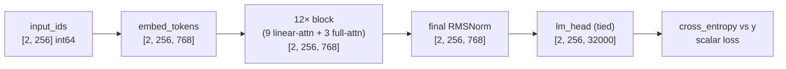

# 03 — The model from scratch: instantiate, inspect, forward pass, loss, sanity checks

Previous: [02_tokenizer_and_data.md](02_tokenizer_and_data.md) · Next: [04_pretraining.md](04_pretraining.md)

## What you will learn

- What "random initialisation" actually means numerically, and why every weight starts from `N(0, 0.02²)`
- The module tree of the real, materialised `tiny-qwen35-110m` — same shapes as chapter 01's `meta`-device printout, but now every number is a real float instead of uninitialised memory
- The exact tensor shapes a forward pass produces, from token ids to logits
- Why a randomly-initialised model's loss should sit at `ln(vocab_size)`, and what our real model measures
- The "can it learn at all?" test: overfit one fixed batch until the loss collapses, then watch the model recite it back
- A real GPU benchmark that decides, with numbers instead of guessing, whether the hybrid architecture's fast linear-attention kernels (`flash-linear-attention`, "fla") are worth using on our RTX 4090 — and what happens when you push the batch size too far
- How checkpoints are saved and loaded (safetensors) — the format every later chapter builds on

Chapters 00–02 ran entirely on the Mac. This chapter's `init-loss`/`overfit`/`bench` commands need either real token shards (only on `rtx`, chapter 02) or a GPU (`bench`), so they run on `rtx` via `just gpu-free` + `just remote`; only the CPU-only inspection functions (`init_weights_report`, `count_params`) run locally.

---

## 1. What random initialisation means

Chapter 01 built the model on PyTorch's `meta` device — shapes only, no memory, no numbers. `build_model(section, device="cpu")` (or `"cuda"`) now actually allocates every tensor and fills it with random numbers drawn from `N(0, initializer_range²)`, with `initializer_range = 0.02` (Qwen3/Qwen3.5's default). Concretely, for `tiny-qwen35-110m`:

```
$ uv run python -c "from llm_tutorial.model import build_model, init_weights_report; ..."
model.embed_tokens.weight       mean=+0.00000  std=0.02000  shape=[32000, 768]
model.layers.0.mlp.gate_proj.weight   mean=-0.00000  std=0.01999  shape=[2048, 768]
```

Every one of the 108.6M parameters is an independent draw from that same tiny bell curve — nothing in the model "knows" anything yet. A standard deviation of 0.02 is deliberately small: it keeps the variance of the residual stream from exploding as it passes through 12 stacked blocks, before RMSNorm and training have a chance to fix anything. `init_weights_report(model)` in `model.py` checks the embedding table and one linear layer per block type so you can confirm this in code, not just take it on faith.

`build_model` also takes a `tokenizer_dir`. If given, it asserts the config's `vocab_size` already equals `len(tokenizer)` rounded up to a multiple of 64 — GPU matmuls (and the embedding/LM-head weight tensors, when untied) are fastest when their last dimension is a multiple of 64, the tensor-core tile size, so an odd tokenizer size gets its embedding table padded with unused rows rather than training with a lopsided matrix. Our tokenizer is exactly 32,000 tokens (already a multiple of 64), so no padding actually happens for this run — but the assertion exists so a future tokenizer change fails loudly in `build_model` instead of silently corrupting a training run. `pad_token_id`/`eos_token_id`/`bos_token_id` are copied from the tokenizer onto the config and the model's `generation_config` at the same time, so nothing downstream has to look the tokenizer up again.

---

## 2. The module tree, now with real numbers

The shapes are identical to chapter 01's `meta`-device printout (section 2.9 there) — the architecture doesn't change when you stop using `meta`. What changes is that every row below is now a real, addressable tensor of floats in memory, not just a declared shape:

```
total parameters      : 108,572,568  (108.57M)
embedding parameters  : 24,576,000
non-embedding         : 83,996,568
tie_word_embeddings   : True
layer_types (12) : LLLF LLLF LLLF
  L = linear_attention (Gated DeltaNet), F = full_attention
```

`count_params(model, config)` computes this split directly from the live model rather than the config alone: `total = sum(p.numel() for p in model.parameters())`, and `embedding = vocab_size × hidden_size` (doubled if the LM head is untied — ours is tied, so it isn't). This is the same 108.57M/24.58M/84.00M split as chapter 01, now backed by an actual `nn.Parameter` you could print, save, or train.

---

## 3. Shapes through one forward pass



A batch of 2 sequences of 256 tokens enters as integers, is looked up into 768-dimensional vectors, passes through all 12 blocks *without changing shape* (every block reads and writes the same `[batch, seq, hidden]` residual stream — this is exactly what "residual stream" meant in chapter 01), and only expands at the very last step, where the tied embedding matrix (transposed) turns each of the 768-dimensional vectors into 32,000 logits — one score per vocabulary entry. `compute_loss` in `sanity.py` does exactly this:

```python
def compute_loss(model, x, y):
    logits = model(input_ids=x).logits          # [batch, seq, vocab]
    return F.cross_entropy(logits.reshape(-1, logits.size(-1)), y.reshape(-1))
```

`x` and `y` come from `PackedDataset` (chapter 02) and are *already* shifted by one token relative to each other, so this is a plain cross-entropy — no extra `[:, :-1]`/`[:, 1:]` slicing the way you'd need with HuggingFace's `labels=` convention.

---

## 4. Cross-entropy and `ln(V)`

Cross-entropy loss is `−log p(correct token)`, averaged over every position in the batch. A model that has learned nothing spreads its probability uniformly over the vocabulary, so `p(correct token) ≈ 1/V` everywhere and the loss should sit near `ln(V)`. `expected_init_loss(vocab_size) = math.log(vocab_size)`; for our 32,000-token vocabulary that's `ln(32000) ≈ 10.3735`.

```
$ just gpu-free && just remote "python -m llm_tutorial.sanity init-loss configs/tiny_qwen35_110m.yaml runs/tokenizer_32k"
measured init loss : 10.5207
ln(vocab_size=32000) : 10.3735
delta              : +0.1472
```

Measured on a real batch of TinyStories validation tokens (`runs/data/tinystories/val.bin`, batch 8 × block 256), the hybrid model's loss is 10.52 — 0.15 nats above the theoretical minimum for a uniform guess. That small a delta is expected: initialisation is not *exactly* uniform (RMSNorm's learned gain and the small-but-nonzero correlations between random weights nudge it slightly), and the gap you actually see this close to `ln(V)` is the first real evidence the model is wired correctly — a completely broken forward pass (wrong reshape, mismatched vocab, a bug in the loss) typically produces a loss wildly far from `ln(V)`, not a few tenths off. Numbers: `runs/sanity_init_loss/metrics.json`.

---

## 5. Can it learn at all? Overfit one batch

The overfit test is deliberately the smallest possible experiment: freeze one batch, train AdamW on it over and over, and see whether the loss goes to (near) zero. There is nothing to generalise to — if this fails, the bug is in the model or the optimiser, never in the data.

```
$ just gpu-free && just remote "python -m llm_tutorial.sanity overfit configs/tiny_qwen35_110m.yaml runs/tokenizer_32k"
step    1  loss 10.5122
reached loss < 0.1 at step 10
prompt   : ' change the battery, but she was too busy.\n\nSo, Timmy decided to play with'
target   : ' his other toys. He found a ball and started bouncing it. Suddenly, a big storm came and the rain made everything wet. Timmy went inside, but he left his ball outside.'
generated: ' his other toys. He found a ball and started bouncing it. Suddenly, a big storm came and the rain made everything wet. Timmy went inside, but he left his ball outside.'
```

Loss fell from 10.51 (right where the init-loss check says it should start) to below the 0.1 threshold in just **10** AdamW steps at `lr=1e-3` — one fixed 4×256-token batch is a tiny, entirely memorisable target for a 108M-parameter model, so this converges far faster than the default budget of 200 steps. The real payoff is the greedy (`temperature=0`) regeneration: prompted with only the first 20 tokens, the model reproduces the *exact* rest of the batch, verbatim. That is what "the model can learn" looks like at the smallest possible scale — full numbers and the loss history in `runs/sanity_overfit/metrics.json`.

---

## 6. The kernel benchmark and the hybrid-vs-dense decision

The hybrid architecture's Gated DeltaNet layers (chapter 01, section 2.5) update a fixed-size recurrent state per token instead of doing a dense matrix multiply, and that update pattern doesn't map onto the matmul-shaped hardware a GPU is built for. A **fused kernel** — a single hand-written GPU program, here written in [Triton](https://github.com/triton-lang/triton) by the `flash-linear-attention` (`fla`) project — computes the whole chunked delta-rule recurrence in one pass without ever materialising the full sequence of intermediate states in GPU memory. Without it, HuggingFace's `torch_chunk_gated_delta_rule` fallback still works (transformers dispatches to it automatically when `fla` isn't importable), but it is pure PyTorch ops chained together, each one a separate kernel launch and a separate round-trip through memory.

`bench` trains `steps` bf16 AdamW steps on random tokens and reports tokens/second, peak GPU memory, and whether `fla` was importable. We ran all four combinations that matter for chapter 04's decision — hybrid vs. dense architecture, eager vs. `torch.compile` — on the RTX 4090 (`fla 0.5.2`, `triton 3.7.1`, `torch 2.13.0+cu130`):

```
$ just gpu-free && just remote "python -m llm_tutorial.sanity bench configs/tiny_qwen35_110m.yaml --batch 8 --label hybrid_eager"
$ just remote "python -m llm_tutorial.sanity bench configs/tiny_qwen35_110m.yaml --batch 8 --compile --label hybrid_compiled"
$ just remote "python -m llm_tutorial.sanity bench configs/tiny_qwen3_110m_dense.yaml --batch 8 --label dense_eager"
$ just remote "python -m llm_tutorial.sanity bench configs/tiny_qwen3_110m_dense.yaml --batch 8 --compile --label dense_compiled"
$ just remote "python -m llm_tutorial.sanity decide"
```

| variant | tokens/s | peak memory | fla available |
|---|---|---|---|
| hybrid, eager | 74,235 | 15.78 GB | yes |
| hybrid, `torch.compile` | 106,383 | 12.13 GB | yes |
| dense, eager | 93,396 | 12.46 GB | yes |
| dense, `torch.compile` | 111,041 | 10.42 GB | yes |

(batch 8, block 2048, 8 measured steps after a 2-step warmup, bf16 autocast; `runs/bench_110m/metrics.json`.)

```
$ just remote "python -m llm_tutorial.sanity decide"
{'hybrid_vs_dense_speed_ratio': 1.258, 'fla_available': True,
 'chosen_arch': 'hybrid', 'reason': 'hybrid eager is only 1.26x slower than dense (<= 3x threshold)'}
```

`fla` imports and its Triton kernels run correctly on this 4090, and the hybrid model's eager mode is only **1.26×** slower than dense eager — comfortably under the 3× "give up and fall back" threshold `decide` uses. `torch.compile` narrows the gap further (106K vs. 111K tok/s) because it fuses the surrounding elementwise ops on both sides; the two compiled numbers are within 5% of each other. **Decision: keep the hybrid architecture.** `configs/pretrain_fineweb.yaml`'s `model_config:` key points at `configs/tiny_qwen35_110m.yaml`, and chapter 04 trains that one.

This is not a foregone conclusion in general — `fla`'s Triton kernels are Linux/CUDA-only, so a Mac or a machine without `fla` installed correctly falls back to the slow path automatically, and `decide` would pick `dense` instead (whichever arch you get, `count_params`/`init_weights_report`/`generate_samples` work identically on both — that's the whole point of keeping `configs/tiny_qwen3_110m_dense.yaml` around).

### Memory at batch 16 × 2048 vs. the 24 GB card

The task originally called for benchmarking at **batch 16**, matching chapter 04's planned training batch size. At batch 8 the hybrid model's eager peak is 15.78 GB; doubling the batch roughly doubles the activation memory (weights and optimiser state don't change), which lands past the 4090's 24 GB:

```
$ just remote "python -m llm_tutorial.sanity bench configs/tiny_qwen35_110m.yaml --batch 16 --steps 4"
OutOfMemoryError: CUDA out of memory. Tried to allocate 1.95 GiB. GPU 0 has a total capacity of
23.52 GiB of which 232.75 MiB is free. Including non-PyTorch memory, this process has 23.24 GiB
memory in use.
```

So the four-variant table above uses batch 8, and chapter 04's training run either uses batch 8 directly or batch 16 with gradient accumulation (accumulate 2 micro-batches of 8 before each optimiser step) to reach the same effective batch size without the OOM. This is exactly the kind of number you only get by actually running the benchmark — guessing "16×2048 should fit in 24 GB for a 110M model" would have been wrong.

---

## 7. Checkpoints

`save_checkpoint(model, tokenizer, run_dir, step)` writes `<run_dir>/checkpoints/step_<n>/` with `model.save_pretrained(..., safe_serialization=True)` (safetensors — a format that stores raw tensor bytes with a small JSON header, no pickle, so a checkpoint can never execute arbitrary code when loaded) plus the tokenizer files and a `step.json`. `load_checkpoint(path)` reverses it with `AutoModelForCausalLM.from_pretrained`. This round-trip (weights in, weights out, identical logits) is exactly what `test_03_model.py` checks, and it's the format every later chapter — resuming a training run, exporting to Ollama, loading a checkpoint for SFT — depends on.

---

## Troubleshooting

| symptom | cause | fix |
|---|---|---|
| `ImportError` or silent fallback when importing `fla` | `flash-linear-attention` only ships Linux/CUDA Triton kernels; not installable on macOS | `bench`'s `fla_available` flag catches this; `decide` automatically falls back to `chosen_arch: "dense"` — train `tiny_qwen3_110m_dense.yaml` instead |
| `CUDA out of memory` partway through `bench`/training | activation memory scales with `batch × block`, not with parameters; batch 16 at block 2048 does not fit our hybrid model in 24 GB (section 6) | use a smaller micro-batch (we use 8) with gradient accumulation to reach the same effective batch size, or reduce `block` |
| `torch.compile` prints repeated `recompile_limit` warnings during `bench` | the Gated DeltaNet cache object's device is lazily initialised on first use, which looks like a new shape to Dynamo the first few calls | expected during warmup; harmless once the model settles into steady state (our 2-step warmup absorbs this before timing starts) |
| `model vocab_size=... does not match tokenizer ...` from `build_model` | the YAML config's `vocab_size` is stale relative to the tokenizer you point it at | fix the YAML, or retrain the tokenizer at the vocab size the config expects — `build_model` refuses to silently pad *this* mismatch away |
| `init-loss`/`overfit` raise a `ValueError: Pointer argument cannot be accessed from Triton (cpu tensor?)` | the model (or the batch) was built/left on `cpu` while `fla`'s Triton kernels are CUDA-only — the hybrid model's linear-attention layer still tries to dispatch into the GPU kernel even when nothing is actually on the GPU | `init-loss`/`overfit` now pick `device="cuda" if torch.cuda.is_available() else "cpu"` (matching `bench`) and move the batch to the same device as the model — don't hardcode `device="cpu"` when running on `rtx` |

## Exercises

1. **Initialisation math.** `initializer_range=0.02` and `hidden_size=768`. If every weight in a linear layer were *exactly* independent `N(0, 0.02²)`, what would you expect the standard deviation of one output unit (a dot product of 768 such weights against a unit-norm input) to be, roughly? Compare against what RMSNorm does immediately afterward.
2. **Reproduce the init-loss check.** Run `just sanity-init` yourself against `tiny_qwen3_110m_dense.yaml` instead of the hybrid config. Is the measured loss closer to or further from `ln(32000)` than the hybrid model's 10.5207? Why might a dense model's random-init loss differ slightly from a hybrid one's, given both have the same vocabulary?
3. **Push the overfit test further.** Lower `--loss_threshold` to `0.01` and rerun `just sanity-overfit`. How many more steps does it take to go from 0.1 to 0.01, and does the generated text change at all once it's already reciting the target exactly?
4. **The 3× threshold.** `decide` falls back to dense if hybrid eager is more than 3× slower. Using this chapter's real numbers, if `fla` were *not* available (forcing the pure-PyTorch fallback), estimate how much slower the hybrid model's linear-attention layers would need to run, per token, before hitting that 3× line — and why the threshold is defined on the *whole model*, not per-layer.

---

Previous: [02_tokenizer_and_data.md](02_tokenizer_and_data.md) · Next: [04_pretraining.md](04_pretraining.md)

Numbers in this chapter: `project/runs/sanity_init_loss/metrics.json`, `project/runs/sanity_overfit/metrics.json`, `project/runs/bench_110m/metrics.json`, all produced on `rtx` (RTX 4090, 24 GB) on 2026-08-30 with `fla 0.5.2`, `triton 3.7.1`, `torch 2.13.0+cu130`, `transformers 5.16.1`.
