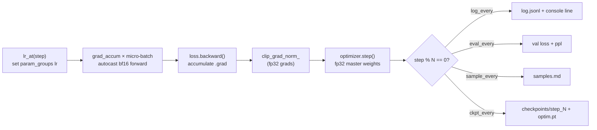

# 04 — Pre-training: the training loop, schedules, mixed precision, the real run

Previous: [03_model_from_scratch.md](03_model_from_scratch.md) · Next: [05_sft.md](05_sft.md)

## What you will learn

- The whole pre-training loop written out as plain PyTorch — no `Trainer`, no framework hiding
  the steps — with commentary on every line
- AdamW's two hyperparameters that matter most at this scale (`β2=0.95`, weight decay 0.1) and
  why norms/embeddings are excluded from decay; where **Muon**, a 2025–26 alternative optimizer,
  fits
- Two learning-rate (LR — how big a step the optimizer takes each update) schedules: cosine decay
  and warmup-stable-decay (WSD)
- Why training runs in bf16 (bfloat16, a 16-bit float) autocast, and which few tensors stay in
  fp32 (32-bit float)
- Gradient accumulation (a bigger effective batch without more memory) and gradient clipping (a
  safety valve against loss spikes)
- What `torch.compile` bought us, and what checkpoint/resume looks like in practice
- The **real ~4-hour run**: loss curve, a table of loss/perplexity at 10 checkpoints, samples at
  four points in training, tokens/s, memory, and MFU (model FLOPs utilisation — how much of the
  GPU's theoretical peak we actually used)
- An honest read on what a 110M-parameter model trained on 1.5B tokens can and cannot do

This chapter's `train` command needs a GPU and the real token shards from chapter 02, so it runs
on `rtx` via `just gpu-free` + `just remote-bg` (a detached, multi-hour job needs a background
tmux session, not a foreground `ssh`). The CPU tests use a synthetic 30-step run instead.

---

## 1. The loop, in ~12 real lines

This is the heart of `train()` in `project/src/llm_tutorial/pretrain.py` — everything before it
(building the model, the optimizer, the data iterators) is setup; everything after it is
logging/eval/checkpointing hung off the same loop:

```python
for step in range(start_step, total_steps):
    lr = lr_at(step, config.lr, config.warmup_steps, total_steps,
               config.min_lr_ratio, config.schedule, config.decay_fraction)
    for group in optimizer.param_groups:
        group["lr"] = lr

    optimizer.zero_grad(set_to_none=True)
    step_loss = 0.0
    for _ in range(config.grad_accum):
        x, y = next(train_iter)
        with torch.autocast(device_type=device_type, dtype=torch.bfloat16):
            loss = compute_loss(model, x, y) / config.grad_accum
        loss.backward()
        step_loss += loss.item()
    grad_norm = torch.nn.utils.clip_grad_norm_(model.parameters(), config.grad_clip)
    optimizer.step()
```

Twelve lines, and every concept in this chapter is in there: the LR schedule is recomputed and
written into every param group *before* the forward pass (§3); the inner loop over `grad_accum`
micro-batches is gradient accumulation (§5); `torch.autocast` is the mixed-precision context
(§4); `clip_grad_norm_` runs *after* all micro-batches have accumulated their gradients but
*before* `optimizer.step()` (§6). `compute_loss` is chapter 03's function, reused unchanged —
this chapter adds nothing to the forward pass itself, only to what surrounds it.



---

## 2. AdamW: β2=0.95, weight decay 0.1, and where Muon fits

AdamW keeps two running statistics per parameter: `β1` (default 0.9) is the momentum on the
gradient itself, `β2` is the momentum on the *squared* gradient, which AdamW uses to scale each
parameter's step inversely to how noisy that parameter's gradients have been. We use `β2=0.95`
instead of the more common `0.999` — a shorter memory for the second moment — because LLM
pre-training batches are large and the loss landscape is non-stationary early on (loss falls by
3 orders of magnitude in the first few hundred steps, see §9); a `β2` that reacts faster to
recent gradient scale avoids over/under-scaling steps based on statistics from a very different
part of training. This is the same choice GPT-3, LLaMA and Qwen all made.

`build_param_groups` (below) splits parameters into two AdamW groups: 2-D-and-up matrices (the
`Linear` weights that do the actual computation) get `weight_decay=0.1`; everything else — 1-D
tensors (RMSNorm gains, biases) and the embedding table — gets none:

```python
def build_param_groups(model, weight_decay):
    decay, no_decay = [], []
    for name, param in model.named_parameters():
        if param.dim() < 2 or "norm" in name.lower() or "embed_tokens" in name:
            no_decay.append(param)
        else:
            decay.append(param)
    return [{"params": decay, "weight_decay": weight_decay},
            {"params": no_decay, "weight_decay": 0.0}]
```

Weight decay pulls every weight toward zero a little on each step — a regulariser that keeps
matrices from growing unboundedly large. That makes sense for weight matrices, which have many
redundant directions to shrink into. It makes no sense for a RMSNorm gain (a single scalar per
channel whose whole job is to *not* be 1.0 or 0.0) or for one row of the embedding table (shrinking
a token's entire representation toward zero fights every other objective the token has). Excluding
them from decay is standard practice (GPT-2, LLaMA, nanoGPT all do it) and `test_04_pretrain.py`
checks the split is exact — every parameter ends up in exactly one group.

**Where Muon fits (2025–26).** [Muon](https://kellerjordan.github.io/posts/muon/) is a newer
optimizer (used in nanoGPT speedrun records and reportedly in several 2025 open-weight training
runs) that replaces AdamW's per-parameter update with an orthogonalised update on each weight
*matrix* — Newton-Schulz iteration pushes every singular value of the update toward 1 instead of
scaling by a per-element second moment. It converges faster (fewer tokens to a target loss) on
matrix-shaped parameters but doesn't apply cleanly to 1-D parameters or embeddings, so real Muon
setups still run AdamW on those — a two-optimizer setup, not a drop-in replacement. We stick with
plain AdamW here because it is simpler to explain end to end and the 110M/1.5B-token budget of
this chapter is not where a faster optimizer pays for itself; it is worth knowing Muon exists for
anything bigger.

---

## 3. LR schedules: warmup, then cosine or WSD

`lr_at(step, ...)` is a pure function — no state, easy to unit-test — called once per step:

```python
def lr_at(step, lr, warmup_steps, total_steps, min_lr_ratio=0.1, schedule="cosine", decay_fraction=0.2):
    min_lr = lr * min_lr_ratio
    if warmup_steps > 0 and step < warmup_steps:
        return lr * (step + 1) / warmup_steps          # linear warmup
    if schedule == "cosine":
        progress = min((step - warmup_steps) / (total_steps - warmup_steps), 1.0)
        return min_lr + 0.5 * (lr - min_lr) * (1 + math.cos(math.pi * progress))
    if schedule == "wsd":
        decay_steps = int(total_steps * decay_fraction)
        decay_start = total_steps - decay_steps
        if step < decay_start:
            return lr                                    # stable plateau
        return lr - (lr - min_lr) * min((step - decay_start) / decay_steps, 1.0)
```

Warmup exists because AdamW's second-moment estimate is unreliable for the first few dozen steps
(too little data to average over) — jumping straight to the peak LR risks a large, badly-scaled
first step. `warmup_steps: 300` ramps linearly from 0 to `lr=6e-4`.

**Cosine** then decays smoothly all the way to `min_lr = lr * min_lr_ratio` by the last step —
the standard choice when you know `total_steps` in advance (we do: `train_tokens / tokens_per_step`
fixes it). **WSD** (warmup-stable-decay) instead holds the LR flat at its peak for most of
training and only decays over the last `decay_fraction` (here 20%) of steps. WSD's practical
advantage is that you can checkpoint on the plateau and extend training (add more tokens, restart
the decay) without having committed to a total step count up front the way cosine implicitly
does — useful when you don't know your token budget exactly ahead of time. We ran the real job
with `schedule: cosine` (the budget was fixed and known); §12's exercises cover trying `wsd`.


Both curves in the plot share the same warmup, peak (`6e-4`) and floor (`6e-5`, `min_lr_ratio=0.1`)
— `lr_at`'s four parametrised test points per schedule (`test_04_pretrain.py`) check exactly the
shapes drawn here: warmup linear to peak, cosine's smooth decay, WSD's flat plateau followed by a
linear decay over the last 20% of steps.

---

## 4. Mixed precision: bf16 autocast, fp32 where it matters

`torch.autocast(device_type="cuda", dtype=torch.bfloat16)` wraps the forward pass (and the loss
computation) so that matmuls run in bf16 — half the memory and roughly double the throughput of
fp32 on the 4090's tensor cores — while PyTorch automatically keeps a handful of numerically
sensitive ops (softmax reductions inside attention, the final loss reduction) in fp32 internally.
Critically, the **master weights and the AdamW optimizer state stay fp32** — only the forward
pass's intermediate activations are computed in bf16. This is why bf16 (as opposed to plain fp16)
needs no loss-scaling trick: bf16 has the same 8-bit exponent range as fp32 (just fewer mantissa
bits), so it can't silently overflow to `inf` the way fp16's narrower exponent range can. This
combination — bf16 compute, fp32 master weights/optimizer — is why the loop above never needs a
`GradScaler`.

---

## 5. Gradient accumulation: a bigger batch for free

Chapter 03 measured that batch 16 at block 2048 does not fit the hybrid model in the 4090's 24 GB
(OOM at just 4 steps in). Gradient accumulation is the standard fix: run `grad_accum` micro-batches
forward+backward, dividing each micro-batch's loss by `grad_accum` before `.backward()` so the
*summed* gradient equals what one full-size batch would have produced, and only call
`optimizer.step()` once every `grad_accum` micro-batches. Memory scales with the micro-batch size
(one micro-batch's activations at a time), while the *effective* batch size — the one that matters
for the optimizer's statistics and for the LR schedule — is `micro_batch * grad_accum`. The real
run uses `micro_batch=8, grad_accum=8` → `8 * 8 * 2048 = 131,072` tokens per optimizer step, the
same effective batch chapter 03's benchmark was sized around, at half the peak activation memory.

---

## 6. Gradient clipping

`clip_grad_norm_(model.parameters(), grad_clip=1.0)` computes the global L2 norm across every
parameter's gradient and rescales all of them down (never up) so that norm is at most 1.0. This
runs after all `grad_accum` micro-batches have added into the same `.grad` buffers and right
before `optimizer.step()` — it is the loop's safety valve against a single bad batch (a
repeated/degenerate sequence, a rare long line of code) producing a gradient spike large enough
to knock the optimizer's second-moment estimate out of a useful range for the following dozens of
steps. Every logged step in this run's `log.jsonl` reports `grad_norm`; §9 shows the real run
settled to a steady ≈0.24 within a couple thousand steps, well under the clip threshold, meaning
clipping rarely bound (a healthy sign — the safety valve is there but not fighting the optimizer).

---

## 7. `torch.compile`

`config.compile: true` wraps the model once, right after it is built/loaded and before training
starts: `model = torch.compile(model)`. Chapter 03's benchmark already measured the payoff for
this exact model/architecture — hybrid eager 74,235 tok/s vs. hybrid compiled 106,383 tok/s, a
1.43× speedup, by fusing the elementwise ops around the Gated DeltaNet kernel and around
attention/MLP blocks into fewer, larger GPU kernel launches. The real run reused that decision
directly rather than re-measuring it. `torch.compile`'s first few steps are slower (tracing +
kernel compilation, plus Dynamo recompiling once or twice as the DeltaNet cache's device
initialises lazily — chapter 03's troubleshooting table) but the loop's `tokens_per_s` figures in
§9 are steady-state means dominated by the following thousands of steps.

---

## 8. Checkpoints and resume

`save_checkpoint`/`load_checkpoint` (chapter 03, unchanged) write/read `safetensors` weights plus
tokenizer files; `pretrain.py` adds three things around them: periodic checkpoints every
`ckpt_every` steps into `checkpoints/step_<n>/` with the AdamW state saved alongside in
`optim.pt` (resuming without the optimizer's second-moment estimates would effectively restart
warmup); `_prune_checkpoints` deletes all but the `keep_last` most recent ones so disk doesn't
fill up over an 11,000-step run; and a final `checkpoints/final/` directory written once training
completes (or is interrupted) — the one path chapters 05 onward load from.

`--resume` finds the highest-numbered `step_*` checkpoint, loads model + optimizer state, and
restarts the loop's `range(start_step, total_steps)` at `start_step = saved_step + 1` — the LR
schedule, being a pure function of `step`, picks back up exactly where it left off with no special
casing. Both `SIGTERM` (tmux/systemd asking the process to stop) and `KeyboardInterrupt` (Ctrl-C)
trigger the same `checkpoint_now(step)` before exiting, so a job killed mid-run is always resumable
from at most `ckpt_every` steps of lost progress.

---

## 9. The smoke run: does the loop actually work?

Before committing hours of GPU time, `configs/pretrain_tinystories_smoke.yaml` runs the identical
loop on the much smaller, much easier TinyStories dataset (block 512, batch 32, 50M-token budget)
as a ~9-minute sanity check:

```
$ just gpu-free && just remote-bg smoke "python -m llm_tutorial.pretrain train configs/pretrain_tinystories_smoke.yaml"
$ just remote-wait smoke
```

762 steps, 534 s wall time, 111,822 tok/s mean, peak memory 12.74 GB. Val loss: **10.53 → 3.67
(step 100) → 2.65 (step 200) → 1.86 (step 500) → 1.70 (step 700, final)**, final val perplexity
**5.48** (`runs/pretrain_110m_tinystories_smoke/metrics.json`). Samples went from pure noise at
step 0 —

```
'Once upon a time dreamrisogical merestrom authentic signature atmospsub Delhi Instru nervesakers...'
```

— to genuinely story-shaped text by step 600:

```
'Once upon a time, there was a little girl named Lily. She loved to play with her toys and her
favorite color was pink. One day, Lily went to the park with her mom and her friend,'
```

Loss well below 3 and story-like completions — the loop, schedule, checkpointing and sampling all
work end to end. Only then did the real ~4-hour FineWeb-Edu run get launched.

---

## 10. Sizing and launching the real run

From the smoke run's throughput (111,822 tok/s at block 512) and chapter 03's bench at the real
run's shape (hybrid compiled, block 2048: 106,383 tok/s), the full 1.5B-token budget at
131,072 tokens/step (`micro_batch=8, grad_accum=8`) comes out to `1.5e9 / 106,383 ≈ 14,100 s ≈
3.9 h` — comfortably under the 6-hour budget rule, so `train_tokens` stayed at the full `1.5e9`
(no reduction needed; `index.md`'s dataset table is unchanged).

```
$ just gpu-free && just remote-bg pretrain "python -m llm_tutorial.pretrain train configs/pretrain_fineweb.yaml"
$ just remote-log pretrain      # poll every ~20 min
$ just remote-wait pretrain     # block until done
$ just remote "python -m llm_tutorial.pretrain plot runs/pretrain_110m_fineweb"
$ just pull
```

One retry was needed: the first attempt (before this run) used `micro_batch=16`, matching the
task's nominal batch size, and OOM'd — chapter 03's bench only measured up to batch 8 at block
2048 (15.78 GB eager peak), and doubling the micro-batch roughly doubles activation memory past
the 24 GB card. Fixed by halving `micro_batch` to 8 and doubling `grad_accum` to 8, keeping the
same 131,072-token effective batch (§5) — exactly the OOM/fix pattern chapter 03's troubleshooting
table already predicted.

---

## 11. The real run: numbers, curve, samples

**Run summary** (`runs/pretrain_110m_fineweb/metrics.json`, produced on `rtx`, RTX 4090 24 GB,
`torch 2.13.0+cu130`, `fla 0.5.2`, on 2026-08-30):

| | |
|---|---|
| total steps | 11,444 |
| tokens seen | 1,499,987,968 (≈1.50B) |
| wall time | 14,288 s ≈ **3.97 hours** |
| tokens/s (mean) | 106,436 |
| peak GPU memory | 12.84 GB |
| MFU (6·N·D / time·165 TFLOP/s) | **41.4 %** |
| final train loss | 3.141 |
| final val loss | 3.140 |
| final val perplexity | 23.09 |
| energy @ ~400 W (4090 TDP) | ≈ 1.6 kWh |


| step | tokens (M) | train loss | val loss | val ppl |
|---|---|---|---|---|
| 0 | 0 | 10.532 | 10.532 | 37,478.70 |
| 1,000 | 131 | 3.965 | 3.918 | 50.28 |
| 2,000 | 262 | 3.708 | 3.600 | 36.59 |
| 3,000 | 393 | 3.542 | 3.453 | 31.61 |
| 4,500 | 590 | 3.385 | 3.349 | 28.46 |
| 6,000 | 787 | 3.299 | 3.269 | 26.28 |
| 7,500 | 983 | 3.278 | 3.202 | 24.58 |
| 9,000 | 1,180 | 3.173 | 3.163 | 23.65 |
| 10,000 | 1,311 | 3.235 | 3.167 | 23.73 |
| 11,000 | 1,442 | 3.241 | 3.151 | 23.35 |

**Samples for all four prompts, verbatim** (`runs/pretrain_110m_fineweb/samples.md`):

*Step 0 (random init):*
```
'The capital of France isSC sixth coffume geographical reverence somewhat plentyWA grasp 1932uled
mainland courtesymetal Birds Courexc Delawaregery Mont apparent spoil ambigointedording rainwater
ANambique prot pathogen 1896 LabLS correlates Classic optionsmansChe Fou'
```

*Step 2000 (early):*
```
'The capital of France is the Pisa River. It is the largest and most important river in the
country. The river flows into the Pisa River and flows into the river. The river's main purpose
is to extract'
```
```
'Photosynthesis is the process by which sunlight is emitted through the photosynthetic system.
It is possible to convert the photosynthetic systems into photosynthetic cells that produce
photosynthetic cells.'
```

*Step 6000 (mid):*
```
'The capital of France is the Paris National Assembly. The first president, the French President,
was named in 1815.\n- "Vérité de Vérité." The French Republic. French Republic. 1913.'
```
```
'Photosynthesis is the process of turning carbohydrates into energy.\n- In the process of
photosynthesis, the energy of sunlight is converted into energy by the oxidation of carbohydrates.'
```

*Step 10000 (final sampled checkpoint; training continued to step 11443):*
```
'The capital of France is Paris. The capital, Paris is the capital of France. The capital city of
France is Paris.\nThe name, "the city of Paris," comes from the Latin word "lore" ('
```
```
'Photosynthesis is the process of the splitting of light in a molecule by light. There are many
different types of photosynthesis. It is possible to grow different kinds of plants using a
combination of sunlight, light, water, and oxygen'
```
```
'def fibonacci(n):\n- He was born in India in 1723, he came from the Old Kingdom, where he was
the son of a well-known nobleman and a great warrior, and the name of a'
```
```
'Once upon a time, a beautiful woman appeared and said, "Beautiful woman is the God of the
Universe." The only way to know for sure was to ask him. But he answered, "The first thing'
```

The progression across these four checkpoints is the real story: nonsense tokens at step 0
(uniform-random logits); grammatical-but-repetitive filler at step 2000 (the model has learned
English syntax but not much fact); topically-appropriate, mostly-grammatical continuations by
step 6000–10000 ("Paris" correctly answers the capital-of-France prompt; "photosynthesis...
converted into energy" is roughly right). `def fibonacci(n):` never produces working code at any
checkpoint — 1.5B tokens of FineWeb-Edu (educational web text, not code) gives the model almost no
exposure to Python syntax, which is exactly the honest limitation §12 covers below.

---

## 12. Why the curve flattens

Val loss drops steeply at first — 10.53 → 3.92 over the first 1,000 steps (131M tokens) — then
flattens: 3.32 (step 5,000) → 3.23 (7,000) → 3.16 (9,000) → 3.17 (10,000), essentially flat within
noise for the last fifth of training while the cosine schedule's LR decays from ≈1.2e-4 down to
its floor of 6e-5. Three things are happening at once, and it's worth separating them:

1. **Diminishing returns is the expected shape.** Language-model loss vs. tokens roughly follows a
   power law (Kaplan et al. 2020, Hoffmann et al. 2022/"Chinchilla") — each doubling of tokens buys
   a shrinking, not constant, drop in loss. The first 131M tokens (the easiest, most learnable
   signal — basic English syntax and word frequencies) accounted for most of the total loss drop;
   the next ~1.4B tokens accounted for the rest.
2. **The cosine tail compounds this.** By the last 10% of steps the LR is within a few percent of
   its floor (`min_lr_ratio=0.1`, i.e. 6e-5) — the optimizer is deliberately taking smaller and
   smaller steps by design, so even if there were more signal left to learn, the schedule wouldn't
   extract it quickly. Step-to-step train loss noise is real (individual steps swing by roughly
   ±0.03–0.05 around the trend — see the raw scatter in the loss.png plot above), which is larger
   than the entire 0.01–0.02 drop between some adjacent 500-step evals late in training; some of
   the apparent "flattening" from 9,000→10,000 is just that noise floor, not a real plateau.
3. **Tokens per parameter is the real lever.** This run trained a 108.6M-parameter model on 1.5B
   tokens ≈ **14 tokens/parameter** — below Chinchilla's compute-optimal ≈20, and far below what
   2024–26 "small" open models actually use (SmolLM2-135M: ~600B tokens, ≈4,400 tokens/parameter;
   a >300× larger token budget than ours for a similar-size model). The remedy for "the curve
   flattened" is **more tokens, not more steps at this LR** — the schedule has already spent its
   whole "steep decay" budget by design.

**Health signals, not warning signs:** `grad_norm` settled to a steady ≈0.24 within the first
couple thousand steps and stayed there (never fighting the clip threshold of 1.0); val loss
tracked train loss closely throughout (val 3.140 vs. train 3.141 at the end — no gap opening up);
and 1.5B tokens is well under one epoch of FineWeb-Edu's much larger `sample-10BT` split, so there
is no possibility of overfitting to repeated data here. The flat tail is the schedule and the
power law doing exactly what they're supposed to, not a bug.

---

## 13. What 110M×1.5B tokens can and cannot do

Compare our run — 108.6M parameters, 1.5B tokens (≈14 tokens/parameter) — to
[SmolLM2-135M](https://huggingface.co/HuggingFaceTB/SmolLM2-135M) — 135M parameters, ~600B tokens
(≈4,444 tokens/parameter). Same rough parameter count, roughly **400× fewer tokens**. What that
buys and costs, honestly, based on what section 11's samples actually show:

- **It can:** learn English syntax and produce fluent, grammatical multi-sentence continuations;
  pick up shallow factual associations that appear often in the corpus verbatim or near-verbatim
  ("the capital of France is Paris" — FineWeb-Edu almost certainly contains this exact fact
  hundreds of times); loosely follow a prompt's topic and register (an encyclopedia-style prompt
  gets an encyclopedia-style continuation).
- **It cannot:** reliably state facts it saw only a handful of times, reason multi-step, follow an
  instruction it wasn't explicitly primed for (this is a *base* model — no instruction tuning yet,
  that's chapter 05's TRL SFT step), or write correct code (`def fibonacci(n):` never produces
  working Python in our samples — FineWeb-Edu is prose, not code, so the model has seen the token
  `fibonacci` in text but essentially no Python syntax to imitate).
- **The gap to SmolLM2-135M is almost entirely a data-budget gap, not an architecture gap.** Our
  hybrid architecture (chapter 01) and training loop are reasonable choices at this scale; what we
  are missing is 400× the tokens SmolLM2 was trained on, and the 42% MFU / 4-hour wall time this
  chapter measured is exactly the cost of buying more of them on a single consumer GPU.

This model is a genuinely-trained but *heavily undertrained* base language model by 2026 standards
— a good foundation for chapter 05's supervised fine-tuning (SFT) to build a chat-shaped model on
top of, not a model to compare against production instruction-tuned assistants.

---

## Troubleshooting

| symptom | cause | fix |
|---|---|---|
| `CUDA out of memory` a few steps into training | activation memory scales with `micro_batch × block_size`; batch 16 at block 2048 doesn't fit the hybrid model in 24 GB (chapter 03, confirmed again here) | halve `micro_batch`, double `grad_accum` to keep the same effective batch (`micro_batch * grad_accum * block_size`) |
| training loss spikes to a much larger value for one step, then recovers (or doesn't) | one bad batch (degenerate/repeated sequence) produced an outsized gradient; a spike that doesn't recover usually means `grad_clip`/`lr` are too permissive for the run's current LR | lower `lr` and/or `grad_clip`; check the logged `grad_norm` around the spike — if it's pinned at the clip value for many consecutive steps, the LR is too high for that part of training |
| loss becomes `nan` under bf16 autocast | rare but possible if a logit or intermediate activation overflows bf16's dynamic range (much less likely than fp16, but not impossible with a bad LR/init combination) | lower `lr`, check `warmup_steps` is nonzero, verify `initializer_range` (chapter 03) wasn't changed; as a last resort, drop to fp32 (`dtype: fp32`) to confirm it's a precision issue and not a data/label bug |
| the `tmux` session backing a `remote-bg` job is gone when you poll it | ssh dropped, the process crashed, or the machine rebooted — `nvidia-smi`/`tmux ls` on `rtx` shows nothing running | re-launch the same command with `--resume` (`just pretrain resume=1`) — the last periodic checkpoint plus its `optim.pt` picks up within `ckpt_every` steps of where it stopped |
| `tokens/s` is far below chapter 03's benchmark number | data loading (disk read + `PackedDataset`'s reshaping) is the bottleneck, not the GPU — check `nvidia-smi` utilisation during a training step; if it's well under 90%, the GPU is waiting on data | the shards (chapter 02) are pre-tokenised flat `uint16` memmaps specifically so this shouldn't happen; if it does, check the shard files are on local/fast disk, not a slow network mount |

## Exercises

1. **Try WSD.** Set `schedule: wsd` in a copy of `configs/pretrain_fineweb.yaml` (same
   `train_tokens`, `decay_fraction: 0.2`) and rerun. Does the val loss at the same token count
   differ from the cosine run's? Is the final loss (after WSD's decay phase) closer to or further
   from cosine's 3.140?
2. **Change warmup.** Halve `warmup_steps` to 150 and rerun the smoke config. Does the early loss
   curve (first ~500 steps) look noisier — bigger step-to-step swings in the logged `grad_norm` —
   than the 300-step-warmup smoke run in §9?
3. **Train the dense variant.** Point `model_config` at `configs/tiny_qwen3_110m_dense.yaml`
   (chapter 03's fallback architecture) instead of the hybrid one, keep everything else identical,
   and compare final val loss and tokens/s against this chapter's hybrid run. Chapter 03 measured
   dense as *faster* eager but only slightly slower once both are compiled — does that hold for a
   full pre-training run, not just an 8-step benchmark?
4. **Continue past 1.5B tokens.** Resume from `checkpoints/final` with a fresh WSD schedule over
   another 1B tokens (`--resume`, new config with `schedule: wsd`, `train_tokens` set to the
   combined total) and see how much further val loss falls — is the drop closer to what a power
   law with diminishing returns (§12) would predict, or does it fall off faster/slower than that?
5. **Halve `min_lr_ratio`.** Rerun (or resume) with `min_lr_ratio: 0.05` instead of 0.1. Does the
   final loss improve measurably, or is the difference within the ±0.03 step-to-step noise band
   §12 measured?

---

Previous: [03_model_from_scratch.md](03_model_from_scratch.md) · Next: [05_sft.md](05_sft.md)

Numbers in this chapter: `project/runs/pretrain_110m_tinystories_smoke/metrics.json`,
`project/runs/pretrain_110m_fineweb/{metrics.json,log.jsonl,samples.md,loss.png}`, all produced on
`rtx` (RTX 4090, 24 GB) on 2026-08-30 with `fla 0.5.2`, `triton 3.7.1`, `torch 2.13.0+cu130`,
`transformers 5.16.1`.
