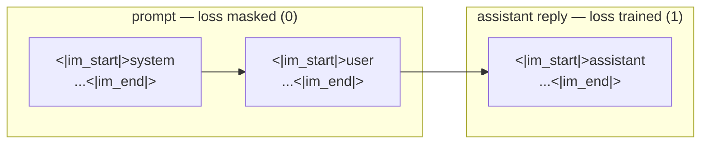

# 05 — SFT: chat template, SmolTalk, TRL's `SFTTrainer`

Previous: [04_pretraining.md](04_pretraining.md) · Next: 06 (coming next)

## What you will learn

- What SFT (Supervised Fine-Tuning) actually changes in a model, and what it does not
- The chat template: turning a list of `{"role", "content"}` messages into the single string a
  causal LM trains and generates on, with the `` Jinja tags that mark which
  tokens belong to the assistant
- SmolTalk, the instruction dataset this chapter trains on, and one real example from it
- TRL's `SFTTrainer` and the handful of arguments that matter: `assistant_only_loss`, `max_length`,
  `packing`
- The real loss curve from fine-tuning `tiny-qwen35-110m-base` (chapter 04) on 50,000 SmolTalk
  conversations, and eight before/after generations, verbatim
- An honest read on what a 110M SFT model can and cannot do, and how Qwen's real SFT recipe
  differs at scale

This chapter's `train` command needs a GPU and the base model from chapter 04, so it runs on `rtx`
via `just gpu-free` + `just remote-bg`. The CPU tests use a synthetic 2-layer model and a tiny
tokenizer instead — no downloads, no GPU.

---

## 1. What SFT is, and what it is not

Chapter 04 left us with `tiny-qwen35-110m-base`: a model that has learned English syntax and
shallow facts from 1.5B tokens of web text, and does one thing — predict the next token of
whatever text it is given. Ask it "What is the capital of France?" and it will happily continue
that string as if it were an exam question, not answer it (§7 shows exactly this).

SFT does not add much new knowledge. The base model already saw most of the facts it will ever
know during pre-training; 50,000 conversations is a rounding error next to 1.5B pre-training
tokens. What SFT teaches is **format and behaviour**: that a `<|im_start|>user\n...` turn should
be followed by a helpful `<|im_start|>assistant\n...` turn, that answers should stop rather than
ramble on forever, that "write a function" means emit code, not repeat the request. This is a
widely-replicated finding (see Zhou et al., ["LIMA: Less Is More for
Alignment"](https://arxiv.org/abs/2305.11206)) — instruction tuning mostly reorganizes what the
base model already knows into a helpful shape, and a surprisingly small, high-quality dataset can
do most of that reorganizing. §6's real generations show this pattern clearly: the SFT model gets
the *format* right almost every time and the *facts* right much less often.

---

## 2. The chat template

A "chat template" is a [Jinja2](https://jinja.palletsprojects.com/) string, stored as
`tokenizer.chat_template`, that turns a Python list of messages into the one flat string the model
actually trains and generates on. `project/src/llm_tutorial/chat.py`'s `CHAT_TEMPLATE` is a
ChatML-style template — the format Qwen and most open chat models use — built entirely from tokens
our chapter-02 tokenizer already has:

```
<|im_start|>system
You are a helpful assistant.<|im_end|>
<|im_start|>user
hello world<|im_end|>
<|im_start|>assistant
how are you<|im_end|>
```

Every turn is wrapped in `<|im_start|><role>\n...<|im_end|>\n`; `<|im_start|>` and `<|im_end|>`
were already reserved as special tokens when the tokenizer was trained (chapter 02's
`SPECIAL_TOKENS`) — this chapter only teaches the tokenizer how to *arrange* them, via
`attach_chat_template(tokenizer)`. If no `system` message is given, a default ("You are a helpful
assistant.") is inserted automatically, as shown above.

**The `` tags are not decoration.** Wrapped around the assistant's content in the
template source:

```jinja
{{ '<|im_start|>assistant\n' }}
{{ message['content'] + '<|im_end|>\n' }}
```

they tell `tokenizer.apply_chat_template(..., return_assistant_tokens_mask=True)` exactly which
tokens are "assistant" tokens, producing an `assistant_masks` array of 0s and 1s alongside
`input_ids`. TRL's `assistant_only_loss=True` (§4) uses this same mask to zero out the loss on
every non-assistant token. Without the tags, both calls raise — there is no way to infer the mask
from the rendered string alone once whitespace and role tokens are stripped away.



**Why `eos_token` changes to `<|im_end|>`.** During pre-training, EOS was `<|endoftext|>` — the
boundary between unrelated documents in a packed shard. `attach_chat_template` sets
`tokenizer.eos_token = "<|im_end|>"` instead: the boundary that matters now is the end of the
assistant's turn, so `generate()` should stop there rather than run on and hallucinate a fake next
user turn. This is not just relabeling a Python attribute — `<|im_end|>` sits *inside* the
`` span, so the training loss is actively teaching the model to produce this exact
token as its stop signal.

**How the real Qwen3.5 template differs.** `Qwen/Qwen3.5-0.8B`'s actual `chat_template` is 7,755
characters — 170× longer than ours — because it also handles `<think>...</think>` reasoning blocks
(togglable via `enable_thinking=True/False`), tool/function-call turns, and multi-modal content.
Rendering one plain user turn through it:

```
$ uv run python -c "from transformers import AutoTokenizer; t=AutoTokenizer.from_pretrained('Qwen/Qwen3.5-0.8B'); print(t.apply_chat_template([{'role':'user','content':'What is the capital of France?'}], tokenize=False, add_generation_prompt=True))"
<|im_start|>user
What is the capital of France?<|im_end|>
<|im_start|>assistant
<think>

</think>

```

Same ChatML skeleton as ours (`<|im_start|>role\n...<|im_end|>`), plus an empty `<think>` block
inserted automatically before the assistant's turn even when no reasoning content is present —
real Qwen3.5 SFT data always includes this block, thinking or not, so the model learns to always
emit it. We skip thinking-mode entirely in this chapter (§7 revisits why).

---

## 3. SmolTalk

[SmolTalk](https://huggingface.co/datasets/HuggingFaceTB/smoltalk) is the instruction dataset
HuggingFace's SmolLM team built specifically for training *small* models (their own SmolLM2
family, 135M–1.7B parameters) — it favours a diverse mix of shorter, high-quality conversations
over the long, complex multi-turn dialogues that only larger models can make good use of.
Apache-2.0 licensed, it's a mixture of newly-generated and existing datasets, several curated
subsets used here:

- **`smol-magpie-ultra`**: multi-turn conversations generated with the
  [Magpie](https://arxiv.org/abs/2406.08464) method (prompting a strong model — Llama-3.1-405B —
  to generate both sides of a conversation from scratch), covering broad general instruction
  following.
- **`smol-constraints`**: instructions with an explicit constraint the answer must satisfy (e.g.
  "do not use the word X", "answer in exactly N sentences") — directly relevant to our
  `constraint` eval prompt in §6.
- **`smol-summarize`**: summarization-specific instruction data.

One real example from `smol-magpie-ultra` (truncated for length; the actual conversation continues
for two more turns):

> **user:** Jim has won a vacation at a lake resort and can choose to travel to either lake A or
> lake B. Lake A has a 20% chance of rain spoiling the vacation while lake B has a 40% chance of
> rain. The cost of travel to lake A is $200 higher than that to lake B. What are some factors Jim
> might consider in making a decision on which lake to choose.
>
> **assistant:** To make an informed decision, Jim should weigh the potential risks and costs
> associated with each option. One key factor to consider is the likelihood of rain spoiling the
> vacation. Lake A has a lower chance of rain, at 20%, which increases the likelihood of a
> pleasant vacation. On the other hand, lake B has a higher chance of rain, at 40%, which may lead
> to a less enjoyable experience. [...]

Notice the shape: a substantial, well-organized answer that directly addresses the question — this
is exactly the *behaviour* §1 said SFT is teaching, regardless of whether the base model already
"knew" any of these specific facts.

---

## 4. TRL's `SFTTrainer`

Unlike chapter 04's hand-written training loop, this chapter delegates the loop, batching,
optimizer, and — crucially — the assistant-only loss mask to TRL's `SFTTrainer`
(`project/src/llm_tutorial/sft.py::train`):

```python
args = SFTConfig(
    num_train_epochs=config.epochs,
    learning_rate=config.lr,
    lr_scheduler_type=config.schedule,
    warmup_steps=warmup_steps,
    per_device_train_batch_size=config.per_device_batch,
    gradient_accumulation_steps=config.grad_accum,
    bf16=True,
    max_length=config.max_len,
    packing=config.packing,
    assistant_only_loss=config.assistant_only_loss,
)
trainer = SFTTrainer(model=model, args=args, train_dataset=..., eval_dataset=..., processing_class=tokenizer)
trainer.train()
```

The handful of arguments that matter for this chapter:

- **`assistant_only_loss=True`** — the flag name confirmed against the installed `trl` (1.12)
  before writing any code (`inspect.signature(trl.SFTConfig)`); it relies entirely on the
  `` tags from §2. This is what makes SFT different from just continuing
  pre-training on chat-shaped text: without it, the model would spend just as much gradient signal
  learning to *predict the user's next question* as learning to answer it.
- **`max_length: 2048`, `packing: false`** — conversations are padded/truncated to 2048 tokens
  individually rather than packed end-to-end into fixed-length blocks (chapter 02's pre-training
  strategy). Packing multiple conversations into one sequence would let one conversation's tokens
  attend across an unrelated conversation's boundary unless a custom attention mask is built for
  it; disabling packing is the simplest thing that cannot leak context between conversations.
- **`lr: 1e-4`** — noticeably higher than the ~1e-5 typical for full-parameter SFT of a 7B model.
  This is a small model (110M) doing full fine-tuning (no LoRA — that's chapter 09) on relatively
  few examples (50k) for only 2 epochs: it needs a bigger step per update to move the loss
  meaningfully in that few steps than a 70×-larger model, which has vastly more parameters
  spreading the same gradient signal thinner, would.
- **`epochs: 2`, `warmup_ratio: 0.03`, `schedule: cosine`** — a short warmup (3% of steps) into a
  cosine decay, the same schedule shape as chapter 04's pre-training run, just far fewer total
  steps.

`filter_by_length` (§5) does one more thing worth calling out here: rather than a text heuristic,
it calls the *exact same* `apply_chat_template(..., return_assistant_tokens_mask=True)` TRL's
trainer will call, and drops any row whose mask is all zero. This mattered in practice — see the
troubleshooting table.

---

## 5. Data preparation

`prepare_dataset` loads the three subsets, keeps only the `messages` column, filters, shuffles,
and splits into non-overlapping train/eval slices — all against `configs/sft_smoltalk.yaml`:

```yaml
run_name: sft_110m_smoltalk
base: runs/models/tiny-qwen35-110m-base
dataset: HuggingFaceTB/smoltalk
subsets: [smol-magpie-ultra, smol-constraints, smol-summarize]
n_train: 50000
n_eval: 1000
max_len: 2048
epochs: 2
lr: 1.0e-4
warmup_ratio: 0.03
schedule: cosine
per_device_batch: 16
grad_accum: 2
num_proc: 16   # rtx has 32 cores; parallel tokenization for the length filter
```

`filter_by_length(ds, tokenizer, max_len, num_proc)` is exposed separately (and unit-tested) so
the length/mask filter can be checked in isolation on a tiny synthetic dataset without touching the
real 1.2M-row combined subsets, which took roughly 2–3 minutes to filter with `num_proc=16` on
`rtx` — single-process filtering of the same data would take closer to half an hour.

---

## 6. The real run: loss curve, before/after

**Run summary** (`runs/sft_110m_smoltalk/metrics.json`, produced on `rtx`, RTX 4090 24 GB, `trl
1.12`, `transformers 5.16`, on 2026-08-30):

| | |
|---|---|
| train examples | 50,000 |
| eval examples | 1,000 |
| epochs | 2 |
| total steps | 3,126 |
| tokens trained | ≈111.9M |
| wall time | 4,157 s ≈ **69 minutes** |
| peak GPU memory | 3.55 GB |
| final train loss | 1.806 |
| final eval loss | **1.884** |
| final eval mean token accuracy | 58.3 % |


| step | epoch | eval loss | eval token accuracy |
|---|---|---|---|
| 200 | 0.13 | 2.120 | 54.7 % |
| 800 | 0.51 | 1.952 | 57.2 % |
| 1,400 | 0.90 | 1.901 | 58.0 % |
| 2,000 | 1.28 | 1.886 | 58.2 % |
| 2,600 | 1.66 | 1.884 | 58.3 % |
| 3,126 | 2.00 | 1.884 | 58.3 % |

The curve's shape is worth reading carefully: eval loss drops steeply for the first epoch (2.12 →
1.89 by epoch 0.9) and is essentially flat for the entire second epoch (1.886 at epoch 1.28 down to
1.884 at the very end). Almost all of the useful learning happened in epoch 1 — the second epoch of
`epochs: 2` bought very little beyond what one epoch already achieved on this dataset size. Peak
GPU memory (3.55 GB) is far under the 4090's 24 GB — SFT on a 110M model is cheap; the bottleneck
here was wall-clock (69 minutes for 3,126 steps), not memory.

**Before/after generations, verbatim** (full table: `runs/sft_110m_smoltalk/samples.md`; 4 of the
8 fixed prompts from `configs/eval_prompts.yaml`, quoted here):

> **question** — *What causes the seasons on Earth?*
>
> base: "What are the factors that make the seasons on Earth more important? What is the weather
> on Earth? What is the weather on Earth? What is the weather on Earth? [...repeats...]"
>
> SFT: "The seasons on Earth can be thought of as a gradual process that spans multiple seasons,
> each corresponding to a specific cycle or cycle. This is known as the 'Echo Effect' or
> 'Hurricanes Effect.' The 'Hurricanes Effect' refers to the gradual process of decreasing or
> losing water vapor in the atmosphere, leading to the formation of clouds [...]"

> **who_are_you** — *Who are you?*
>
> base: "How many times have you been called up by your teacher?.................." (over a
> hundred literal `.` characters follow)
>
> SFT: "I'm a passionate and passionate person with a passion for helping people improve their
> lives and communities. I'm passionate about sharing their stories, sharing their stories, and
> sharing their stories with others. I'm excited to see where you take your work and how it can
> benefit everyone involved."

> **python_function** — *Write a Python function that returns the square of a number.*
>
> base: "Write a function that returns the square of a number.soon Write a function that returns
> the square of a number.soon [...repeats the prompt back, verbatim, dozens of times...]"
>
> SFT: "Here's a Python function that returns the square of a number:
> ```python
> def square_number_numbers(numbers):
>     return square_number_numbers(numbers)
> ```
> This function takes the square of the numbers as input and prints the square of the number in
> the list. If it finds a square number, it returns `num_num_num`. [...]"

> **follow_up** — *What is the capital of Japan? → How many people live there?*
>
> base: "The capital of Japan is Shinto What is the capital of Japan?reeks?reeks?reeks?reeks?
> [...degenerates into a repeated fragment...]"
>
> SFT: "The capital of Japan is Tokyo. There are approximately 50,000 people, and the capital is
> Tokyo. The capital is Tokyo, which is the largest city in the world. The capital is Tokyo, which
> is located in the heart of the city. The capital is Tokyo."

The pattern across all 8 prompts (not just these 4) is consistent: **the base model does not
answer at all** — it echoes/rephrases the prompt or degenerates into a repeated token loop, because
it has never seen a `<|im_start|>assistant\n` header followed by an actual answer. **The SFT model
always attempts an answer**, in the right format, stopping cleanly at `<|im_end|>` instead of
rambling into a hallucinated next turn (compare the base model's `follow_up` output, which invents
a fake second "What is the capital of Japan?" question, to the SFT model's clean single reply).

---

## 7. Quality at 110M — an honest read

Reading the SFT column in §6 again with a critical eye: it correctly names Tokyo as Japan's
capital, but invents "approximately 50,000 people" — off by roughly three orders of magnitude
(Tokyo's population is ~14 million; the greater metro area ~37 million). The `who_are_you` answer
is fluent and on-topic but generic filler, not a real self-description. The `python_function`
answer produces syntactically valid Python with the right shape (`def ...(): return ...`) but the
function is wrong — it calls itself recursively with no base case and returns the input, not its
square.

This is the expected shape of a 110M SFT model, not a bug: **it has learned the format and the
conversational behaviour extremely well (as §6's steep first-epoch loss drop and the clean
`<|im_end|>` stopping shows) and picked up almost no new factual reliability from just 50k
examples**, because 110M parameters simply do not have the capacity to store and retrieve facts
precisely, and SFT was never meant to teach facts in the first place (§1). At 4B–27B parameters —
the range chapter 04's `index.md` targets as this tutorial's eventual scale — the same SFT recipe
on a much larger pre-trained base (with proportionally more stored factual associations, per
Chinchilla-style scaling) produces answers that are both well-formatted *and* substantially more
factually reliable; the format-learning story in this chapter generalizes, the factual-reliability
story does not — that is squarely a base-model-capacity story, not an SFT-recipe story.

**How Qwen does SFT, for comparison.** Qwen3's own [technical
report](https://arxiv.org/abs/2505.09388) and follow-on notes from
[Unsloth](https://unsloth.ai/blog/qwen3) on the Qwen3.x family describe a much larger and more
structured SFT stage than ours: reasoning ("thinking mode", the `<think>...</think>` blocks §2
showed) and non-reasoning data are deliberately mixed in the same SFT run, with Unsloth's notes
citing a rule of thumb of keeping **≥75% of SFT examples as reasoning-style ("thinking") examples**
to prevent the model's chain-of-thought behaviour from degrading — too much short-answer,
non-thinking data during SFT measurably erodes a model's ability to reason step-by-step, even if
that capability was present after pre-training/earlier RL stages. We use 0% thinking data here
(§2) because `tiny-qwen35-110m-base` never saw a `<think>` block and 110M parameters plus 50k
examples is not a setting where chain-of-thought training would pay for itself — this is squarely
a "format and behaviour" chapter, and thinking-mode SFT is out of scope until a much larger base
model justifies it.

---

## Troubleshooting

| symptom | cause | fix |
|---|---|---|
| `assistant_only_loss=True` raises "chat template does not contain ``" (or similar) at training start | the tokenizer's `chat_template` lacks the `...` tags around assistant content | use `attach_chat_template` from `chat.py`, or add the tags to a custom template — `assistant_only_loss` and `return_assistant_tokens_mask=True` both require them |
| `RuntimeError: ... at least one example has no assistant tokens` partway through training, after the (slow) dataset filter already ran | some rows have no non-empty assistant turn, or — subtler — the tokenizer silently drops a character (our chapter-02 tokenizer drops a lone `{` right after a newline, common in JSON-formatted answers), zeroing that row's entire assistant mask | `filter_by_length` calls the exact `apply_chat_template(..., return_assistant_tokens_mask=True)` TRL uses and drops any row with an all-zero mask *before* training starts — the same check, just moved earlier and made cheap to fail |
| the model never stops generating, running on past a sensible answer | `eos_token` was never changed from `<|endoftext|>` (chapter 04's pre-training EOS) to `<|im_end|>` | call `attach_chat_template(tokenizer)`, which sets `tokenizer.eos_token = "<|im_end|>"`, and pass `eos_token_id=tokenizer.convert_tokens_to_ids("<|im_end|>")` to `generate()` (`chat.py::chat` does both) |
| `CUDA out of memory` during SFT | activation memory scales with `per_device_batch × max_len` | lower `max_len` (fewer conversations get through the filter, but each is cheaper) and/or halve `per_device_batch`, doubling `grad_accum` to keep the same effective batch |
| dataset filtering is very slow (tens of minutes for ~1M rows) | `.filter()` defaults to a single process; tokenizing + rendering the chat template per row is not free | pass `num_proc` (rtx has 32 cores; `num_proc: 16` brought a 409k-row subset's filter from single-process to ~70 s) |

## Exercises

1. **One epoch instead of two.** §6's eval loss table shows almost the entire drop happens in
   epoch 1 (2.12 → 1.886) with epoch 2 buying only 1.886 → 1.884. Rerun with `epochs: 1` — is the
   final eval loss meaningfully worse, or within noise of the 2-epoch run's?
2. **Turn packing on.** Set `packing: true` and rerun. Does `tokens_trained` per wall-clock second
   improve (more tokens processed per step since padding waste drops)? Does eval loss change?
3. **Drop `assistant_only_loss`.** Set it to `False` and rerun on a small subset (e.g. `n_train:
   5000`). Compare the generations in a fresh `compare()` run against this chapter's — does the
   model now also try to *ask* questions back, having been trained to predict the user's turns too?
4. **Vary the subset mix.** Retrain using only `smol-constraints`. Does the model get noticeably
   better at the `constraint` eval prompt (§6, not quoted above — see `samples.md`) at the cost of
   general fluency on the others?
5. **Raise the learning rate further.** Try `lr: 3e-4` (3× this chapter's value) — does training
   diverge (loss spikes / `nan`), or does it converge faster to a similar final eval loss?

---

Previous: [04_pretraining.md](04_pretraining.md) · Next: 06 (coming next)

Numbers in this chapter: `project/runs/sft_110m_smoltalk/{metrics.json,samples.md,loss.png}`,
produced on `rtx` (RTX 4090, 24 GB) on 2026-08-30 with `trl 1.12`, `transformers 5.16.1`, `torch
2.13.0+cu130`.
