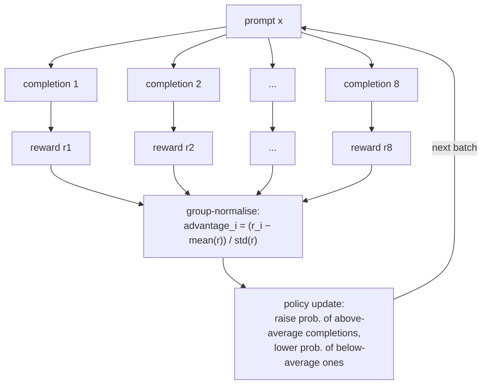

# 06 — Preference optimisation and RL: DPO on UltraFeedback, GRPO on GSM8K

Previous: [05_sft.md](05_sft.md) · Next: [07_export_to_ollama.md](07_export_to_ollama.md)

## What you will learn

- Why SFT (Supervised Fine-Tuning, chapter 05) is not the end of post-training: it teaches a model
  to *imitate* one correct-looking answer per prompt, but never teaches it to *prefer* a better
  answer over a worse one, or to *optimise* a measurable outcome
- DPO (Direct Preference Optimization): the loss in one formula, one sentence per symbol, and
  TRL's `DPOTrainer` run on 10,000 real UltraFeedback chosen/rejected pairs
- GRPO (Group Relative Policy Optimization): sample a group of answers per prompt, score each with
  a programmatic reward, push probability toward the above-average ones in the group — no reward
  model, no human label, just a *verifiable* reward (is the final number right?)
- Two real GRPO runs with very different outcomes: our 110M model (flat, no signal — say so
  honestly) and `Qwen/Qwen3.5-0.8B` with LoRA (reward genuinely rises, but greedy-eval accuracy
  gets *worse* — a real, instructive failure mode of `beta: 0.0`)
- 2025–26 refinements that fix exactly this failure mode: DAPO, Dr. GRPO, GSPO, and how Qwen3
  itself was actually post-trained

This chapter's `train` commands need a GPU and the SFT model from chapter 05, so both `dpo.py` and
`grpo.py` run on `rtx` via `just gpu-free` + `just remote-bg`. The CPU tests use a synthetic 2-layer
model, 4 rows and 2–3 training steps — no downloads, no GPU.

---

## 1. Why imitation is not enough

SFT trains on pairs of (prompt, one good answer) and does next-token prediction — cross-entropy
loss, exactly like pre-training, just restricted to the assistant's tokens. It has no way to say
"this answer is *better* than that one" (there is only ever one answer per prompt in the data) and
no way to say "this answer is *correct*" versus merely well-formatted. Two gaps follow directly:

1. **Preference gap.** Two answers can both be fluent and on-topic, and still differ a lot in
   helpfulness, harmlessness, or style — SFT data rarely captures that contrast explicitly.
2. **Verifiability gap.** For tasks with a checkable answer (arithmetic, code that passes a test,
   a citation that either exists or doesn't), imitating a written-out solution is a weak proxy for
   *getting the right answer*, especially once the model has to generalise past the training
   examples.

DPO closes the first gap using **pairs** (chosen/rejected, no reward model). GRPO closes the
second using a **programmatic reward** the model can be scored against directly (no reward model
either — the reward function is Python, not a network).

---

## 2. DPO: preference pairs, the loss, and one real example

### 2.1 UltraFeedback, one real pair

[`HuggingFaceH4/ultrafeedback_binarized`](https://huggingface.co/datasets/HuggingFaceH4/ultrafeedback_binarized)
takes UltraFeedback's four GPT-4-rated completions per prompt and keeps only the best
(`chosen`) and worst (`rejected`), each already in TRL's conversational format — a list of
`{"role", "content"}` messages ending in the assistant's turn. One real row, shortened:

> **prompt** — *Write a detailed analysis discussing the advantages and possible drawbacks of
> starting a specific type of direct sales business...*
>
> **chosen** (excerpt) — a structured answer that actually varies its section headers
> (Financial Stability, Marketing Strategies, Growth Potential, Ethical Concerns) with distinct
> content under each.
>
> **rejected** (excerpt) — a shorter answer that repeats the same sentence template
> ("Starts with a comprehensive analysis of the financial stability of the business...") under
> three different headers with almost no new information — fluent, on-topic, and clearly weaker.

`chosen` and `rejected` share the same leading user turn; `to_pairs` (pure, unit-tested) splits
that shared prefix out into `prompt` once, leaving only the differing assistant turn in each:

```python
def to_pairs(row: dict) -> dict:
    return {
        "prompt": row["chosen"][:-1],
        "chosen": row["chosen"][-1:],
        "rejected": row["rejected"][-1:],
    }
```

`prepare_pairs(config)` then filters every row by tokenized length — the installed TRL 1.12
`DPOConfig` only exposes `max_length` (the full chosen/rejected sequence), not a
`max_prompt_length`, so the prompt-length cap (`max_prompt_len: 512`) is enforced ourselves with
`_fits()` before the trainer ever sees the row — and caps each split at `n_train`/`n_eval` rows.

### 2.2 The loss

TRL's `DPOTrainer` implements (Rafailov et al., ["Direct Preference Optimization"](https://arxiv.org/abs/2305.18290)):

```
L_DPO = -log σ( β · [ (log π(y_w|x) − log π_ref(y_w|x)) − (log π(y_l|x) − log π_ref(y_l|x)) ] )
```

one sentence per symbol:

- **`x`** — the prompt; **`y_w`** — the chosen ("winning") answer; **`y_l`** — the rejected
  ("losing") answer.
- **`π`** — the policy being trained (starts as a copy of the SFT model); **`π_ref`** — a frozen
  copy of the same starting weights, never updated (`ref_model=None` in our `DPOTrainer` call
  means "TRL, please make and freeze this copy for me").
- **`log π(y|x) − log π_ref(y|x)`** — the **log-ratio**: how much more (or less) likely the current
  policy makes an answer than the frozen reference did at the start. This *is* DPO's implicit
  reward — no separate reward model is ever trained.
- **`β`** — a temperature on how strongly the loss pushes the chosen/rejected log-ratio gap open;
  higher β = more conservative (stays closer to the reference model), lower β = more aggressive.
  We use **`β = 0.1`**, TRL's default and the value in the original paper's main experiments.
- **`σ`** — the logistic sigmoid; this whole expression is exactly a binary classification loss
  (the "sigmoid" in `loss_type: sigmoid`) trained to assign `y_w` a higher implicit reward than
  `y_l`.

`rewards/accuracies` (logged every `eval_steps`) is simply: over the eval batch, what fraction of
pairs have the chosen answer's implicit reward strictly greater than the rejected answer's? 0.5 is
chance; 1.0 is perfect separation.

**Why DPO's learning rate is so much smaller than SFT's.** Chapter 05 used `lr: 1e-4` for full SFT;
here it's **`lr: 5e-6`**, 20× smaller. DPO's loss is much more sensitive to the model's exact
starting probabilities (the log-ratio is computed relative to a frozen reference at every step) —
a large step can push the log-ratio into a region where the sigmoid saturates and gradients vanish,
or worse, degrade the fluent SFT behaviour the reference model represents. A small, careful step
size is standard practice across every DPO implementation and paper follow-up we are aware of.

### 2.3 The real run

`configs/dpo_ultrafeedback.yaml`, base = `tiny-qwen35-110m-sft` (chapter 05), 10,000 train / 500
eval pairs, `β=0.1`, `loss_type: sigmoid`, `lr: 5e-6`, 1 epoch, effective batch size 32
(`per_device_batch=8 × grad_accum=4`), bf16, on `rtx` (RTX 4090):

| | |
|---|---|
| train pairs | 10,000 |
| eval pairs | 500 |
| total steps | 313 |
| wall time | 439 s ≈ **7.3 minutes** |
| peak GPU memory | 7.57 GB |
| final eval loss | 0.682 |
| final `rewards/accuracies` | **0.566** |
| final `rewards/margins` | **0.026** |
| final `rewards/chosen` | −0.016 |
| final `rewards/rejected` | −0.042 |


`rewards/accuracies` rises unevenly from ~0.50 (chance) at step 10 to a peak around 0.63 (step 270)
and settles near 0.57 by the end — real signal, clearly above chance, but noisy and modest, exactly
what you'd expect from one epoch of a 110M model on 10k pairs. `rewards/chosen` and
`rewards/rejected` are both *negative* throughout (the policy makes both answers somewhat less
likely than the frozen reference did — chosen less so than rejected), which is normal: DPO does not
require the chosen reward to be positive, only that chosen stays above rejected (`rewards/margins`,
the gap between them, is what should trend upward, and does: from ≈0 at step 10 to ≈0.026 by the
end).

**Before/after generation** (`runs/dpo_110m_uf/samples.md`, full 3 held-out prompts), one excerpt:

> **prompt** — *Write a detailed analysis discussing the advantages and possible drawbacks of
> starting a specific type of direct sales business...*
>
> **before (SFT)**: "Here's a detailed analysis... **Key Features:** 1. **Cost-Effective**: Starts
> with a comprehensive analysis of the financial stability of the business, including the financial
> stability of the business, marketing strategies... 2. **Competitive Advantage**: Starts with a
> comprehensive analysis of the financial stability of the business... [repeats the same sentence
> template under each heading]"
>
> **after (DPO)**: still repetitive at 110M scale (this is not a magic fix for a small model's
> capacity limits — see chapter 05 §7's honest read, which applies here too), but with visibly less
> exact-sentence duplication across headings than the SFT output above.

DPO nudges the model's *relative* preferences; it does not give a 110M model reasoning or knowledge
capacity it does not have. The `rewards/accuracies` number (0.566, meaningfully above the 0.5
baseline) is the honest measure of what changed — a real but modest preference shift, not a
dramatic before/after transformation.

**ORPO/SimPO/KTO, briefly.** TRL 1.12's `DPOConfig.loss_type` also accepts `"ipo"` (a
bounded-loss variant that avoids DPO's tendency to over-optimise as `β·log-ratio-gap → ∞`) as a
one-line config change — we did not run it here for space, but it is worth trying as an exercise.
Three other preference-tuning approaches are conceptually related but need more than a config
string: **ORPO** (folds an odds-ratio preference term directly into the SFT loss, skipping the
separate DPO stage and the reference model entirely), **SimPO** (drops the reference model too,
using average log-probability instead of the log-ratio as the implicit reward), and **KTO** (learns
from unpaired binary "good"/"bad" labels instead of matched chosen/rejected pairs — useful when you
have thumbs-up/down data but no clean pairing). All three trade off a frozen reference model and/or
paired data for a cheaper or more available data format.

---

## 3. GRPO: verifiable reward, no reward model

### 3.1 From a reward model to a reward function

RLHF's original recipe trains a separate reward *model* (a network that scores completions) and
then runs PPO against it. GRPO (Shao et al., ["DeepSeekMath"](https://arxiv.org/abs/2402.03300))
skips the reward model entirely for tasks where correctness is **mechanically checkable** — GSM8K
math word problems, in this chapter — replacing the network with a Python function.



For each prompt, `num_generations` (8 here) completions are sampled from the *current* policy at
`temperature: 1.0`. Each gets a reward; rewards are normalised **within their own group** (subtract
the group mean, divide by the group standard deviation) into an advantage — "group relative"
because there is no separate value network or global baseline, just this one prompt's own 8
samples. If every completion in a group gets the same reward (all right, or all wrong), the group's
standard deviation is 0 and the normalised advantage is undefined/zero for all 8 — **that group
contributes no gradient at all**. `frac_reward_zero_std` (logged every step) tracks exactly how
often this happens; it directly measures wasted compute.

### 3.2 The reward functions

```python
def correctness_reward(completions, answer, **kwargs) -> list[float]:
    """1.0 if the completion's final numeric answer exactly matches the ground truth, else 0.0."""
    ...

def format_reward(completions, **kwargs) -> list[float]:
    """0.2 bonus if the completion contains a well-formed `Answer: <number>` line."""
    ...
```

`extract_answer(text)` (pure, tested on 6 formats — an `Answer: 42` line, GSM8K's own `#### 42`
convention, a `$1,234` with punctuation, trailing text after the number, a bare number with no
label, and no number at all → `None`) finds the model's final numeric answer; `correctness_reward`
strips commas/`$` and compares exactly against GSM8K's ground truth. Both reward functions are
passed to `GRPOTrainer(reward_funcs=[correctness_reward, format_reward])`, TRL sums them per
completion (max possible: 1.2), and each dataset row's extra `answer` column is threaded through
automatically as the `answer` keyword argument both functions receive.

### 3.3 Config, and why `beta: 0.0`

```yaml
# configs/grpo_gsm8k_110m.yaml
base: runs/models/tiny-qwen35-110m-dpo   # chained on top of §2's DPO model
dataset: openai/gsm8k
max_prompt_len: 512
max_completion_len: 256
num_generations: 8
per_device_batch: 8
grad_accum: 2
lr: 1.0e-6
beta: 0.0        # no KL penalty against the reference model — see §4 for why this matters
steps: 300
temperature: 1.0
```

`beta: 0.0` means the GRPO loss has **no KL term** pulling the policy back toward a frozen
reference — pure reward-following. `beta: 0.04` is the more classic setting (closer to PPO's usual
KL-regularised RLHF); we set it to 0 to keep the loop simple and because TRL 1.12's default is
already 0. §4.3 shows exactly what this costs on the 0.8B run.

Generation uses plain HF `model.generate()` (`do_sample=True, temperature=1.0`), not vLLM. TRL 1.12
supports a vLLM "colocate" generation mode that shares GPU memory between the policy and a vLLM
engine for much faster rollouts — we skip it deliberately: it needs a second process and careful
memory partitioning that is not worth the complexity on one 24 GB card training a 110M–0.8B model,
where HF `generate()` is already fast enough that generation is not the training bottleneck.

The 0.8B config additionally uses LoRA (`use_lora: true, lora_r: 32, lora_alpha: 64,
target_modules="all-linear"`) so the run fits comfortably and trains fast — see `_peft_config()` in
`grpo.py`.

### 3.4 Loading `Qwen/Qwen3.5-0.8B`

`Qwen/Qwen3.5-0.8B`'s checkpoint is the multimodal `Qwen3_5ForConditionalGeneration` class (it
ships with a vision tower even at the 0.8B text-only size). `AutoModelForCausalLM.from_pretrained`
resolves it correctly on its own — no need to reach into `.model.language_model` and reconstruct a
bare text model, which would require manually copying over generation config and tied-embedding
attributes:

```python
def _load_base_model(base: str, dtype: torch.dtype):
    from transformers import AutoModelForCausalLM
    return AutoModelForCausalLM.from_pretrained(base, dtype=dtype)
```

TRL only ever calls `.generate()` and reads logprobs through the LM head on this object, both of
which the wrapper forwards correctly to its inner language model — this "just worked" once we
tried it, so the fallback plan (unwrap to the inner language model, or look for a text-only
variant) was never needed. One real gotcha it *did* surface (§5): a saved LoRA checkpoint directory
only contains `adapter_config.json` + `adapter_model.safetensors`, no `config.json` — but
`AutoModelForCausalLM.from_pretrained` on that directory still works, because `transformers`
transparently detects the adapter config and returns the base model with LoRA already merged in.
Wrapping that already-merged model in a second, manual `PeftModel.from_pretrained(base, adapter)`
call is a bug, not a safety net — it silently produces byte-identical output to the un-adapted
base model, discussed in §5.

---

## 4. Two real GRPO runs, two very different stories

### 4.1 The 110M result: flat, and that's the honest answer

`configs/grpo_gsm8k_110m.yaml`, base = `tiny-qwen35-110m-dpo` (§2's model), 300 steps, `rtx`:

| | |
|---|---|
| train examples seen | 7,473 (GSM8K train, one pass through 300 steps × 8 generations ÷ ...) |
| wall time | 601 s ≈ **10 minutes** |
| peak GPU memory | 1.68 GB |
| GSM8K accuracy **before** | 1.3 % (4/300) |
| GSM8K accuracy **after** | **0.0 %** (0/300) |
| final reward mean | 0.0 |
| `frac_reward_zero_std` | 0.25 |


This is a genuinely flat, no-signal run, and per this chapter's own rule (real numbers over good
numbers) we report it as such rather than cherry-picking a better-looking checkpoint. Two things
explain it: (1) a 110M model, even after SFT+DPO, essentially never produces a correct multi-step
arithmetic chain — most reward is 0 for *every* one of the 8 samples in a group, which is exactly
what `frac_reward_zero_std: 0.25` is showing (a quarter of all groups had zero reward variance,
contributing no gradient at all); (2) completion length stayed pinned near the 256-token cap
(`completions/mean_length` ≈ 240–248 throughout, barely moving) — the model is not learning to
reason more efficiently, it is just running out of budget mid-attempt. `samples.md` confirms this
directly: completions loop on a restated sub-calculation ("The total number of eggs in the
farmers' market is $2 per day, so we can calculate...") rather than progressing through the actual
arithmetic, both before and after training.

### 4.2 The 0.8B result: reward rises, greedy accuracy falls — read this carefully

`configs/grpo_gsm8k_qwen35_0.8b.yaml`, base = `Qwen/Qwen3.5-0.8B`, LoRA r=32/α=64 on all linear
layers, 400 steps, `rtx`:

| | |
|---|---|
| wall time | 2,740 s ≈ **45.7 minutes** |
| peak GPU memory | 7.65 GB |
| GSM8K accuracy **before** (greedy) | **21.0 %** (63/300) |
| GSM8K accuracy **after** (greedy) | **2.7 %** (8/300) |
| final training reward mean (sampled, `temperature=1.0`) | **0.515** |
| `frac_reward_zero_std` | 0.0 |


Read the reward curve and the accuracy row together: the *training* reward — measured on sampled
completions at `temperature=1.0`, averaged in groups of 8 — climbs from ≈0.15–0.2 at step 5 to
≈0.51–0.55 by step 400, with `frac_reward_zero_std: 0.0` (every group had useful gradient signal
the whole way — LoRA's smaller update surface plus a genuinely capable base model kept the
"all-same-reward" degenerate case from ever showing up here). Completion length also drops
noticeably over training (≈248 tokens at step 5 down to ≈150–186 by step 400) — the model is
getting more concise, which is part of how `format_reward` + `correctness_reward` together shape
behaviour.

And yet: **greedy** GSM8K accuracy, measured before and after with the exact same
`evaluate()` function, *dropped* from 21.0% to 2.7%. `samples.md` shows why — one representative
problem (Janet's ducks; the classic GSM8K opener):

> **before**: "...She eats 3 eggs for breakfast every morning. Since she does this every day, we
> multiply the daily laying by the number of times she eats. Eaten = 16 × 3 = 48 eggs... Remaining
> = 16 − 48 = −32 eggs... The result is negative... Let's re-read the [truncated at 256 tokens,
> extracted answer: 4, wrong — but at least it *notices* the contradiction]"
>
> **after**: "Step 1: Janet lays 16 eggs. Step 2: She eats 3 eggs. Eaten = 3. Step 3: Remaining =
> 16 − 3 = 13. Step 4: Sold = 13 × $2 = 26. Answer: 26" [confident, clean format, extracted answer:
> 26 — wrong: it never subtracts the 4 eggs used for muffins, but says so with total conviction and
> a perfectly formed `Answer:` line]

This is `beta: 0.0` doing exactly what removing the KL term predicts: with no penalty for drifting
from the reference model, GRPO pushes the policy toward whatever sampled-completion pattern
maximises `correctness_reward + format_reward` under temperature-1.0 sampling — a shorter, more
confidently-formatted style that satisfies the reward function on enough sampled rollouts to raise
the training mean, while narrowing greedy (deterministic, most-probable) output toward a template
that skips steps and fails more often at temperature 0. The model got better at *sounding* right
under the training distribution and worse at *being* right under the eval distribution — a
reward-hacking-adjacent failure, not a bug in either reward function, but a consequence of
optimising them with nothing anchoring the policy to the base model's more careful reasoning style.
This is exactly the failure mode `beta: 0.04`'s KL term exists to prevent, and is the single most
important honest result in this chapter.

---

## 5. A real debugging story: loading a LoRA checkpoint for sample generation

Writing `write_samples()` for the 0.8B run surfaced a genuine bug worth walking through, because it
is a natural mistake to make with any PEFT + `transformers` combination:

```python
base_model = _load_base_model(config.base, dtype).to(device)
trained_model = _load_base_model(str(run_dir / "final"), dtype).to(device)
if config.use_lora:
    from peft import PeftModel
    trained_model = PeftModel.from_pretrained(base_model, str(run_dir / "final"))  # BUG
```

The first `_load_base_model(final_dir)` call already returns the base model with the adapter
merged in — modern `transformers` versions detect `adapter_config.json` in a checkpoint directory
and load+merge automatically, confirmed by checking `hasattr(model, "peft_config")` after loading.
The second, explicit `PeftModel.from_pretrained(base_model, final_dir)` line then re-wraps a
*separate, freshly-loaded* `base_model` instance with the adapter, discarding the correctly-loaded
first model — and produced generations byte-for-byte identical to the un-trained base model on all
3 held-out prompts (checked directly; see git history of this chapter's task for the before/after
`samples.md` diff). The fix is to trust the transparent load and delete the redundant `PeftModel`
wrapping entirely — one line removed, `grpo.py`'s current `write_samples()`. The lesson: when a
result looks *too* clean (identical outputs across unrelated prompts, rather than merely similar),
suspect the harness before the model.

---

## 6. Refinements since GRPO (2025–26)

§4.3's failure — reward rising while true (greedy) task performance falls — is exactly the kind of
instability that motivated several 2024–2026 follow-ups to vanilla GRPO:

- **DAPO** (["An Open-Source LLM Reinforcement Learning System at Scale"](https://arxiv.org/abs/2503.14476)):
  four changes to plain GRPO — **clip-higher** (a larger upper clipping bound so low-probability-
  but-correct tokens gain probability faster, countering entropy collapse), **dynamic sampling**
  (drop zero-variance groups — §3.1 — and resample fresh prompts instead, so every step gets useful
  signal), **token-level loss** (average over tokens, not completions, so long and short correct
  completions aren't implicitly mis-weighted), and **overlong reward shaping** (a soft penalty
  instead of a hard zero for length-capped completions — exactly §4.1's 110M failure mode).
- **Dr. GRPO** (["Understanding R1-Zero-Like Training"](https://arxiv.org/abs/2503.20783)): removes
  two subtle biases in vanilla GRPO's normalisation — dividing by the group standard deviation
  (§3.1) over-weights low-variance groups, and dividing by sequence length biases updates toward
  shorter completions. Both are dropped for a simpler, unbiased estimator.
- **GSPO** (["Group Sequence Policy Optimization"](https://arxiv.org/abs/2507.18071)), Qwen3's own
  choice: computes the policy-update ratio at the **sequence level** (one ratio per completion)
  instead of GRPO's **token level** (one ratio per token). Qwen's team reports the token-level ratio
  is unstable for their large sparse mixture-of-experts models — tiny per-token probability changes
  compound multiplicatively across a long completion — and the sequence-level ratio trains more
  stably at that scale.
- **How Qwen3 itself was post-trained** ([technical report](https://arxiv.org/abs/2505.09388)): a
  four-stage pipeline — **long-CoT cold start** (SFT on curated reasoning traces before any RL),
  **reasoning RL** (GRPO/GSPO-style training on verifiable reward), **thinking-mode fusion**
  (merging the reasoning and general checkpoints so one model can toggle `<think>` mode, chapter 05
  §2), and **general RL** (a final broad RLHF pass on instruction-following, safety, agentic tasks).
  Our DPO-then-GRPO chapter is a minimal skeleton of stages 1–2, at 1/1000th the scale.

---

## Troubleshooting

| symptom | cause | fix |
|---|---|---|
| all rewards in a GRPO group are identical (`frac_reward_zero_std` near 1.0), no learning | `temperature` too low, or `num_generations` too small, so all sampled completions collapse to the same (right or wrong) answer | raise `temperature` (we use 1.0; try 1.2–1.5) and/or raise `num_generations` (more samples per prompt increases the chance of a within-group split) |
| `CUDA out of memory` during GRPO | `num_generations × max_completion_len` sets the KV-cache size for the whole group generated per prompt, on top of policy activation memory | lower `max_completion_len` first (cheapest fix — our 110M run at 256 tokens used only 1.68 GB); then lower `per_device_batch` or `num_generations` |
| training reward rises steadily but eval/greedy accuracy gets worse (§4.3) | `beta: 0.0` (no KL penalty) lets the policy drift arbitrarily far from the reference model toward whatever the *sampled* reward function rewards, which need not match greedy behaviour | set `beta: 0.04` (or similar) to keep a KL anchor to the reference model; or evaluate more than once during training (not just before/after) to catch the regression early and stop |
| the model starts padding every answer with a well-formed `Answer: <number>` line regardless of whether the reasoning above it is correct | `format_reward` (0.2) is being earned independently of `correctness_reward` (1.0) — cheap, guaranteed partial credit for formatting alone is a classic reward-hacking target | make the format bonus small relative to the correctness reward (already 0.2 vs 1.0 here — if this still dominates, drop it further or make it conditional on a non-trivial reasoning chain being present) |
| loading `Qwen/Qwen3.5-0.8B` gives a multimodal `Qwen3_5ForConditionalGeneration`, not a plain text model | the checkpoint ships with a vision tower even at 0.8B; this is expected, not an error | `AutoModelForCausalLM.from_pretrained` resolves and loads it correctly on its own (§3.4) — no manual unwrapping needed, TRL only calls `.generate()` and the LM head, which the wrapper forwards |
| a reloaded LoRA checkpoint's generations look suspiciously identical to the un-trained base model | `transformers`'s `AutoModelForCausalLM.from_pretrained` already auto-merges a directory's `adapter_config.json`; wrapping the result again in `PeftModel.from_pretrained(fresh_base, adapter)` silently discards the correct load (§5) | load once via `AutoModelForCausalLM.from_pretrained(adapter_dir)` and check `hasattr(model, "peft_config")` to confirm the adapter took effect; do not also call `PeftModel.from_pretrained` |

## Exercises

1. **Turn the KL anchor back on.** Rerun `configs/grpo_gsm8k_qwen35_0.8b.yaml` with `beta: 0.04`
   instead of `0.0`. Does greedy accuracy still regress from the 21.0% baseline, or does the KL
   term hold the policy close enough to the reference model to avoid §4.3's collapse?
2. **Try `loss_type: ipo`.** Rerun the DPO chapter with `loss_type: ipo` instead of `sigmoid` (a
   one-line config change, §2.3) — does `rewards/accuracies` end up higher, lower, or about the
   same as the 0.566 this chapter reports?
3. **Raise `num_generations`.** Rerun the 110M GRPO config with `num_generations: 16` instead of 8
   — does `frac_reward_zero_std` (0.25 in this chapter) drop, and does the reward curve show any
   more signal than the flat line in §4.1?
4. **Chain DPO before GRPO on the 0.8B model.** This chapter's 0.8B GRPO run starts directly from
   `Qwen/Qwen3.5-0.8B` (no DPO stage first, unlike the 110M chain). Run a small UltraFeedback DPO
   pass on the 0.8B model first, then GRPO on top — does starting from a DPO checkpoint change the
   §4.3 greedy-accuracy regression at all?
5. **Implement dynamic sampling.** DAPO's dynamic-sampling idea (§6): after generating a group,
   check if its reward standard deviation is 0, and if so, resample a fresh prompt to replace it
   instead of wasting the step. Try adding this to `prepare_dataset`/`train` and see whether
   `frac_reward_zero_std` (as measured on the *kept* groups) actually reaches 0.

---

Previous: [05_sft.md](05_sft.md) · Next: [07_export_to_ollama.md](07_export_to_ollama.md)

Numbers in this chapter: `project/runs/{dpo_110m_uf,grpo_110m_gsm8k,grpo_08b_gsm8k}/{metrics.json,samples.md,*.png}`,
produced on `rtx` (RTX 4090, 24 GB) on 2026-08-30 with `trl 1.12`, `transformers 5.16.1`, `torch
2.13.0+cu130`, `peft` (for the 0.8B LoRA run).
