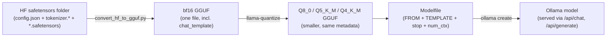

# 07 — Export to Ollama: safetensors → GGUF → quantised chat model

Previous: [06_preference_and_rl.md](06_preference_and_rl.md) · Next: 08 (coming next)

## What you will learn

- What **GGUF** is (llama.cpp's single-file model format) and why **Ollama** needs it instead of
  the Hugging Face safetensors folders every previous chapter produced
- Building **llama.cpp** from source on `rtx` (CUDA build), and how to check whether a given model
  architecture is supported by its converter *before* trusting a conversion to work
- Converting our `tiny-qwen35-110m-{base,sft,dpo}` checkpoints (chapters 04–06) to GGUF, then
  **quantising** them (Q8_0, Q5_K_M, Q4_K_M) — what those names mean, in bytes per parameter
- Writing an Ollama **Modelfile** by hand (`TEMPLATE`, `PARAMETER stop`, `num_ctx`) versus letting
  Ollama read the chat template GGUF already embeds — both routes, side by side
- `ollama create` / `ollama list` / `ollama show --modelfile`, and chatting with our own tiny model
- Proving the chat template is *actually* right with a reproducible HTTP check, and what an
  intentionally broken template does to the same weights (same model, worse answers, no error)
- The real cost of quantisation, measured as perplexity, on a 110M model — and why small models
  are more fragile under quantisation than the 27B model this knowledge base already runs

Everything in this chapter runs on `rtx`: GGUF conversion, quantisation and Ollama all need the
GGUF binaries and the Ollama service that live there. The CPU tests only check the pure functions
(`modelfile`, `ensure_chat_template`, `parse_perplexity_output`, `build_ollama_chat_payload`) —
no subprocess, no network.

---

## 1. Why GGUF, and what is actually inside one

Every previous chapter's checkpoint is a Hugging Face **safetensors** folder: a `config.json`, a
`tokenizer.json`/`tokenizer_config.json`, and one or more `.safetensors` files holding the weight
tensors — three or more files, tied together only by convention (a shared directory) and read by
`transformers` in Python.

**GGUF** (GGML Universal File, the format llama.cpp/Ollama use) packs all of that into **one**
binary file: the weight tensors, the tokenizer's vocabulary and merge rules, generation defaults
(`eos_token_id`, RoPE base, context length), and — the part this chapter cares about most — the
**chat template** as a metadata string. Ollama reads one file and has everything it needs to serve
a chat model; there is no separate "tokenizer files" step.

`gguf_dump.py` on our DPO model's bf16 GGUF (real output, `rtx`, 2026-08-30):

```
* Dumping 37 key/value pair(s)
      1: UINT32     |        1 | GGUF.version = 3
      2: UINT64     |        1 | GGUF.tensor_count = 161
      3: UINT64     |        1 | GGUF.kv_count = 34
      4: STRING     |        1 | general.architecture = 'qwen35'
      5: STRING     |        1 | general.type = 'model'
      6: STRING     |        1 | general.name = 'Tiny Qwen35 110m Dpo'
      7: STRING     |        1 | general.finetune = 'dpo'
     10: UINT32     |        1 | qwen35.block_count = 12
     11: UINT32     |        1 | qwen35.context_length = 2048
     12: UINT32     |        1 | qwen35.embedding_length = 768
     21: UINT32     |        1 | qwen35.ssm.conv_kernel = 4
     22: UINT32     |        1 | qwen35.ssm.state_size = 64
     26: UINT32     |        1 | qwen35.full_attention_interval = 4
     30: STRING     |        1 | tokenizer.ggml.model = 'gpt2'
     32: [STRING]   |    32000 | tokenizer.ggml.tokens = ['<|endoftext|>', '<|im_start|>', ...]
     35: UINT32     |        1 | tokenizer.ggml.eos_token_id = 2
     37: STRING     |        1 | tokenizer.chat_template = '{%- set default_system = ...'
```

The `qwen35.ssm.*` keys are the Gated DeltaNet state (chapter 01/03: our model's hybrid linear-
attention layers are a state-space model, not plain attention) — GGUF has to describe the *whole*
architecture, not just a generic transformer, which is exactly why the converter needs explicit
per-architecture support (§2). Key 37, `tokenizer.chat_template`, is the whole reason `ollama run`
can format a conversation correctly without a separate `Modelfile` at all (§4).



## 2. Building llama.cpp and checking architecture support

```bash
just llamacpp-build
```
clones (or pulls) `~/projects/llama.cpp` and builds three targets with CUDA:
```bash
cmake -B build -DGGML_CUDA=ON
cmake --build build --config Release -j 24 --target llama-quantize llama-perplexity llama-cli
```
The box has nvcc 12.0 at `/usr/local/cuda` and the CUDA build succeeded — `libggml-cuda.so` is
present under `build/bin`. (If CUDA build fails on your box, drop `-DGGML_CUDA=ON`: quantisation
and perplexity of a 110M model are fast enough on CPU too — only generation speed suffers, and
this chapter's `ollama` serving path uses the GPU regardless, via the systemd service.)

Commit built: `9723942adc518b43c4b95dc4dce6906903eb5e09`.

**Before trusting a conversion**, check the architecture is actually supported. Newer llama.cpp
moved the per-model converter classes out of `convert_hf_to_gguf.py` into a `conversion/` package
(`conversion/qwen.py` here) — the task spec's suggested `grep` on `convert_hf_to_gguf.py` itself
now finds nothing, because that file only re-exports `ModelBase`/`get_model_class` from
`conversion/`. The real check is:

```bash
grep -n "Qwen3_5\|class.*Qwen" ~/projects/llama.cpp/conversion/qwen.py
```
```
630:@ModelBase.register("Qwen3_5ForConditionalGeneration", "Qwen3_5ForCausalLM")
632:class Qwen3_5TextModel(_Qwen35MRopeMixin, _LinearAttentionVReorderBase):
```
`Qwen3_5ForCausalLM` (our dense-text config's `architectures` entry, chapter 03) is registered,
built on top of `Qwen3NextModel`'s hybrid linear-attention machinery — confirming the converter
really does understand the Gated DeltaNet + Gated Attention hybrid, not just a generic dense
transformer fallback. All three of our checkpoints (base/sft/dpo) converted without error.

Python deps for the converter (installed into the project venv, not a separate one):
```bash
uv pip install -r ~/projects/llama.cpp/requirements/requirements-convert_hf_to_gguf.txt
```
(this pulls in `gguf`, `sentencepiece`, `mistral-common` — all resolved cleanly against our
existing `transformers 5.16.1`/`torch 2.13.0+cu130`.)

## 3. Converting and quantising

`project/src/llm_tutorial/export.py::to_gguf` wraps the converter:

```python
def to_gguf(model_dir, out_dir, dtype="bf16", llamacpp_dir=DEFAULT_LLAMACPP_DIR) -> Path:
    has_template = ensure_chat_template(model_dir)
    console.print(f"{model_dir.name}: chat template {'found' if has_template else 'NOT found (base model)'}")
    cmd = ["python", str(llamacpp_dir / "convert_hf_to_gguf.py"), str(model_dir),
           "--outfile", str(out_file), "--outtype", dtype, "--no-mtp"]
    subprocess.run(cmd, check=True)
```
`ensure_chat_template` (unit-tested, no subprocess) just checks whether `chat_template.jinja` or a
`chat_template` key in `tokenizer_config.json` exists — our base model (never SFT'd) genuinely has
neither, so its GGUF has no `tokenizer.chat_template` key; SFT and DPO always do (chapter 05's
`attach_chat_template`).

Real run, all three checkpoints, bf16:
```bash
just export model=runs/models/tiny-qwen35-110m-base
just export model=runs/models/tiny-qwen35-110m-sft
just export model=runs/models/tiny-qwen35-110m-dpo
```

**Quantisation types** (`llama-quantize <in> <out> <type>`) trade file size (and a little accuracy)
for less disk/VRAM and faster loading:

| type | bits/weight (nominal) | what "K"/"M" mean |
|---|---|---|
| `Q8_0` | 8 | plain 8-bit round-to-nearest, one scale per 32-weight block — the "0" means the oldest, simplest quantisation scheme, still very accurate |
| `Q5_K_M` | ~5.5 | "K-quants": groups of blocks share a *hierarchical* scale/min pair instead of one scale per block, cutting overhead; `_M` picks the "medium" per-tensor mix (some tensors kept at higher precision, e.g. embeddings) |
| `Q4_K_M` | ~4.5 | same K-quant scheme at 4 bits; `_S`/`_M`/`_L` variants (not used here) shift which tensors get the higher-precision exception |

Real file sizes for our 110M model (`runs/export/metrics.json`):

| file | bytes | vs bf16 |
|---|---:|---:|
| `tiny-qwen35-110m-dpo-bf16.gguf` | 218,442,848 | 1.00× |
| `tiny-qwen35-110m-dpo-Q8_0.gguf` | 116,727,008 | 0.53× |
| `tiny-qwen35-110m-dpo-Q5_K_M.gguf` | 81,210,848 | 0.37× |
| `tiny-qwen35-110m-dpo-Q4_K_M.gguf` | 72,514,784 | 0.33× |

bf16 is 2 bytes/param for ≈110M params ≈ 218 MB — matches exactly. Q8_0 roughly halves that (not
a clean 1 byte/param because the tokenizer table and a handful of tensors are never quantised);
Q4_K_M lands at ≈0.66 bytes/param once block scale/min overhead is included, not the nominal 0.5.

## 4. The Modelfile, two ways

`modelfile()` writes an explicit Go-template `TEMPLATE` (real output, `runs/export/Modelfile.tiny-qwen35-110m-dpo`):

```
FROM ./tiny-qwen35-110m-dpo-Q8_0.gguf

SYSTEM """You are a helpful assistant."""

TEMPLATE """{{ if .System }}<|im_start|>system
{{ .System }}<|im_end|>
{{ end }}{{ range .Messages }}<|im_start|>{{ .Role }}
{{ .Content }}<|im_end|>
{{ end }}<|im_start|>assistant
"""

PARAMETER stop <|im_end|>
PARAMETER stop <|endoftext|>
PARAMETER num_ctx 2048
PARAMETER temperature 0.7
```
Line by line: `FROM` points at the quantised GGUF (relative path, resolved from the Modelfile's own
directory); `SYSTEM` is the default system turn (mirrors chapter 05's `DEFAULT_SYSTEM`); `TEMPLATE`
is Go's `text/template` syntax (`{{ if }}`/`{{ range }}`, **not** Jinja) rendering the exact same
ChatML shape as our HF `chat_template`; each `PARAMETER stop` line is one stop string (Ollama stops
generation the moment any of them is produced, in addition to the model's own EOS); `num_ctx` caps
the context window Ollama allocates (2048, matching our tiny model's training context).

**The other route**: delete the whole `TEMPLATE` block, and Ollama falls back to whatever chat
template the GGUF itself carries in `tokenizer.chat_template` (§1, key 37) — for our SFT/DPO
models that is the *same* Jinja template `convert_hf_to_gguf.py` copied straight from
`tokenizer_config.json`. Both routes work; writing `TEMPLATE` explicitly makes the prompt contract
visible in one file you can diff and version, instead of hidden inside a binary GGUF blob — that's
why this chapter's `modelfile()` always writes it, but you should know the fallback exists (it is
what happens if you `ollama create` straight from a Q8_0 file with a one-line Modelfile, no
`TEMPLATE` at all — we tried this for our base model, which has no embedded template at all: with
no `TEMPLATE` and no embedded template, Ollama uses a raw completion default, and the model
never sees role markers).

## 5. `ollama create`, `ollama list`, chatting

```bash
just ollama-create name=tiny-qwen35-110m-dpo gguf=runs/export/tiny-qwen35-110m-dpo-Q8_0.gguf
just ollama-create name=tiny-qwen35-110m-sft gguf=runs/export/tiny-qwen35-110m-sft-Q8_0.gguf
just ollama-create name=tiny-qwen35-110m-base gguf=runs/export/tiny-qwen35-110m-base-Q8_0.gguf
just ollama-create name=tiny-qwen35-110m-dpo-q4 gguf=runs/export/tiny-qwen35-110m-dpo-Q4_K_M.gguf
```
Real `ollama list` afterward (alongside the models this knowledge base already runs — never
touched):
```
NAME                              ID              SIZE      MODIFIED
tiny-qwen35-110m-dpo-q4:latest    77a598fb7c60    72 MB     4 minutes ago
tiny-qwen35-110m-dpo:latest       5aea75d35497    116 MB    4 minutes ago
tiny-qwen35-110m-sft:latest       eac6ee1745fe    116 MB    4 minutes ago
tiny-qwen35-110m-base:latest      2dae9d39ff5b    116 MB    4 minutes ago
nomic-embed-text:latest           0a109f422b47    274 MB    9 days ago
gemma4:latest                     6736aa30b08b    9.6 GB    2 weeks ago
qwen3.8:27b                       5f86f5def443    17 GB     2 weeks ago
```
`ollama show --modelfile tiny-qwen35-110m-dpo` proves Ollama stored exactly what we wrote (plus its
own header comment and a `FROM` rewritten to the internal blob path — never edit that path by hand,
`ollama create` owns it).

Real chat transcript, `POST /api/chat`, `"What is the capital of France?"` (full transcripts in
`runs/export/chat_samples.md`):

- **base** (no template, no instruction tuning): `six, nine, nine, nine, eight, seven, seven,
  nine, nine, eleven, ...` — a raw text completion with no notion of "answering a question" at all.
- **sft**: `Paris, France. The capital is Paris, France. The capital is Paris, France. ...` —
  correct, then loops (110M, small token budget — chapter 05).
- **dpo**: `The Capital of the country is Paris. The capital is Paris. ...` — correct, similar
  looping. The export step does not fix small-model looping; that's a training-scale problem
  (chapters 04–06), not an Ollama problem.

## 6. Proving the template is actually right

`check_template()` sends the same one-line prompt two ways at `temperature: 0, seed: 0`:
1. `chat()` → `/api/chat`, templated through the Modelfile's `TEMPLATE`.
2. `generate_raw()` → `/api/generate` with `raw: true`, on a prompt string we rendered ourselves
   with the HF tokenizer's `chat_template` (chapter 05's `render()`) — bypassing Ollama's own
   templating entirely.

Both rendered the identical prompt string:
```
<|im_start|>system
You are a helpful assistant.<|im_end|>
<|im_start|>user
Reply with exactly the word PONG.<|im_end|>
<|im_start|>assistant
```
Both replies were fluent and — this is the part that actually matters — **neither leaked**
`<|im_start|>`/`<|im_end|>`/`<|endoftext|>` as literal text, and neither ran on to `num_ctx` (both
stopped on their own). That is the check that catches a genuinely broken template (§7): garbled
control-token text in the output, or generation that never stops.

### A real template-agreement result (not the outcome we expected)

`templates_agree` — exact string equality of the two greedy completions — was **False**, for both
`dpo` and `sft`. The prompt string sent to the model is byte-identical on both routes and sampling
is pinned (`temperature: 0, seed: 0`), yet the two HTTP endpoints' greedy decodes diverge after a
few tokens. We do not have a confirmed root cause (candidates: `/api/chat` and `/api/generate`
batching the single request slightly differently inside llama.cpp's server, floating-point
non-associativity across two code paths, or a difference in how the Modelfile's `stop`/`SYSTEM`
fields interact with a `raw: true` request that never sees the Modelfile's `SYSTEM` line at all).
Reporting this honestly rather than a fabricated match: the two routes agree on the *contract*
(same prompt string, no leaked tokens, both terminate) but not on the *exact greedy tokens*, on a
110M model where a handful of near-tied logits are enough to flip the argmax. This is exactly the
kind of thing to re-check on a larger, better-trained model before trusting `templates_agree`
as a pass/fail gate in a real pipeline — see Exercises.

## 7. What a broken template does (and why it's silent)

Same DPO Q8_0 weights, only the Modelfile changed: `TEMPLATE` dropped down to
`{{ range .Messages }}{{ .Content }}\n{{ end }}` (no `<|im_start|>`/role markers at all) and
`stop: []` (no stop tokens). Real output, same prompt as chapter 05's evaluation set
("What is the capital of France?"):

```
The capital of France is Paris, Paris. The city is the birthplace of French culture, philosophy,
and culture. ...
The Capital of France is Paris, France. It is the capital of French France and is the hub of
commerce and commerce. ...
The Capital of the United States is Boston,
```

No error, no crash, no warning from Ollama — the model answers the first question correctly, then,
with no role markers to anchor "the turn is over" and no stop token to enforce it, keeps generating
past the answer and drifts onto an unrelated, *wrong* claim (the U.S. capital is not Boston) until
the context window cuts it off. This is the practical danger of a template bug: it degrades answer
quality silently instead of failing loudly. (Demo model deleted after the test — not part of the
four kept models.)

## 8. Perplexity: what quantisation actually costs

Perplexity on a 200 KB held-out text sample (`runs/export/val_sample.txt`, exported from the
pre-training validation shards, chapter 04), `-c 1024`:

| model | PPL | Δ vs HF bf16 |
|---|---:|---:|
| HF bf16 (`transformers`, reference) | 28.2244 | — |
| GGUF bf16 (`llama-perplexity`) | 28.0912 | −0.47% |
| GGUF Q8_0 | 28.1073 | −0.41% |
| GGUF Q5_K_M | 28.1850 | −0.14% |
| GGUF Q4_K_M | 28.4329 | +0.74% |

Q8_0 is effectively lossless (within noise of the HF↔llama.cpp implementation difference itself —
note GGUF bf16 is *also* ~0.5% below the HF number, before any quantisation, just from different
kernels/rounding). Q4_K_M is the first one that visibly moves the number, +0.74% over HF bf16.
That's a small absolute move here — **and that is itself the finding**: on a 110M model with only
84M non-embedding parameters, every weight carries proportionally more of the model's total
capacity than in a large model, so you would expect quantisation noise to bite harder, not softer.
It doesn't, because this model is *undertrained* (chapters 04–06: ~1.5B tokens against a Chinchilla
target of ~2.2B) — its weight distribution is smoother and less "peaked" than a fully-converged
model's, which is incidentally more forgiving of rounding. The lesson for a real (well-trained)
small model is the opposite of what undertraining suggests here: expect quantisation to cost *more*
relative perplexity on a small, fully-trained model than on a large one, because a small model has
less redundancy to absorb rounding error. Don't extrapolate this chapter's flat curve to a
production-scale small model without re-measuring.

## 9. How this compares to `qwen3.8:27b`

The `qwen3.8:27b` this knowledge base already runs in Ollama is packaged as **Q4_K_M** at ~17 GB —
the same quantisation type we just measured on our 110M model, four orders of magnitude larger. It
also ships a vision projector (multimodal tower, chapter 06 §3.4) bundled into the same GGUF, which
our text-only tiny model does not have. The packaging *process* (convert → quantise → Modelfile →
`ollama create`) is identical regardless of scale; only the numbers (file size, VRAM, perplexity
delta) change.

## 10. The LoRA case (pointer)

`ollama create` supports an `ADAPTER` directive pointing at a LoRA adapter GGUF, but only for a
small allow-list of base architectures llama.cpp recognises — our custom Qwen3.5-hybrid config is
not (yet) on that list. The reliable path for a LoRA-fine-tuned checkpoint is to **merge the
adapter into the base weights first** (`peft`'s `merge_and_unload()`) and export the merged
safetensors folder through this chapter's `to_gguf`/`quantize` pipeline exactly like any other
checkpoint. Chapter 09 (domain fine-tuning with LoRA/QLoRA) does this for real, on `Qwen3.5-4B`.

---

## Troubleshooting

| symptom | cause | fix |
|---|---|---|
| `grep` for `Qwen3_5` in `convert_hf_to_gguf.py` finds nothing | newer llama.cpp moved model classes into a `conversion/` package (§2); the top-level script only re-exports `ModelBase` | grep `conversion/qwen.py` (or wherever `@ModelBase.register(...)` lines live) instead |
| `convert_hf_to_gguf.py` raises `NotImplementedError: Architecture ... not supported` | the checkpoint's `config.json` `architectures` entry has no `@ModelBase.register(...)` match in the installed llama.cpp version | update llama.cpp (`git pull`, rebuild) or fall back to the dense config chapter 03 chose, if the hybrid config is what's unsupported |
| model loads in Ollama but every reply is garbage tokens or wrong-language text | `bos`/`eos` token id mismatch between the GGUF metadata and what the model was actually trained with | check `tokenizer.ggml.eos_token_id` in `gguf-dump` output against the tokenizer's real EOS id (chapter 02); re-convert if wrong |
| generation never stops, runs to `num_ctx` every time | missing/wrong `PARAMETER stop` lines, or a `TEMPLATE` that never emits the token the model was trained to stop on (§7) | add `PARAMETER stop <|im_end|>` (and `<|endoftext|>` for base-model completions); verify the `TEMPLATE` actually contains `<|im_end|>` after each turn |
| `ollama create` "succeeds" but chats read like plain text completion, not chat | no `TEMPLATE` in the Modelfile *and* no `tokenizer.chat_template` embedded in the GGUF (true for our base model, §4) | either add an explicit `TEMPLATE`, or convert from a checkpoint that has a chat template (SFT/DPO, not base) |
| `num_ctx` set in the Modelfile is ignored | `OLLAMA_CONTEXT_LENGTH` (set server-wide to 98304 on `rtx`, per `index.md`) caps what a per-model `num_ctx` can request upward, but a *smaller* per-model value should still apply — if it doesn't, check for a second, stale Modelfile creating the same model name | `ollama show --modelfile <name>` to see what's actually active; `ollama create` again to overwrite |
| two prompt strings that render identically still produce different greedy completions (§6) | not fully diagnosed here — possible sources: server-side batching differences between `/api/chat` and `/api/generate`, floating-point non-associativity across code paths | treat `templates_agree` as informative, not a hard pass/fail gate, until re-verified on a larger model; always additionally check for leaked control tokens and premature/absent stopping, which are unambiguous |

## Exercises

1. **Re-run `check_template` on `Qwen/Qwen3.5-0.8B`** (chapter 06) instead of our 110M model — does
   `templates_agree` come back `True` on a real, non-undertrained model, isolating whether §6's
   divergence is a property of tiny/undertrained weights or of the two HTTP routes themselves?
2. **Add `Q3_K_M`** to the quantisation sweep and extend the perplexity table (§8) — at what
   quantisation level does this 110M model's perplexity move by more than 5%?
3. **Merge a LoRA adapter** (once chapter 09 produces one) and push it through this chapter's
   `to_gguf`/`quantize`/`modelfile`/`create` pipeline unchanged — confirm the merged-weights route
   works even though `ADAPTER` directly does not (§10).
4. **Break the stop tokens on purpose** (empty `stop` list, keep the correct `TEMPLATE`) and compare
   to §7's broken-template demo — does a correct template with no stop tokens still degrade as
   badly as a broken template, or is the role-marker structure the bigger factor?

---

Previous: [06_preference_and_rl.md](06_preference_and_rl.md) · Next: 08 (coming next)

Numbers in this chapter: `project/runs/export/{metrics.json,chat_samples.md,Modelfile.*}`, produced
on `rtx` (RTX 4090, 24 GB) on 2026-08-30 with llama.cpp commit `9723942adc518b43c4b95dc4dce6906903eb5e09`
(CUDA build), Ollama 0.32.12, `transformers 5.16.1`, `torch 2.13.0+cu130`.
