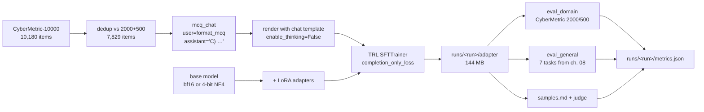

# 09 — Domain fine-tuning: LoRA on Qwen3.5-4B, QLoRA on Qwen3.8-27B

Previous: [08_evaluation.md](08_evaluation.md) · Next: 10 (coming next)

## What you will learn

- What **LoRA** (Low-Rank Adaptation) actually is — the `W + (α/r)·B·A` decomposition, what `r` and
  `α` do, and why training 32 million numbers instead of 4.2 billion is not obviously a compromise
- Why the modern advice ("adapt **all** linear layers, including the MLP, and use a learning rate
  about 10× the full-fine-tuning one") is what it is, and which papers say so
- **QLoRA**: freezing the base model in 4-bit **NF4** with double quantisation while the adapters
  stay in bf16 — the trick that puts a 27-billion-parameter model on one 24 GB consumer card
- Building a fine-tuning set out of **CyberMetric** and why de-duplicating it against the
  evaluation split is not optional
- Why the assistant answer is trained as `"C) …"` and not `"…, which is C"`
- Measuring **both** numbers every time: domain accuracy *and* the general suite from chapter 08,
  so "it got better at security" can be told apart from "it got worse at everything else"
- A **9-run ablation** on learning rate, rank, epochs, and which matrices get an adapter — with the
  numbers actually measured, including the ones that contradict the folklore
- The three separate out-of-memory walls a 27B QLoRA run hits on a 24 GB card, and the fix for each
  (they are all the same root cause: a 248,320-token vocabulary)

Everything here runs on `rtx` (RTX 4090, 24 GB). The Mac test suite only exercises pure functions —
no downloads, no GPU.

---

## 1. What LoRA is

Fine-tuning normally means changing every weight matrix `W` in the model. A 4-billion-parameter
model in bf16 needs 8 GB just for the weights; add gradients (another 8 GB) and the Adam optimizer's
two moment buffers in fp32 (32 GB) and you are at 48 GB before a single activation. That does not
fit on a 24 GB card.

**LoRA** (Low-Rank Adaptation, Hu et al. 2021) starts from an observation: the *change* a
fine-tune makes to a weight matrix is usually low-rank — it does not need all the degrees of
freedom the matrix has. So instead of learning `ΔW` (a `d_out × d_in` matrix), learn two thin
matrices whose product has the same shape:

```
                    FROZEN                      TRAINABLE
                ┌──────────────┐            ┌───┐   ┌──────────────┐
    y  =        │      W       │ · x   +    │ B │ · │      A       │ · x  ·  α/r
                │ d_out × d_in │            │   │   │  r  ×  d_in  │
                └──────────────┘            └───┘   └──────────────┘
                                          d_out × r
                 e.g. 2560×2560            2560×16      16×2560
                 6,553,600 numbers         ── 81,920 numbers (1.25 %) ──
```

- `r` (**rank**) is how thin the bottleneck is. `r=16` on a `2560 × 2560` matrix replaces 6.55 M
  trainable numbers with `2 × 16 × 2560 = 81,920` — 1.25 % of them.
- `α` (**alpha**) is a scaling constant; the update is multiplied by `α/r`. Keeping `α = 2r` (our
  default: `r=16, α=32`) means the effective update size stays roughly constant when you change `r`,
  so a rank sweep is a sweep of capacity and not secretly also of learning rate.
- `A` starts as small random noise and `B` starts at **zero**, so `B·A = 0` and the adapted model is
  *exactly* the base model at step 0. There is no warm-up shock.
- Only `A` and `B` get gradients and optimizer state. The frozen `W` still needs its 8 GB, but the
  gradients and Adam buffers now cover 32 M numbers instead of 4.2 B.

Measured on `Qwen/Qwen3.5-4B` with `r=16` on all linear layers:

```
trainable 32,464,896 / total 4,238,216,192 = 0.766%
```

At the end you can either keep the adapter as a 144 MB file that loads on top of the base model, or
**merge** it: `W ← W + (α/r)·B·A` gives back an ordinary checkpoint with zero inference overhead.

### Why "all linear layers" and a big learning rate

Two results drive the defaults in this chapter:

- ***LoRA Learns Less and Forgets Less*** (Biderman et al., 2024) — on programming and mathematics,
  LoRA underperforms full fine-tuning on the target domain, **but** it also degrades the base
  model's other abilities far less. LoRA is a regulariser: the low-rank constraint limits how far
  the model can travel from where it started. That trade-off is the entire subject of chapter 10,
  and it is why this chapter measures the general suite on every run.
- ***LoRA Without Regret*** (Thinking Machines, 2025) — LoRA matches full fine-tuning **when** you
  (a) put adapters on *all* linear layers, MLP included, not just attention; (b) use a learning rate
  roughly **10× larger** than you would for full fine-tuning; and (c) do not use a huge batch size.
  Our defaults — `target_modules: all-linear`, `lr: 1e-4` (full fine-tuning of a 4B would be around
  1e-5), effective batch 16 — come straight from this.

### A wrinkle specific to Qwen3.5

Qwen3.5-4B is a **hybrid** model. Of its 32 blocks, 24 use *Gated DeltaNet* (a linear-recurrent
attention variant whose projections are named `in_proj_qkv`, `in_proj_z`, `in_proj_a`, `in_proj_b`,
`out_proj`) and only **8** use ordinary Gated Attention (`q_proj`/`k_proj`/`v_proj`/`o_proj`). All 32
have an MLP (`gate_proj`/`up_proj`/`down_proj`).

That has a direct consequence for the classic "attention-only LoRA" recipe: on this architecture it
adapts only 8 blocks out of 32. `finetune.py` keeps the DeltaNet projections **out** of the
`attention` preset (so the ablation measures the recipe as people actually write it) and **in**
`all-linear` (so the recommended default really does touch every block). The run log prints what it
adapted, and `metrics.json` stores it:

```
adapted module kinds: ['down_proj', 'gate_proj', 'in_proj_a', 'in_proj_b', 'in_proj_qkv',
                       'in_proj_z', 'k_proj', 'o_proj', 'out_proj', 'q_proj', 'up_proj', 'v_proj']
```

`Qwen/Qwen3.5-4B` also happens to load fine through `AutoModelForCausalLM` as a text-only
`Qwen3_5ForCausalLM` — there is no vision tower in the way. For checkpoints where there *is* one
(`Qwen3_5ForConditionalGeneration`), `all-linear` would happily adapt the image encoder too, which
is wasted capacity for a text task; `load_base` detects that case and substitutes a regex that only
matches language-model projections:

```python
LANGUAGE_MODEL_LINEAR_RE = r".*language_model.*\.(q_proj|k_proj|v_proj|o_proj|gate_proj|up_proj|down_proj)"
```

---

## 2. The training data: CyberMetric, de-duplicated

Chapter 08 measures domain knowledge with **CyberMetric**, a multiple-choice cybersecurity
benchmark, on its 2000-question and 500-question splits. For training we use the 10,000-question
split — but the splits overlap. Training on questions that are also in the eval set would turn
"domain accuracy" into a memorisation score:

```
$ just ft-data
{'train_split': '10000', 'eval_splits': ['2000', '500'], 'n_before': 10180,
 'n_after': 7829, 'n_removed': 2351, 'path': 'runs/data/cybermetric/train_dedup.json'}
```

**2,351 of 10,180 questions (23 %) were also in the evaluation splits.** Every number in this
chapter is measured on questions the model never saw.

### The answer format decision

Each surviving item becomes a two-turn chat. The user turn is *byte-for-byte* the string chapter
08's evaluator sends (`format_mcq`), and the assistant turn is the letter first:

```python
examples.append({
    "messages": [
        {"role": "user", "content": format_mcq(item)},
        {"role": "assistant", "content": f"{letter}) {answer}"},
    ]
})
```

The letter-first ordering is not cosmetic. Chapter 08's `parse_letter` reads the first standalone
A–D letter out of the reply, so a model trained to answer *"Confidentiality, which is D"* would be
scored on a letter it never emitted (or worse, on an "A" that happened to appear in the prose).
**Train the answer in the shape the metric parses** — that is part of designing the metric, not
cheating it.

### Two things that silently break TRL here

1. Chapter 05 used `assistant_only_loss=True` to train only on assistant tokens. That flag needs
   `` tags in the chat template to know which tokens those are, and **Qwen3.5's
   official template has none** — the mask comes back all zeros and the model trains on nothing,
   with no error. `finetune.py` renders the prompt and completion as separate strings and uses
   `completion_only_loss=True`, which masks by token count and needs no template cooperation.
2. Rendering it ourselves also lets us pass `enable_thinking=False`. Left at Qwen's default the
   generation prompt ends with a bare `<think>\n` and the model would learn to answer *inside* a
   reasoning block; with the flag off the template emits a closed, empty `<think>\n\n</think>` and
   the answer follows directly — the same shape the evaluator generates against. The trade-off is
   real: this fine-tune teaches the model to answer security multiple-choice **without** reasoning
   first. That is what the benchmark rewards, and it is a limitation of the benchmark as much as of
   the model (see §8).

---

## 3. The pipeline



One module, `project/src/llm_tutorial/finetune.py`, does all of it, driven by a Pydantic config
(`extra="forbid"`, so a typo in the YAML fails loudly) and these recipes:

```
just ft-data                                  # build the de-duplicated training file
just ft      config=configs/ft_qwen35_4b_lora.yaml
just ft-eval run=ft_qwen35_4b_lora splits=2000
just ft-merge   run=ft_qwen35_4b_lora         # fold the adapter into bf16 weights (CPU)
just ft-samples run=ft_qwen35_4b_lora         # before/after on 6 fixed prompts
just ft-judge   run=ft_qwen35_4b_lora         # answer the ch.08 judge set, then score it
just ablate  config=configs/ablation_4b.yaml
```

Everything writes into the chapter-08 `metrics.json` schema, so runs can be compared mechanically.

---

## 4. Run 1 — Qwen3.5-4B, LoRA, bf16

`configs/ft_qwen35_4b_lora.yaml`: `r=16`, `α=32`, dropout 0.05, `all-linear`, `lr 1e-4`, cosine with
3 % warm-up, 2 epochs, per-device batch 8 × grad-accum 2 (effective 16), `max_len 1024`, gradient
checkpointing on.

| | |
|---|---|
| trainable / total | 32,464,896 / 4,238,216,192 = **0.766 %** |
| training rows | 7,829 |
| steps | 980 (489 per epoch) |
| wall time | **10.8 min** (648.8 s), 24.1 samples/s |
| peak GPU memory | **12.47 GB** |
| final train loss | 0.0056 (mean over the run 0.0352) |
| adapter on disk | 144 MB |

The loss curve (`runs/ft_qwen35_4b_lora/loss.png`) drops from 0.854 at step 10 to ~0.04 within a
fifth of the first epoch and then flattens — unsurprising: the task is "emit one letter and copy one
short option string", and token accuracy is already 98 % after 200 steps. Most of what the model
learns, it learns in the first few hundred steps.

### The result

| metric | base `Qwen/Qwen3.5-4B` | LoRA fine-tuned | Δ |
|---|---:|---:|---:|
| **CyberMetric-2000 accuracy** | 0.8760 `[0.8620, 0.8900]` | **0.9045** `[0.8915, 0.9175]` | **+2.85 pt** |
| CyberMetric-500 accuracy | — | 0.9120 `[0.8860, 0.9360]` | |
| mmlu (acc) | 0.7149 ± 0.0129 | 0.7658 ± 0.0121 | +5.09 pt |
| gsm8k (exact_match) | 0.7300 ± 0.0315 | 0.7950 ± 0.0286 | +6.50 pt |
| ifeval (prompt_level_strict) | 0.2350 ± 0.0301 | 0.3200 ± 0.0331 | +8.50 pt |
| arc_challenge (acc_norm) | 0.5233 ± 0.0289 | 0.5467 ± 0.0288 | +2.33 pt |
| hellaswag (acc_norm) | 0.6600 ± 0.0274 | 0.6633 ± 0.0273 | +0.33 pt |
| winogrande (acc) | 0.7000 ± 0.0265 | 0.7133 ± 0.0262 | +1.33 pt |
| truthfulqa_mc2 (acc) | 0.4838 ± 0.0300 | 0.4839 ± 0.0304 | +0.01 pt |
| **general_mean** | **0.5781** | **0.6126** | **+3.45 pt** |
| LLM-as-judge, 20 open questions (`qwen3.8:27b`, 1–5) | 4.00 | 4.20 | +0.20 |

The domain confidence intervals overlap slightly, so +2.85 points on 2000 questions is a *modest*
win, not a dramatic one — the base model already knew most of this material (87.6 %).

The general suite is the surprise: **nothing got worse.** The three benchmarks that moved outside
their standard errors (mmlu, gsm8k, ifeval) all moved *up*. This is not what "catastrophic
forgetting" folklore predicts, and it is worth being precise about why:

- LoRA at `r=16` on a 4B model changes 0.77 % of the parameters through a rank-16 bottleneck. There
  is simply not much room to overwrite general knowledge — exactly Biderman et al.'s "forgets less".
- The training signal is short, clean, well-formatted answers to knowledge questions. That is
  format-adjacent to MMLU (also multiple-choice knowledge) and to IFEval (which rewards answering
  the question asked instead of rambling), so some of the "general" gain is really *the same skill*.
- The gsm8k jump (+6.5) is harder to explain away and may partly be the `enable_thinking=False`
  rendering making the model terser and less likely to run out of generation budget mid-derivation.

The honest reading: **at this scale, on this data, with these hyper-parameters, specialising was
free.** §6 shows that this stops being true as soon as you turn the learning rate up.

### Before / after

Full text in `runs/ft_qwen35_4b_lora/samples.md` (6 prompts: 3 cybersecurity, 3 general — a poem, a
Python function, a history question; greedy, `max_new_tokens=220`). The differences are stylistic
rather than dramatic. On *"What is the difference between symmetric and asymmetric encryption…"* the
base answers in prose with bolded headings; the fine-tune opens with a comparison **table** and is
noticeably more compressed. On the general prompts the two are hard to tell apart — consistent with
the benchmark numbers.

---

## 5. QLoRA and the 27B

A 27-billion-parameter model in bf16 is **54 GB of weights**. The card has 24. LoRA alone does not
help: the frozen base still has to be resident.

**QLoRA** (Dettmers et al., 2023) solves it by storing the frozen base in 4 bits:

- **NF4** ("4-bit NormalFloat") is a quantisation grid whose 16 levels are placed at the quantiles of
  a normal distribution — the distribution neural-network weights actually follow — rather than
  spaced evenly. Same 4 bits, less error where the weights actually live.
- **Double quantisation** quantises the quantisation constants themselves (one scale per 64-weight
  block would otherwise cost ~0.5 bits per weight). Roughly another 0.4 bits per parameter, free.
- **Compute dtype bf16**: the stored 4-bit weight is de-quantised to bf16 on the fly for every
  matrix multiply. The maths happens in bf16; only the *storage* is 4-bit.
- The LoRA adapters stay in **bf16** and are the only thing that gets a gradient.

```yaml
# configs/ft_qwen38_27b_qlora.yaml (excerpt)
base: Qwen/Qwen3.8-27B
quant: nf4
lora: {r: 16, alpha: 32, dropout: 0.05, target_modules: attention+mlp}
max_len: 512
epochs: 1
lr: 1.0e-4
per_device_batch: 1
grad_accum: 8
gradient_checkpointing: true
liger: true
```

`target_modules` is the explicit attention+MLP list rather than `all-linear`: on a 27B hybrid model
the extra Gated DeltaNet projections would add adapters (and their activations) we cannot afford,
and attention+MLP is the set the QLoRA literature actually validated. Unsloth's published 24 GB
recipe for a model this size is batch 1 / grad-accum 4 / seq 2048 / lr 2e-4; we are more
conservative on sequence length and twice as accumulating, so the effective batch is the same 8
sequences per optimizer step.

### Three out-of-memory walls, one root cause

This is the part worth reading even if you never fine-tune a 27B. Qwen3.8's vocabulary is
**248,320 tokens**. The embedding matrix and the (un-tied) output head are `248,320 × 5,120 ≈ 1.27
billion parameters **each**` — and bitsandbytes does **not** quantise them. Everything below is a
consequence.

| # | where it broke | what it tried to allocate | fix |
|---|---|---|---|
| 1 | `peft.prepare_model_for_kbit_training`, before step 0 | it upcasts every non-4-bit tensor to fp32 — for those two matrices that is **~10 GB** | replaced with `prepare_kbit_bf16()`: freeze + `enable_input_require_grads` + gradient checkpointing, **no upcast** |
| 2 | TRL's default `loss_type="chunked_nll"`, at the first loss | it computes the head projection itself and does `w.float()` inside every chunk — a **4.7 GB** transient | `SFTConfig(use_liger_kernel=True)` |
| 3 | (after naively setting `loss_type="nll"`) TRL's metrics block | `outputs.logits[..., :-1, :]` → `TypeError: 'NoneType' object is not subscriptable` | same fix — the flag both flips the loss type *and* guards that block, because the fused kernel returns no logits |

Wall #2 is worth dwelling on, because the obvious reaction is wrong: dropping `max_len` from 1024 to
512 changed **nothing** — the failing allocation stayed at exactly 2.37 GiB, because it is the size
of the *weight matrix*, not of the activations. The real fix is **Liger-Kernel**'s fused
linear+cross-entropy, which computes the loss without ever materialising the
`[tokens, 248320]` logit tensor or a full-precision copy of the head.

```python
def prepare_kbit_bf16(model, *, use_gradient_checkpointing: bool = True):
    """A bf16-preserving replacement for peft's `prepare_model_for_kbit_training`."""
    for param in model.parameters():
        param.requires_grad = False
    if use_gradient_checkpointing:
        # With every base weight frozen the checkpointed blocks have no input that requires grad
        # and autograd would silently skip recomputation — this hook fixes that.
        model.enable_input_require_grads()
        model.gradient_checkpointing_enable(gradient_checkpointing_kwargs={"use_reentrant": False})
    return model
```

Keeping the embedding and head in bf16 instead of fp32 is safe here: they are frozen, and
`bnb_4bit_compute_dtype=bfloat16` already does the surrounding arithmetic in bf16.

Chapter 09's optional experiment was "try `liger-kernel` on the 4B and keep it if it helps". On the
4B it was a **null result** — a 2000-example A/B gave 84.0 s / 12.35 GB without it and 83.2 s /
12.35 GB with it, i.e. nothing. On the 27B the same kernel is the difference between running and
not running. The lesson is not "always use Liger", it is that fused linear+cross-entropy matters in
proportion to `vocab_size / hidden_size`, which is where the 4B and the 27B differ least in ratio
and most in absolute bytes.

### Memory, measured

Peak reserved GPU memory during training: **17.49 GB** of 23.5 GB. Roughly where it goes:

| what | approx. |
|---|---:|
| 26.4 B non-embedding params, NF4 + double quant (~4.4 bit/param) | ~14.5 GB |
| `embed_tokens` + `lm_head`, bf16, not quantised | ~5.1 GB (but ~2.5 GB of it is paged/shared during the step) |
| LoRA adapters, bf16 (79.7 M params) | 0.16 GB |
| Adam moments for the adapters, fp32 (2 × 79.7 M) | 0.64 GB |
| activations, batch 1 × 512 tokens with gradient checkpointing | < 1 GB |
| **measured peak** | **17.49 GB** |

Gradient checkpointing is what keeps the last row small — without it the activations of 64 blocks at
512 tokens would not fit next to the weights.

### Result

| | trainable | wall time | peak GB | final train loss |
|---|---:|---:|---:|---:|
| `ft_qwen38_27b_qlora` | 79,691,776 / 14,800,412,160 = **0.538 %** | **83.7 min** (979 steps, 5.1 s/step) | **17.49** | 0.0487 |

(The "total" counts 4-bit-packed tensors, so it is not the model's true parameter count — read the
0.538 % as "adapters are a rounding error", not as an exact fraction.)

| CyberMetric-2000 | accuracy | 95 % CI |
|---|---:|---|
| `qwen3.8:27b` base (chapter 08, via Ollama) | 0.9220 | [0.9105, 0.9335] |
| `ft_qwen38_27b_qlora` (QLoRA, in 4-bit) | **0.9340** | [0.9230, 0.9445] |

**+1.2 points, and the confidence intervals overlap.** Being honest about this matters more than the
headline: the 27B already scored 92.2 % on CyberMetric, so one epoch of LoRA on 7,829 questions
moved it by an amount that is at the edge of measurement noise. The 4B, which started 4.6 points
lower, gained more than twice as much (+2.85). Fine-tuning buys the most where the base model knows
the least — which is also why the capstone here is a *feasibility* demonstration ("a 27B fine-tune
fits in 24 GB and takes an hour and a half") rather than a claim of a large quality win.

Two caveats on comparing those two rows:

- The base number comes from Ollama's Q4_K_M GGUF and the fine-tuned number from bitsandbytes NF4 in
  `transformers` — two different 4-bit schemes and two different serving stacks. Chapter 08 could
  not run the loglikelihood half of the suite through Ollama at all, so `general` is `false` in this
  config and there is **no general-suite number for the 27B**: it would have needed another
  ~2 hours of GPU on a bf16 forward pass that does not fit. That gap is stated, not papered over.
- One epoch, not two. The 4B got two.

### Before / after, 27B

`runs/ft_qwen38_27b_qlora/samples.md`. The same effect as on the 4B, more pronounced: the base
answers the encryption question with an extended prose explanation and an analogy; the fine-tune
answers with a terse bulleted comparison. On *"Write a four-line poem about a lighthouse in
winter"* both produce a competent four-line poem — the fine-tune has not lost the ability, which is
the point of checking.

### Merging the 27B

`merge_and_unload()` cannot fold a bf16 adapter into 4-bit NF4 weights — it needs the base in
**bf16 on the CPU**, which for a 27B is 54 GB, on a box with 62 GB of RAM. The chapter spec expected
this to fail, so `merge()` catches `RuntimeError`/`MemoryError`/`OSError` and records
`{"merge": {"ok": false, "error": …}}` rather than taking the run down.

It did not fail. `just ft-merge run=ft_qwen38_27b_qlora` produced a 51 GB bf16 checkpoint in about
six minutes:

```
wrote merged bf16 checkpoint to runs/models/ft_qwen38_27b_qlora-merged
model-00001-of-00002.safetensors  46 GiB
model-00002-of-00002.safetensors   3.7 GiB
```

The reason it fits is that `transformers` 5.x loads safetensors by **memory-mapping** them, so the
54 GB is page cache the kernel can evict, not anonymous memory the OOM killer has to account for.
`free -g` during the merge showed 3 GB "used" and 23 GB in buff/cache. This is worth knowing
precisely because the folklore says it should not work.

Two caveats remain, and they are why the *adapter* is still what we keep:

- Merging a QLoRA adapter is **lossy in a way merging a bf16 LoRA is not**. The adapters were
  trained against the *quantised* weights `Q(W)`, and the merge writes `W + BA` — the original bf16
  weights plus a correction learned for a slightly different matrix. It is a good approximation, not
  an identity. The evaluation numbers above were measured on `base_4bit + adapter`, the
  configuration the model was actually trained in.
- 51 GB is not a thing you want to move around. The 4B merges to a 8.5 GB checkpoint
  (`just ft-merge run=ft_qwen35_4b_lora`, seconds) and that is what chapter 10 builds on.

---

## 6. Ablation on the 4B

`configs/ablation_4b.yaml` varies **one axis at a time** around a single reference point (lr 1e-4,
`r=16`, 2 epochs, `all-linear`), so every row differs from `ref` in exactly one setting. Nine runs.
Each trains and then measures **CyberMetric-500** (a ~11-minute eval); the ~100-minute general suite
runs only for the three rows the "specialise vs forget" scatter needs — the reference and the two
learning-rate extremes. Running it for all nine would have cost nine more hours to tell us the same
thing.

`just ablate` loops them, is restartable (variants already in `summary.json` are skipped) and writes
`runs/ablation_4b/{summary.json,ablation.png}`.

The base model measured on the same 500 questions: **0.888**.

| variant | lr | r | epochs | targets | trainable | train | domain acc (500) | 95 % CI | general_mean |
|---|---:|---:|---:|---|---:|---:|---:|---|---:|
| base (no fine-tune) | — | — | — | — | — | — | 0.888 | — | 0.5781 |
| **ref** | 1e-4 | 16 | 2 | all-linear | 32.5 M | 10.8 min | 0.910 | [0.884, 0.934] | **0.6172** |
| lr_2e-5 | 2e-5 | 16 | 2 | all-linear | 32.5 M | 10.8 min | **0.920** | [0.894, 0.944] | 0.5989 |
| lr_5e-4 | 5e-4 | 16 | 2 | all-linear | 32.5 M | 10.8 min | **0.846** | [0.812, 0.878] | **0.5492** |
| r_4 | 1e-4 | 4 | 2 | all-linear | 8.1 M | 10.7 min | 0.916 | [0.890, 0.940] | — |
| r_64 | 1e-4 | 64 | 2 | all-linear | 129.9 M | 10.9 min | 0.894 | [0.866, 0.920] | — |
| epochs_1 | 1e-4 | 16 | 1 | all-linear | 32.5 M | 5.4 min | **0.922** | [0.898, 0.944] | — |
| epochs_4 | 1e-4 | 16 | 4 | all-linear | 32.5 M | 21.6 min | 0.900 | [0.874, 0.924] | — |
| attn_only | 1e-4 | 16 | 2 | attention | **3.1 M** | 8.2 min | 0.912 | [0.886, 0.936] | — |
| mlp_only | 1e-4 | 16 | 2 | mlp | 18.1 M | 9.5 min | 0.906 | [0.880, 0.932] | — |


Three lessons the data actually supports:

**1. Only the learning rate mattered, and only when it was too big.** Eight of the nine variants land
between 0.894 and 0.922 on the domain metric — a spread of 2.8 points on 500 questions, where the
95 % confidence interval on a single measurement is already ±2.6 points. Those eight are *not
distinguishable from each other*. The ninth, `lr_5e-4`, is different: at 0.846 it is not only the
worst variant, it is **4.2 points below the untouched base model**. Fine-tuning made it worse at the
thing it was fine-tuned on, and it lost 2.9 points of `general_mean` at the same time. There is no
trade-off curve here — turning the learning rate up 5× from the recommended value simply damaged the
model on both axes.

**2. More is not better.** `epochs_1` (5.4 minutes, 0.922) beat `epochs_4` (21.6 minutes, 0.900).
`r_4` (8.1 M parameters, 0.916) beat `r_64` (129.9 M, 0.894). Both differences are inside the noise
band, so the honest statement is "four times the compute bought nothing" rather than "less is more" —
but look at the training losses: `epochs_4` ends at **0.0001** and `r_64` at 0.0021, versus 0.046 for
`epochs_1`. Those runs memorised the training set. The extra capacity and the extra passes went into
fitting 7,829 specific questions, not into knowing more about security. **Train loss going to zero is
a warning, not a success.**

**3. Which matrices you adapt barely moved the needle *on this task*.** `attn_only` adapts 3.1 M
parameters — 10× fewer than `all-linear`, and on this hybrid architecture it only touches 8 of 32
blocks (§1) — and still scores 0.912. That is *not* a refutation of "adapt all linear layers": it is
a statement about the task. Answering a multiple-choice question with a letter is a small, format-
shaped change to a model that already knows the material; it does not need much capacity anywhere.
The `all-linear` advice comes from tasks that teach genuinely new behaviour, and chapter 10's
preference stage is a better test of it than this one.

The general-suite column adds the fourth observation: at the recommended learning rate, general
ability went **up** (0.5781 → 0.6172); at 5× that rate it went **down** (0.5492), with IFEval
collapsing from 0.335 to 0.180 — the model stopped following instructions and started emitting
terse multiple-choice-shaped answers to everything. That is what "catastrophic forgetting" looks
like when you can see it, and it is entirely a function of one hyper-parameter.

One last honesty note: `ref` is the *same configuration* as the chapter's headline 4B run, retrained
from scratch. It scored 0.910 on CyberMetric-500 where the headline run scored 0.912. That 0.2-point
gap is pure run-to-run non-determinism, and it is a useful calibration for reading every other row
in the table.

---

## 7. What "accuracy" did and did not capture

Both models got better at CyberMetric. It is worth being precise about what that sentence means.

**What the number does capture.** The eval questions were removed from the training set (§2), so
this is not memorisation. The answers are parsed the same way for base and fine-tune, so it is not a
formatting artefact — and the fact that `lr_5e-4` scored *below* the untouched base proves the metric
can go down, which is the minimum bar for believing it when it goes up.

**What it does not capture.**

- **Four options and one correct letter is not what a security analyst does.** CyberMetric rewards
  recognition, not investigation, not writing a detection rule, not saying "I don't know". A model
  can go from 87.6 % to 90.5 % here without having become measurably more *useful*.
- **We trained the model not to think.** Every training example renders with
  `enable_thinking=False`, so the fine-tune has been taught to emit an answer letter immediately.
  That is exactly what the benchmark measures and it is a *loss* of a capability the base model had.
  A model fine-tuned this way should not be expected to reason through a novel multi-step security
  question — and CyberMetric will never notice.
- **The general suite is seven tasks with `limit` applied** (200–1140 questions each, chapter 08 §3).
  `general_mean` moving by 3 points is a real signal; it moving by 0.5 points is not. And "general
  ability" is far larger than seven academic benchmarks — the judge's +0.20 on 20 open questions
  (measured by another Qwen model, with all the self-preference caveats of chapter 08 §6) is the only
  thing here that looks at prose at all.
- **The 27B has no general-suite number at all** (§5). We can say its domain accuracy did not
  meaningfully change; we cannot say whether anything else did.
- **`general_mean` averages incommensurable things.** It adds an accuracy on a 4-way multiple choice
  to an exact-match rate on grade-school arithmetic and calls the result a number. It is useful for
  spotting a *collapse* (`lr_5e-4`) and untrustworthy for ranking two good runs.

The single most useful habit this chapter can leave you with is the one built into `metrics.json`:
**never report a domain number without the general number next to it**, and never report either
without the confidence interval. Three of the nine ablation rows would look like meaningful findings
if you dropped the intervals, and none of them are.

---

## Troubleshooting

| symptom | cause | fix |
|---|---|---|
| training "runs" but the loss is exactly 0.0 from step 1, or the model is unchanged | `assistant_only_loss=True` with a chat template that has no `` tags — Qwen3.5's official template has none, so the completion mask is all zeros | use the prompt-completion format and `completion_only_loss=True` (what `to_prompt_completion` does); or verify the mask first: `trainer.train_dataset[0]["completion_mask"]` must contain 1s |
| `CUDA out of memory` while *loading* a 4-bit model, before step 0 | `peft.prepare_model_for_kbit_training` upcasts the un-quantised embedding and output head to fp32 — ~10 GB on a 248k vocabulary | `prepare_kbit_bf16()` (§5), or lower `max_len`/`per_device_batch` if it is really activations; check *what* the traceback was allocating before assuming it is the batch |
| OOM at the **first loss**, and lowering `max_len` changes nothing | the allocation is the output-head weight, not the activations: TRL's `chunked_nll` does `w.float()` per chunk | `SFTConfig(use_liger_kernel=True)` — fused linear+cross-entropy never materialises the logits |
| `TypeError: 'NoneType' object is not subscriptable` in TRL's `compute_loss` | you set `loss_type="nll"` by hand with a fused-CE kernel active; TRL then reads `outputs.logits`, which the kernel returns as `None` | set `use_liger_kernel=True` instead of `loss_type` — it guards the metrics block too |
| `bitsandbytes` import fails, or "CUDA Setup failed despite GPU being available" | the wheel was built against a different CUDA runtime than the installed `torch` | `python -m bitsandbytes` prints its diagnostic; reinstall it *after* torch in the same environment (`uv sync --extra gpu` does this in the right order) |
| `NCCL Error 1: unhandled cuda error` on a machine with two GPUs | HF `Trainer` sees both devices and starts DataParallel; the second card here is a GTX 1080 Ti this torch build does not support | always `CUDA_VISIBLE_DEVICES=0` in front of the training command (every `just ft*` recipe already does) |
| `all-linear` adapts far more parameters than expected, and training is slower | on a multimodal checkpoint peft's `all-linear` also matches the vision tower's projections | `load_base` detects `*ForConditionalGeneration` and substitutes the language-model regex; check the printed "adapted module kinds" line |
| answers contain `<think>` or are cut off mid-reasoning | the chat template's default generation prompt opens an unclosed thinking block | render with `enable_thinking=False` (`chat.render`) **both** when building training data and when generating — a mismatch between the two is worse than either choice |
| `ValueError: Can't find 'adapter_config.json'` or shape mismatches on load | the adapter was trained against a different base revision, or you point `PeftModel.from_pretrained` at the run directory instead of `<run>/adapter` | the adapter's own `adapter_config.json` records `base_model_name_or_path`; keep base and adapter versions pinned together |
| the general suite OOMs when run from inside another Python process (e.g. the ablation loop) | `lm_eval` runs as a subprocess with its **own** CUDA context and cannot reuse the ~12 GB the parent's caching allocator is holding from training | `free_gpu()` (`gc.collect()` + `torch.cuda.empty_cache()`) before shelling out — this is exactly what killed the first ablation attempt |
| `merge_and_unload()` is killed by the OOM killer on the CPU | merging needs the base in bf16 in **system** RAM: 54 GB for a 27B against 62 GB of RAM with something else already resident | keep the adapter and serve `base_4bit + adapter` (§5); merging a QLoRA adapter is lossy anyway |

## Exercises

1. **Change the answer format and watch the metric move.** Edit `build_train_examples` to train
   `"<option text> (<LETTER>)"` instead of `"<LETTER>) <option text>"`, retrain the 4B for one epoch
   and re-run `just ft-eval`. The model's *knowledge* is unchanged; how much does CyberMetric
   accuracy drop purely because `parse_letter` now reads a letter out of the option text first?
   This is the cheapest possible demonstration that a benchmark measures a pipeline, not a mind.

2. **Rank vs data size.** The ablation varies `r` at a fixed 7,829 training examples. Fix `r=64`
   and vary `data.n_train` instead (500 / 2000 / 7829). Does the extra capacity of `r=64` only pay
   off once there is enough data to fill it, as the low-rank argument in §1 predicts?

3. **A different domain: text-to-Cypher.** Swap CyberMetric for
   [`neo4j/text2cypher-2025v1`](https://huggingface.co/datasets/neo4j/text2cypher-2025v1) — a
   question plus a graph schema in, a Cypher query out. It needs a new `data.format` in
   `build_train_examples` (the assistant turn is a query, not a letter) and a new metric, because
   exact string match is far too strict for a query language. Use the tutorial Neo4j database from
   the sibling [`../neo4j`](../../../graph_rag/tutorials/neo4j) tutorial and score a generated query as correct if
   `EXPLAIN <query>` parses **and** the query returns the same rows as the reference. That
   execution-based metric is a much better exercise in "what does accuracy actually capture" than
   anything multiple-choice can offer.

4. **Replay, early.** `data.replay` is already implemented (`{dataset: HuggingFaceTB/smoltalk, n: 2000}`
   mixes 2,000 general chat conversations into the training set). Run the `lr_5e-4` variant — the one
   ablation row that visibly damaged general ability — with and without 2,000 replay examples, and
   see how much of the loss comes back. Chapter 10 does this properly; doing it once by hand first
   makes that chapter's numbers much easier to read.

---

Previous: [08_evaluation.md](08_evaluation.md) · Next: 10 (coming next)

Numbers in this chapter: `project/runs/ft_qwen35_4b_lora/metrics.json`,
`project/runs/ft_qwen38_27b_qlora/metrics.json`, `project/runs/ablation_4b/summary.json` and the
chapter-08 baselines in `project/runs/eval_baselines/`. Produced on `rtx` (RTX 4090, 24 GB, 62 GB
RAM) on 2026-08-31 and 2026-09-06 with `transformers` 5.16.1, `trl` 1.12, `peft`, `bitsandbytes`,
`liger-kernel` 0.8.2, `lm_eval` 0.4.12, `torch` 2.13.0+cu130.
