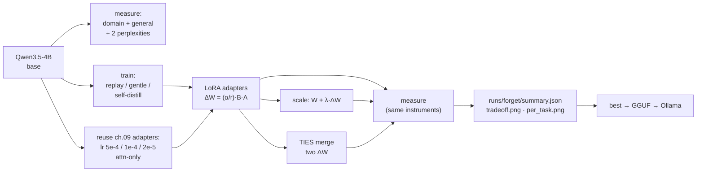

# 10 — Catastrophic forgetting: measure it, reduce it, ship it

Previous: [09_domain_finetuning.md](09_domain_finetuning.md) · Next: 11 (coming next)

## What you will learn

- What **catastrophic forgetting** is — why teaching a model one thing can quietly cost it another —
  and the two-sentence mechanical reason it happens
- How to **measure** it honestly: paired evaluation, identical limits and seeds, confidence
  intervals, and why the very first thing to check is whether your model forgot anything at all
- Six mitigation recipes across **ten measured variants**, each run for real on
  `Qwen/Qwen3.5-4B` and scored with chapter 08's instruments: **replay** (mixing general chat data
  back in, at two doses), **gentler optimisation** (lower learning rate, one epoch, lower rank),
  **attention-only targets**, **self-distillation** (training on the model's own words),
  **adapter scaling** (`W + λ·ΔW`), and **TIES merging** — including which of them did *not* work
- Why **perplexity** belongs next to accuracy — a continuous signal that sees drift a 500-question
  accuracy rounds away
- The tensor arithmetic of merging: `ΔW = (α/r)·B·A`, trimming, sign election, disjoint mean
- The 27B result — where the same mitigation turned out to be nearly free — and the **final
  export** of a domain model through GGUF to Ollama as `cyber-qwen35-4b` and `cyber-qwen38-27b`,
  with the quantisation cost measured on the real task rather than assumed
- Why a model that scores 0.912 on your benchmark can still return an **empty string** to a user,
  and how to catch that before your users do
- A decision guide and a **production checklist** for shipping a fine-tune you will have to
  maintain

The headline result of this chapter is not the one it was written to expect. Chapter 09 measured a
domain gain; this chapter set out to measure the general loss that supposedly pays for it — and on
this model, with this data, at a sane learning rate, **there was no loss to mitigate**. That is a
more useful lesson than a tidy trade-off curve would have been, and §5 is about how you can tell
the difference.

Everything here runs on `rtx` (RTX 4090, 24 GB). The Mac test suite exercises only pure functions —
no GPU, no downloads.

---

## 1. What forgetting is

Train a network on task B and it gets better at task B. Nothing in the loss function says "and stay
good at task A". Gradient descent walks downhill on the examples in front of it, and the weights it
moves are the same weights task A was using. When those weights move far enough that task A breaks,
that is **catastrophic forgetting** — a term from the connectionist literature of the late 1980s,
when networks trained on a second dataset were found to lose the first one almost completely.

The mechanical version is about **parameter interference**. A weight matrix in a transformer is not
a filing cabinet with one drawer per skill. Every skill the model has is a direction in the same
high-dimensional weight space, and those directions overlap heavily — the circuits that recognise
"this is a question about protocols" share machinery with the circuits that recognise "this is a
question about anything". Fine-tuning computes an update `ΔW` that is optimal for the new data and
indifferent to everything else. Where `ΔW` happens to point along a direction some other skill was
using, that skill is perturbed. Small `ΔW` and the perturbation is noise the model absorbs; large
`ΔW` and it is damage.

That framing already contains every mitigation in this chapter:

- **Move less.** A smaller learning rate, fewer epochs, a lower LoRA rank, or a target the model
  already agrees with all make `ΔW` shorter, so it overlaps less with everything else.
- **Keep practising.** Mix the old kind of data back in, and "stay good at ordinary conversation"
  becomes part of the loss again instead of being nobody's job.
- **Edit afterwards.** `ΔW` is just a tensor sitting in a file. Multiply it by 0.5. Add a second
  one to it with a rule that resolves their disagreements. No training required.

---

## 2. How to measure it (or you are wasting your GPU)

Forgetting is a *difference between two measurements*, so all the usual ways a difference can lie
apply. Chapter 08 built the instruments; this chapter's only job is to not move them.

**Paired evaluation, one instrument.** Every number below comes from
`configs/eval_general_4b.yaml`: the same seven `lm-evaluation-harness` tasks, the same `--limit` per
task, the same `--num_fewshot`, the same `--batch_size 2`, the same `--seed 1234`. If any of those
changed between the base run and the fine-tune run you would be measuring the harness, not the
model. This is why three rows of this chapter's table are `kind: reuse` — they copy numbers chapter
09 already paid 80 GPU-minutes each for, rather than recomputing them slightly differently.

**Confidence intervals, always.** `--limit 200` on GSM8K means the exact-match rate has a standard
error near 3 points. Two runs differing by 2 points on that task are *the same run*. The domain
accuracy carries a bootstrap 95 % interval (`eval_domain.ci95`, chapter 08 §4) for the same reason.
The rule of thumb used throughout this chapter: on this suite, **a `general_mean` move of less than
about 1.5 points is noise**, and any per-task move under about 2× its printed standard error is
noise.

**`general_mean` is a convenience, not a measurement.** It averages an accuracy on 4-way multiple
choice with an exact-match rate on arithmetic and a strict prompt-following rate. It is useful for
spotting a *collapse* and untrustworthy for ranking two good runs — which is exactly why
`per_task.png` exists (§6).

**Measure the base model on the same day.** The reference point here is
`runs/eval_baselines/Qwen3.5-4B/metrics.json`, measured in chapter 08 with the identical config.
Everything in this chapter is a delta against it, in **percentage points**.

| reference | CyberMetric-500 | `general_mean` |
|---|---|---|
| `Qwen/Qwen3.5-4B`, untouched | **0.888** | **0.5781** |

---

## 3. The instruments this chapter adds

Three small additions; no rewrite of chapter 09's `finetune.py`.

### Perplexity, next to accuracy

Accuracy is a step function. A model can drift a long way before a single answer letter flips, and
then several flip at once. Perplexity — "how surprised is the model by this text" — is continuous,
and costs one forward pass over a few hundred short texts instead of eighty minutes of benchmark.

```python
# src/llm_tutorial/eval_domain.py
def perplexity(model, tokenizer, texts, max_len=1024, batch_size=4):
    ...
    labels = enc["input_ids"].clone()
    labels[enc["attention_mask"] == 0] = -100        # never score padding
    logits = model(input_ids=..., attention_mask=...).logits
    shift_logits, shift_labels = logits[:, :-1, :].float(), labels[:, 1:]
    loss = F.cross_entropy(shift_logits.reshape(-1, V), shift_labels.reshape(-1),
                           ignore_index=-100, reduction="sum")
    ...
    return {"nll": total_nll / total_tokens, "perplexity": math.exp(...), ...}
```

Two are recorded for every variant: **domain NLL** on the correct CyberMetric-500 answers, and
**general NLL** on 200 held-out SmolTalk conversations. Lower is better for both, and the pair moves
before accuracy does.

### Self-distilled training targets

Chapter 09 trained the assistant turn as the terse string `"B) IP"`. Self-distillation replaces it
with *the base model's own explanation* of the same correct option, harvested by showing the model
the answer and asking it to phrase one:

```python
# src/llm_tutorial/finetune.py
SELF_DISTILL_SYSTEM = (
    "You are a cybersecurity expert writing model answers for a study guide. "
    "You are given a multiple-choice question and the correct option. "
    "Reply with the correct option letter and text, then one or two sentences explaining why it is "
    "correct. Start your reply with the letter.")
```

The intuition: fine-tuning moves weights in proportion to how surprised the model is by the target.
A canned string is short but stylistically alien — the model has to travel a long way to make it
likely, and that travel is what damages unrelated abilities. A sentence the model would have written
anyway costs almost no movement except on the one thing being taught: *which option is right*. This
is the "on-policy" / self-distillation idea that the 2025–26 fine-tuning literature keeps returning
to; the numbers below are ours, not any paper's.

`just distill` produced the file in **12.8 minutes** for all 7,829 training questions:

```
{'base': 'Qwen/Qwen3.5-4B', 'path': 'runs/data/cybermetric/train_selfdistill.json',
 'n': 7829, 'started_with_correct_letter': 7808, 'mean_chars': 385.9,
 'wall_seconds': 767.0}
```

7,808 of 7,829 (**99.7 %**) began with the correct letter unprompted; the 21 that did not are
repaired by prefixing `"<LETTER>) <option>. "` so the evaluator's parser still works. The targets
are **386 characters** on average against roughly 20 for the canned answer — nineteen times more
text, all of it in the model's own voice:

> **D) Confidentiality** Confidentiality ensures that sensitive information is accessible only to
> authorized individuals, thereby maintaining its secrecy. The other options refer to different
> security goals: Availability guarantees system access, Authentication verifies identity, and
> Integrity protects data from unauthorized modification.

### Editing the delta directly

A LoRA layer computes `y = W·x + (α/r)·B·(A·x)`, so the update folded into the frozen weight is
`ΔW = (α/r)·B·A`. That expression is **linear in `B`**, which makes the simplest possible
intervention available: scale `B` and the whole update scales with it.

```python
# src/llm_tutorial/forget.py
def scale_lora_state_dict(state, lam):
    return {k: (v * lam if ".lora_B." in k else v.clone()) for k, v in state.items()}
```

`λ = 1.0` is the fine-tune, `λ = 0.0` is the base model, and values in between walk the straight
line between them — a dial between "specialised" and "original" that costs no training at all.
Scaling *both* factors would give `λ²`, which is the classic off-by-a-square in this trick, and the
test suite pins it:

```python
def test_scale_lora_state_dict_halves_the_delta():
    ...
    torch.testing.assert_close(scaled_delta, 0.5 * delta)
    # A must be untouched — scaling both factors would give 0.25*delta.
    torch.testing.assert_close(scaled[..."lora_A.weight"], a)
```

**TIES merging** solves the harder problem: combining two deltas. Adding them straight up is a bad
idea — where one says `+0.30` and the other says `−0.28`, the sum is a meaningless `+0.02` and both
fine-tunes lose. That cancellation *is* parameter interference, in its most concrete form. TIES
(Yadav et al. 2023) fixes it in three steps:

1. **Trim** each delta to its largest-magnitude entries (default: the top 20 %). Most of a
   fine-tuning delta is noise, and the noise is what collides.
2. **Elect a sign** per entry: whichever direction carries more total magnitude wins.
3. **Disjoint mean**: average only the deltas that agree with the elected sign. The dissenters are
   *dropped*, not allowed to cancel the winner out.

```python
elected  = torch.sign((stacked * w).sum(dim=0))
agrees   = (torch.sign(stacked) == elected) & (stacked != 0)
merged   = (stacked * w * agrees).sum(0) / (w * agrees).sum(0)   # where the denominator > 0
```

We merge the reconstructed `ΔW` matrices rather than the `A`/`B` factors. peft's
`add_weighted_adapter(combination_type="ties")` elects signs on `A` and `B` separately, which is not
the same operation — the sign of a factor is not the sign of the product, and two adapters can
disagree on `B` while agreeing perfectly on `B·A`. Reconstructing `ΔW` costs one small matmul per
layer and makes the arithmetic exactly the paper's. `mergekit` was not needed: the whole of TIES is
the six lines above, and implementing it locally avoided pinning a second copy of `transformers`.

---

## 4. The variants



One YAML drives all of it (`configs/forget_variants.yaml`), and `run_all` skips any variant that
already has a complete `metrics.json` — which is what makes an eighteen-hour job survivable.

---

## 5. What actually happened

The whole grid, sorted the way `runs/forget/summary.json` stores it. `Δ` columns are percentage
points against the untouched base model. `domain NLL` is the mean negative log-likelihood of the
correct answers on the held-out CyberMetric rows, `general NLL` the same on 200 SmolTalk
conversations — lower is better for both.

| variant | how | domain acc | Δ dom | `general_mean` | Δ gen | domain NLL | general NLL | train min |
|---|---|---|---|---|---|---|---|---|
| **base** (chapter 08) | — | 0.888 | — | 0.5781 | — | 2.095 | 1.254 | — |
| `naive_lr5e-4` | ch.09 adapter, lr 5e-4 | 0.846 | **−4.2** | 0.5492 | **−2.9** | 2.837 | 1.197 | 10.8 |
| `gentle` | lr 2e-5, 1 epoch, r 8 | 0.906 | +1.8 | 0.5882 | +1.0 | 2.017 | 1.202 | 5.4 |
| `selfdistill` | targets = base model's own words | 0.904 | +1.6 | 0.5898 | +1.2 | 2.213 | 1.346 | 17.9 |
| `lr2e-5_2ep` | ch.09 adapter, lr 2e-5 | 0.920 | +3.2 | 0.5989 | +2.1 | 2.011 | 1.159 | 10.8 |
| `attn_only` | ch.09 adapter, q/k/v/o only | 0.912 | +2.4 | 0.6068 | +2.9 | 1.976 | 1.107 | 8.2 |
| `naive_lambda_0.5` | `W + 0.5·ΔW` of the 5e-4 delta | 0.900 | +1.2 | 0.6119 | +3.4 | 2.319 | 1.110 | 0 |
| `default_lr1e-4` | ch.09 reference, lr 1e-4 | 0.910 | +2.2 | 0.6172 | +3.9 | 1.945 | 1.098 | 10.8 |
| `ties_default_replay` | TIES(ref, replay), density 0.2 | 0.916 | +2.8 | 0.6252 | +4.7 | 1.959 | **0.973** | 0 |
| `replay_2500` | +2,500 SmolTalk chats | **0.924** | **+3.6** | 0.6259 | +4.8 | 2.014 | 0.990 | 95.4 |
| `replay_10000` | +10,000 SmolTalk chats | 0.912 | +2.4 | **0.6442** | **+6.6** | 2.046 | 0.978 | 186.2 |


### 5.1 The result the chapter did not order

Read the plot before reading the table. Nine of the ten variants sit **up and to the right** of the
origin: better on the domain *and* better on the general suite than the model they started from.
Only one point, `naive_lr5e-4`, is in the bottom-left quadrant where the textbook says fine-tuned
models live.

So the honest headline is: **on this task, at a sane learning rate, fine-tuning did not cause
forgetting.** It caused a general *improvement* of 2–7 points. Nothing was traded.

Before believing that, it is worth asking what else could produce it. Three candidates, and what
the data says about each:

- *Is the general suite leaking domain knowledge?* MMLU contains a security subset, so some of the
  MMLU gain is domain transfer rather than general improvement. But MMLU is one of seven tasks, and
  the largest single gain is on **IFEval** (23.5 → 49.0 for `replay_10000`), which contains no
  security content at all. Leakage cannot explain it.
- *Is it noise?* `general_mean` moves of +4.8 and +6.6 are three to four times the ~1.5-point noise
  floor of §2, and they are reproduced independently by the two perplexity columns, which come from
  a completely different computation on different text (general NLL 1.254 → 0.978).
- *Is the base model just badly formatted for the harness?* This is the real explanation, and the
  IFEval column gives it away.

`Qwen/Qwen3.5-4B` is a base-ish checkpoint. Asked a multiple-choice question or an
instruction-following prompt, it will often ramble, restate the question, or refuse to commit to a
format. Chapter 09's fine-tune taught it to answer a question in a fixed shape, immediately and
without preamble. That is a *general* skill even though it was learned from security data, and the
harness — which scores strict prompt-level compliance on IFEval and exact matches on GSM8K —
rewards it heavily. GSM8K goes 73.0 → 82.0 not because the model got better at arithmetic but
because it got better at stopping when it is finished.

This is worth internalising because it generalises: **a large share of "fine-tuning improved my
benchmarks" is format acquisition, and a large share of "fine-tuning destroyed my benchmarks" is
format destruction.** Neither is a change in knowledge. The perplexity columns are what let you
tell them apart — see §6.2.

### 5.2 The one variant that did forget, and why

`naive_lr5e-4` is the same data, the same rank, the same number of epochs as `default_lr1e-4`. The
single difference is a learning rate 5× larger, and it is the only row that lost anything:

- general_mean −2.9 points, with the damage concentrated in MMLU (−3.9), GSM8K (−9.5) and IFEval
  (−5.5) — the three tasks that need the model to hold a long chain of its own reasoning together;
- domain accuracy −4.2 points, *below the untouched base model*;
- domain NLL 2.095 → **2.837**, by far the worst in the table.

That last row is the tell. A model that had over-specialised on the domain would have a *low*
domain NLL and a high general one. This model got worse at everything, including the thing it was
trained on. It is not a model that traded generality for a domain; it is a model that was damaged.
An lr that is too large does not buy you specialisation at the price of breadth — it just breaks
the network, and the "forgetting" is a symptom.

Practical consequence: **before you reach for a mitigation, check that your problem is forgetting
at all.** If domain accuracy is also down, you have a broken optimisation, and no amount of replay
data will fix a learning rate.

### 5.3 Recipe by recipe

**Replay is the only recipe that clearly works** (`replay_2500`, `replay_10000`). Mixing general
instruction data into the training set produced the two best general_mean values in the table, and
the dose–response is monotone: 2,500 chats buys +4.8 points, 10,000 buys +6.6. It is also the only
recipe whose *general perplexity* drops substantially (1.254 → 0.99 / 0.98), which is the signal
that the model genuinely re-fit general text rather than merely re-learning an answer format.

The cost is real and worth stating: replay dominated the GPU budget. `replay_2500` trained for 95
minutes and `replay_10000` for 186, against 10.8 for domain-only, because a SmolTalk conversation
is many times longer than a CyberMetric row. Replay is not a free mitigation; it is the expensive
one that works.

Note the dose trade-off. `replay_2500` has the best domain accuracy in the whole table (0.924);
`replay_10000` gives 1.2 points of that back to buy 1.8 more points of general_mean. There is no
universal right answer — it depends whether the model's job is the domain or the breadth.

**Gentler optimisation works, in the weak sense that it does no harm** (`gentle`, `lr2e-5_2ep`).
Both moved the weights less and both stayed comfortably above the base model. But `gentle`
(lr 2e-5, 1 epoch, r 8) is the *worst-performing* successful variant on both axes: +1.8 domain,
+1.0 general. Biderman et al.'s "LoRA learns less and forgets less" is visible here, and the first
half of that sentence matters as much as the second. When there is nothing to forget, deliberately
learning less is simply learning less. `gentle`'s virtue is its cost — 5.4 minutes, the cheapest
row in the table — not its scores.

**Self-distillation did not help here, and its perplexity column says why.** `selfdistill`
(training on the base model's own explanations of the correct answers) scored +1.6 domain and +1.2
general — mid-table — but it has the **worst general NLL in the table, 1.346, higher than the base
model's 1.254**. The intuition behind self-distillation is that staying inside the model's own
output distribution should minimise the disruption to everything else. What happened instead is
that the 7,829 generated explanations are stylistically narrow — the same greedy model, the same
prompt, the same 160-token budget, producing 7,829 variations of one paragraph shape — so training
on them *narrowed* the output distribution rather than preserving it. Self-distillation gives you
on-policy text, but on-policy text generated from one prompt at temperature 0 is not a sample of
the model's distribution; it is a sample of its mode. This is an honest negative result: the recipe
is sound in the literature and did not pay off at this scale on this data.

**Attention-only targets did better than expected** (`attn_only`: +2.4 domain, +2.9 general, 8.2
minutes). On this hybrid architecture only 8 of the 32 blocks are attention blocks, so this adapter
touches a small fraction of the model — and still captured most of the domain gain. If you want one
cheap knob for "adapt less of the network", this is a better one than dropping the rank.

**Post-hoc weight editing is the surprise of the table.** Neither of these two rows involved a
single gradient step:

- `naive_lambda_0.5` takes the *damaged* lr-5e-4 delta and simply halves it: `W = W_base + 0.5·ΔW`.
  That one multiplication converts the table's worst model (0.846 / 0.5492) into a respectable one
  (0.900 / 0.6119) — recovering **6.3 points of general_mean and 5.4 of domain accuracy for zero
  GPU time.** If you have already burned a training run at too high a learning rate, do this before
  you retrain. It will not match a correctly-trained model (domain NLL stays a poor 2.319, the scar
  of the bad run) but it is nearly free.
- `ties_default_replay` TIES-merges the reference delta with the replay-trained delta and lands at
  0.916 / 0.6252 — statistically indistinguishable from `replay_2500`, which cost 95 GPU-minutes,
  and with the **best general NLL in the entire table (0.973)**. Merging bought a replay-quality
  model without paying for replay training, given that both parent adapters already existed.

The caveat on merging is that it is not magic: it needs parents that are individually good. TIES
resolves *disagreements* between two deltas by sign election and keeps the top-density magnitudes;
it cannot manufacture a skill neither parent has. Here it worked because the two parents were
trained on overlapping data with the same hyperparameters — the easy case.

---

## 6. Reading the per-task chart

`general_mean` hides more than it shows. The same three models, broken out:


### 6.1 Where the damage and the gains actually live

The four knowledge/commonsense tasks — ARC-Challenge, HellaSwag, WinoGrande, TruthfulQA — barely
move for *any* variant, in either direction. WinoGrande is 70.0 for the base model, 69.3 for the
damaged one and 70.0 for the best one. These are loglikelihood tasks: the harness scores the
model's probability of each candidate completion, never asking it to generate anything. **Formatting
skill cannot help you and cannot hurt you on a loglikelihood task**, so what these four columns
measure is closer to raw knowledge — and raw knowledge did not move.

Everything interesting is in the three generative columns:

| task | base | `naive_lr5e-4` | `replay_10000` |
|---|---|---|---|
| MMLU (5-shot, generative-scored) | 71.5 | 67.6 | 75.0 |
| GSM8K (exact match) | 73.0 | 63.5 | 81.0 |
| IFEval (strict prompt-level) | 23.5 | 18.0 | **49.0** |

IFEval more than doubles. No security data teaches a model to "write exactly three bullet points
and no preamble" — what it teaches is *comply with the shape you were asked for*, and that transfers.
Symmetrically, the bad run's losses are concentrated in the same three columns. Both directions are
the same phenomenon measured with the same ruler.

**The practical rule: split your general suite into loglikelihood tasks and generative tasks and
read them separately.** A drop confined to the generative half is a formatting regression — check
your chat template and your stop tokens before you conclude the model forgot anything. A drop in
the loglikelihood half is the real thing.

### 6.2 Why perplexity earns its place

Accuracy on 500 questions is a coarse instrument: it moves in steps of 0.2 points and carries a
±3-point interval. The NLL columns are continuous, need no generation, and take about two minutes
per model. Twice in this chapter they said something accuracy did not:

- `naive_lr5e-4`'s domain NLL of 2.837 identifies it as *damaged* rather than *over-specialised* —
  the diagnosis in §5.2 rests on that number.
- `selfdistill`'s general NLL of 1.346, the only value in the table *above* the base model's,
  exposes distribution narrowing that its perfectly ordinary accuracy scores concealed entirely.

Neither conclusion was available from accuracy alone. Perplexity is not a substitute for task
accuracy — it cannot tell you whether the model gets questions right — but as a cheap second
opinion on *what kind* of change you caused, it is the best value in the chapter.

---

## 7. The 27B

The 4B grid says replay is the recipe that works. Testing that at 27B means changing exactly one
thing, so `configs/ft_qwen38_27b_replay.yaml` is chapter 09's 27B config with a single line edited:

```yaml
data:
  replay: {dataset: HuggingFaceTB/smoltalk, subsets: [smol-magpie-ultra], n: 2500}
```

Same base, same NF4 quantisation, same rank 16, same `attention+mlp` targets, same lr 1e-4, same
one epoch, same `max_len: 512`, same seed. Any difference in the numbers is replay's doing.

One honest substitution: the 4B's pre-registered winner was `replay_10000`, but this run uses the
**2,500** dose. At 27B a replay step costs ~2.5× a domain step, so 10,000 rows would have turned a
1.5-hour run into a 4.5-hour one, and the 4B grid shows 2,500 already captures 72 % of the general
gain (+4.8 of +6.6) while posting the best domain accuracy in the table. The `replay_10000` adapter
is the one that got exported (§8); the 27B got the cheaper dose.

### 7.1 What it cost

| | chapter 09, domain only | chapter 10, + 2,500 replay |
|---|---|---|
| optimizer steps | 979 | 993 |
| wall time | 83.7 min | **85.3 min** |
| peak VRAM | — | 17.7 GB |
| final train loss | 0.0487 | 0.0423 |

Replay was **essentially free at 27B** — 1.6 extra minutes — and that is worth understanding,
because on the 4B the same mitigation cost 9× the training time. The difference is `max_len`. The
4B configs allow 1,024 tokens, so a long SmolTalk conversation is trained in full; the 27B config
uses 512 and truncates it. Truncated replay rows cost barely more than domain rows, and — as the
numbers below show — truncation did not destroy replay's usefulness. **If replay's cost is what is
stopping you, cap the sequence length before you cut the dose.**

### 7.2 What it bought

The domain measurement, `CyberMetric-2000` against the 4-bit model, the same instrument chapter 09
used:

| 27B model | CyberMetric-2000 | ci95 |
|---|---|---|
| `Qwen/Qwen3.8-27B`, untouched | 0.922 | [0.9105, 0.9335] |
| chapter 09, domain-only QLoRA | 0.934 | [0.923, 0.9445] |
| chapter 10, + replay | **0.9345** | [0.923, 0.945] |

Replay cost nothing on the domain: 0.9345 against 0.934 is the same number twice. That alone is the
useful result — **the mitigation is free on the axis you care about.**

For the general axis, the comparable measurement is the one chapter 08 used for the 27B baseline,
which is the *Ollama* route (gsm8k and IFEval through the OpenAI-compatible endpoint), not an HF
forward pass — see §7.3 for why. Against the exported Q4_K_M model of §8:

| 27B model | GSM8K | IFEval | `general_mean` |
|---|---|---|---|
| `qwen3.8:27b` (chapter 08 baseline) | 0.425 | 0.695 | 0.560 |
| `cyber-qwen38-27b` (+ replay) | **0.685** | 0.710 | **0.6975** |

`general_mean` +13.8 points — and the shape of that gain is the best confirmation of §5.1 in the
chapter. **GSM8K moves 26 points; IFEval moves 1.5 and is flat within its own standard error.** The
4B saw the mirror image: IFEval +25.5, because the 4B base model was terrible at instruction
formats (0.235) while the 27B base was already good (0.695) and had nothing to gain.

The gains appear exactly where the base model's *formatting* was weak and nowhere else. A 27B model
does not learn arithmetic from 7,829 security multiple-choice questions. It learns to answer in a
parseable shape, and GSM8K's exact-match scorer pays for that in 26 points.

### 7.3 The trap this ran into

The first attempt at the 27B general eval crashed, and the failure is worth keeping:

```
CalledProcessError: Command '['lm_eval', '--model', 'hf', '--model_args',
'pretrained=Qwen/Qwen3.8-27B,dtype=bfloat16,...,peft=runs/forget/qwen38_27b_replay/adapter',
'--tasks', 'mmlu', ...]' returned non-zero exit status 1.
```

`dtype=bfloat16` on a 27B is 54 GB of weights on a 24 GB card. `finetune.evaluate()` honours
`eval.load_in_4bit` for the *domain* evaluation but does not forward it to `eval_general`, so the
general suite went out in bf16 and died on the first task.

The deeper point is that **the 4-bit path was never the right one anyway.** The five
loglikelihood tasks need per-token logprobs, which is why chapter 08's 27B baseline has
`skipped_loglikelihood_tasks` in its metrics: that baseline was measured through Ollama, which
exposes no logprobs endpoint, so only the two generative tasks ran. Reproducing a comparison means
reproducing the *route*, not just the tasks — the 27B general numbers above come from
`eval_general.run_ollama` against the exported GGUF, exactly as the baseline did.

This is the paired-evaluation discipline of §2 biting in a place that is easy to miss: the same
task list evaluated through a different runtime is a different instrument.

---

## 8. The final export

The pre-registered rule in `forget._pick_best` — written before the grid ran, so it could not be
tuned to the results — takes the highest `general_mean` among variants that did not lose domain
accuracy. That is `replay_10000` (0.6442 / 0.912). It is the model that ships.

```
runs/forget/replay_10000/adapter                    LoRA delta, ~100 MB
  -> finetune merge            -> runs/models/forget/replay_10000-merged      bf16, 8.4 GB
  -> export to-gguf            -> replay_10000-merged-bf16.gguf              8.41 GB
  -> export quantize Q4_K_M    -> replay_10000-merged-Q4_K_M.gguf            2.7 GB
  -> export quantize Q8_0      -> replay_10000-merged-Q8_0.gguf              4.5 GB
  -> ollama create             -> cyber-qwen35-4b
```

Same pipeline for the 27B, from the merged replay checkpoint, `cyber-qwen38-27b` at 16 GB.

### 8.1 What quantisation actually cost

Measured on the real task — CyberMetric-500, the same 500 questions, the same scorer — rather than
on a perplexity proxy:

| `cyber-qwen35-4b` | precision | size | CyberMetric-500 | ci95 |
|---|---|---|---|---|
| HF checkpoint | bf16 | 8.4 GB | 0.912 | [0.886, 0.936] |
| Ollama | Q8_0 | 4.5 GB | 0.918 | [0.894, 0.942] |
| Ollama | Q4_K_M | 2.7 GB | 0.908 | [0.882, 0.932] |

**Q4_K_M cost 0.4 points and Q8_0 "gained" 0.6.** All three intervals overlap almost completely;
the correct reading is that at this measurement precision the quantisation cost is *not
detectable*, and the model is 3.1× smaller. Note that Q8_0 scoring above bf16 is a reminder to read
the intervals rather than the point estimates — quantisation does not improve a model, and a
0.6-point move on 500 questions is a coin flip.

The 27B, measured the same way against the base model on the identical split and runtime:

| 27B via Ollama, Q4_K_M | CyberMetric-500 | ci95 |
|---|---|---|
| `qwen3.8:27b` (untouched) | 0.944 | [0.922, 0.964] |
| `cyber-qwen38-27b` | 0.950 | [0.930, 0.968] |

**+0.6 points, which is noise.** This is a ceiling effect and it deserves stating plainly: an
untouched 27B already answers 94.4 % of CyberMetric-500 correctly, so there are 28 questions left
to win and fine-tuning won 3 of them. The 27B fine-tune is *not* justified by domain accuracy on
this benchmark. Its measurable wins are on the harder 2000-question split (+1.2 points over base)
and on the general suite (+13.8), which is a strange thing to say about a domain fine-tune and an
honest one.

If your base model already scores 94 % on your benchmark, your benchmark has stopped being able to
tell you whether fine-tuning helped. Get a harder evaluation before you spend the GPU hours.

### 8.2 Does it still behave like an assistant?

`runs/forget/samples.md` has the full transcripts from both exported models through Ollama's
`/api/chat`. The 4B answers a domain MCQ with the letter *and* a correct explanation, gives a
structured, non-generic answer to an open-ended SOC question, and handles arithmetic and verse —
i.e. the replay did its job, and the model is not a multiple-choice-only savant.

### 8.3 The bug the transcript found

One prompt in the transcript returns **empty content**. Asked "Write a haiku about TLS
certificates.", `cyber-qwen35-4b` replies with nothing at all. Over 10 repeats through the raw
`/api/chat` endpoint: **10 out of 10 empty**, every one with `done_reason: "length"` and 5,130–5,980
characters in the response's separate `thinking` field.

The model is not broken. It is *thinking itself out of the context window*. Qwen3.5's reasoning
mode is still enabled in the served template, and `export.modelfile` writes a conservative
`PARAMETER num_ctx 2048`. The model spends all 2,048 tokens deliberating about syllable counts and
the window closes before it writes a single line of the poem.

Three candidate fixes, all measured against the live endpoint:

| attempt | result |
|---|---|
| `options: {num_predict: 2048}` | still empty — `done_reason: length`, 5,390 chars of thinking |
| `options: {num_ctx: 8192}` | **sometimes**: one run answered (833 chars of thinking), a repeat ran to 25,973 chars and still hit the limit |
| `think: false` | `done_reason: stop`, an actual haiku, every time |

The ordering is the lesson. `num_predict` is the wrong knob — `num_ctx` was the binding limit, so
raising the generation cap changed nothing. Raising `num_ctx` is the *right* knob and still is not
a fix, because the length of the thinking block is unbounded: quadrupling the window bought one
success and one 26,000-character runaway. Only disabling reasoning is reliable.

Note what this means for §5.1. The fine-tuning data was 7,829 short, non-thinking answers, and the
model still reasons at length on a prompt unlike its training data. The adapter changed the model's
behaviour on domain-shaped inputs without removing a base-model behaviour elsewhere — which is the
same "no forgetting" result as the rest of the chapter, seen from the side where it is inconvenient.

The generalisable lesson is the one in the production checklist: **a model that scores well on your
benchmark can still return an empty string to a user**, because benchmarks send prompts the model
answers tersely and users send prompts it does not. Exercise the served endpoint with prompts that
look nothing like your eval set before you call it shipped.

---

## 9. Decision guide

Ten lines, in the order you should apply them.

1. **Measure first.** No mitigation until you have a base-model number from the same harness.
2. **Domain accuracy also down?** Your lr is too high. Fix that; it is not forgetting.
3. **Loss confined to generative tasks?** Suspect formatting, not knowledge — check template and stops.
4. **Loss in the loglikelihood tasks?** Now it is real forgetting. Continue.
5. **Already have a bad adapter?** Scale it: `W + 0.5·ΔW`. Free, and recovered 6.3 points here.
6. **Have two decent adapters?** TIES-merge them. Free, and matched a 95-minute replay run here.
7. **Willing to retrain?** Replay is the recipe that works. Start at ~30 % general data.
8. **Need more breadth, can spare the GPU?** Raise the replay dose; it is monotone but costs linearly.
9. **GPU-poor?** Attention-only targets, ~8 minutes, kept most of the gain.
10. **Shipping?** Re-measure after quantisation on the real task. Never assume it is free.

---

## 10. Production checklist

The things that turn a good run into a model you can still maintain in six months.

**Data**
- [ ] **Dedup training data against every eval set** you will quote — by exact match *and* by
      near-duplicate hash. Chapter 09 built `train_dedup.json` for this reason; a fine-tune that
      memorised your test set will look excellent and ship broken.
- [ ] **Hold out before you start**, not after. A split chosen once you have seen scores is not a
      hold-out.
- [ ] **Record the exact data files and row counts** in `metrics.json` (`train_rows`, `n_domain`,
      `n_replay`). "The cybermetric data" is not a reproducible statement.

**Evaluation**
- [ ] **Measure the base model with the identical harness config**, and keep that file. Every claim
      you make is a delta against it.
- [ ] **Both directions**: domain *and* a general suite. A domain-only scorecard cannot see the
      cost of your fine-tune.
- [ ] **Confidence intervals on everything**, and a stated noise floor. Decide in advance what
      counts as a real move.
- [ ] **Split general tasks into loglikelihood and generative** and read them apart (§6.1).
- [ ] **Perplexity next to accuracy** — two minutes per model, and it catches what accuracy rounds
      away (§6.2).

**Artefacts and reproducibility**
- [ ] **Version adapters, not just merged models.** An adapter is ~100 MB and lets you re-derive,
      rescale or re-merge later; a merged folder does not.
- [ ] **Seed, config and `metrics.json` beside every checkpoint.** The config file *is* the
      experiment record — this chapter's `ft_qwen38_27b_replay.yaml` differs from chapter 09's by
      one line on purpose, and that is auditable.
- [ ] **Never overwrite a run directory.** New name, new folder, always.

**Shipping**
- [ ] **Re-measure after quantisation on the real task** (§8), not on perplexity and not on faith.
- [ ] **Verify the chat template** end to end in the serving stack — chapter 07's template check.
      A template mismatch looks exactly like catastrophic forgetting and is far more common.
- [ ] **Exercise the served endpoint with prompts unlike your eval set**, and assert the response
      is non-empty. A model scoring 0.912 on CyberMetric returned an empty string to "write a
      haiku" 10 times out of 10 (§8.3). Read `done_reason`, not just `content`.
- [ ] **Check `num_ctx` and whether reasoning is on** in the Modelfile you ship. A default context
      window that a thinking block can fill is an outage waiting for a user.
- [ ] **Check disk before `ollama create`** on a large model; intermediates are large. The 27B
      needed a 51 GB bf16 GGUF on the way to a 16 GB Q4_K_M — `df -h` first, delete it after.
- [ ] **Monitor drift**: keep a small fixed prompt set and re-run it on a schedule against the
      deployed endpoint. The model does not drift, but the runtime, the template and the defaults
      around it do.

---

## Troubleshooting

**"My fine-tune scored *better* on the general suite. Did I do something wrong?"**
Probably not — see §5.1. Base-ish checkpoints gain a lot from learning to answer in a fixed shape,
and the generative tasks reward that. Check whether the gain is concentrated in IFEval/GSM8K
(formatting) or spread across the loglikelihood tasks (a real change).

**The general suite takes 80 minutes per variant and I have ten variants.**
Size the grid by *evaluations*, not trainings. Reuse numbers where a previous chapter already paid
for them (`kind: reuse` in `forget_variants.yaml`), and use perplexity as the cheap screen — it is
two minutes and correlates well enough to rank candidates before you spend the 80.

**Replay training is 9× slower than domain-only training.**
Expected. SmolTalk conversations are much longer than a CyberMetric row, so the cost scales with
tokens, not rows. If it is prohibitive, lower `max_len` (the 27B run uses 512 and truncation
brought the penalty down to ~2.5×) or lower the dose.

**`ties_merge` produced a model that is worse than both parents.**
TIES needs parents that agree about something. Merging adapters trained on unrelated data with
different hyperparameters will elect signs almost at random. Check `density` too — 0.2 keeps only
the top 20 % of magnitudes per tensor; if your deltas are diffuse rather than sparse, that throws
away most of the signal.

**Scaling the adapter changed nothing.**
Check you scaled only one side of the product. `ΔW = (α/r)·B·A`, so multiplying *both* `A` and `B`
by λ scales the delta by λ². `scale_lora_state_dict` scales the `B` matrices only; the tests in
`tests/test_10_forget.py` pin this.

**My exported model returns an empty response.**
Check `done_reason` on the raw `/api/chat` reply. If it is `"length"` and the response carries a
long `thinking` field, the model reasoned until it hit the context window and never wrote an
answer (§8.3). Check `num_ctx` in your Modelfile first — `num_predict` is usually the wrong knob.
Raising `num_ctx` helps only intermittently, because thinking length is unbounded; sending
`think: false` (or building the template with reasoning off) is the reliable fix.

**Ollama serves my adapter but the answers are wrong / it refuses the `ADAPTER` line.**
Ollama's `ADAPTER` support is limited to a whitelist of architectures. Merge the adapter into the
base weights and export the merged model as GGUF — which is what §8 does, and why chapter 09's
merge step exists.

---

## Exercises

1. **A second domain.** Repeat the grid with a text2cypher dataset instead of CyberMetric. The
   general suite is unchanged, so the only thing that varies is the domain — does replay still win?
   The interesting question is whether a domain that is *further* from the base model's
   distribution (structured query generation vs security multiple-choice) produces the forgetting
   this chapter failed to find.
2. **Replay ratio 50 %.** The dose–response between 32 % and 128 % was monotone in general_mean but
   non-monotone in domain accuracy. Add `n: 4000` and find the knee. Plot general_mean and domain
   accuracy against replay fraction on one axis.
3. **DPO on domain preferences.** Chapter 06's DPO machinery plus a preference set built from the
   fine-tune's own right and wrong answers. Measure it with exactly this chapter's instruments:
   does preference optimisation on a narrow domain forget more or less than SFT on the same domain?
4. **Merge three.** `ties_merge` takes a list. Merge the reference, replay and self-distill deltas
   and see whether the self-distill parent — which was the weakest single model — helps or hurts.
