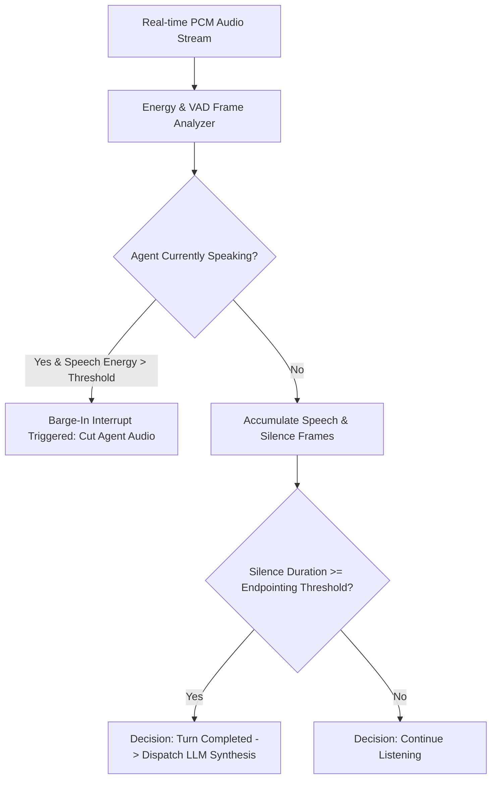

> PDF location: https://github.com/alphaparkinc/genpark-voice-turn-taking-endpointing-detector-skill (no source.pdf fetched; repo source — see Source field below)
# alphaparkinc/genpark-voice-turn-taking-endpointing-detector-skill
Source: https://github.com/alphaparkinc/genpark-voice-turn-taking-endpointing-detector-skill
Kind: repo
Fetched: 2026-09-22T14:09:57.133283+00:00
Tool: git-clone

# alphaparkinc/genpark-voice-turn-taking-endpointing-detector-skill

Commit: 95738ce860e01bc0d540f5ddfc29d3a3bf172839

## README

# GenPark AI Agent Skill - Voice Turn-Taking & Endpointing Detector

Acoustic voice activity detection (VAD), dynamic silence endpointing, and barge-in interruption arbitrator for real-time conversational voice agents.

Verified by [GenPark AI](https://genpark.ai) and compatible with [Model Context Protocol (MCP)](https://genpark.ai/mcp).

## Architecture Diagram

## Features
- **Low-Latency VAD Heuristics**: Operates on sub-frame time slices for immediate interruption handling.
- **Dynamic Endpointing**: Automatically balances conversational fluidity against premature turn cutoff.
- **Zero External Dependencies**: Pure Python standard library implementation.

## Top-level layout

- .gitignore (~7 lines)
- client.py (~70 lines)
- example_usage.py (~22 lines)
- mcp_server.py (~84 lines)
- README.md (~23 lines)
- requirements.txt (~1 lines)
- skill.json (~12 lines)

