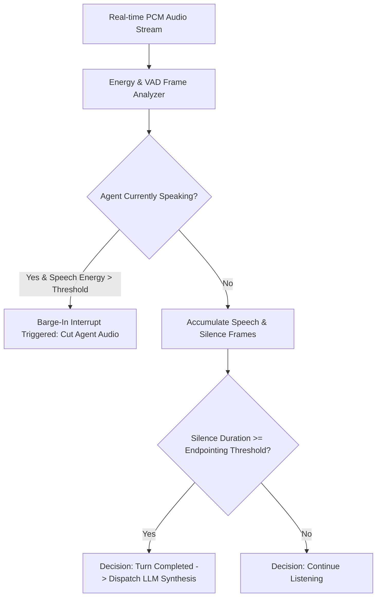

> [[../index|Wiki]] | [[../summary|Summary]] | [[../digest|Digest]]
# Overview
**In one sentence:** Acoustic voice activity detection (VAD), dynamic silence endpointing, and barge-in interruption arbitration for real-time conversational voice agents (README.md:9).
## Key points
- Detects acoustic voice activity to drive turn-taking decisions for real-time conversational voice agents (README.md:9).
- Applies dynamic silence endpointing to decide when a user turn is complete versus when to keep listening (README.md:9).
- Arbitrates barge-in interruptions, cutting agent audio when user speech energy exceeds threshold while the agent is speaking (README.md:9, README.md:20).
- Pipes endpointing decisions into LLM synthesis dispatch once silence reaches the endpointing threshold (README.md:22).
- Uses low-latency VAD heuristics operating on sub-frame time slices for immediate interruption handling (README.md:27).
- Balances conversational fluidity against premature turn cutoff via dynamic endpointing (README.md:28).
- Ships as a pure Python standard library implementation with zero external dependencies (README.md:29).
- Verified by GenPark AI and compatible with Model Context Protocol (MCP) (README.md:11).
---
## Architecture
Pipeline ingests a real-time PCM audio stream into an energy and VAD frame analyzer (README.md:17-18):

Decision branches (README.md:19-24):
| Condition | Decision |
|---|---|
| Agent speaking and speech energy > threshold | Barge-in interrupt triggered: cut agent audio |
| Agent not speaking | Accumulate speech and silence frames |
| Silence duration >= endpointing threshold | Turn completed, dispatch LLM synthesis |
| Silence duration < endpointing threshold | Continue listening |

## Features
- **Low-Latency VAD Heuristics**: operates on sub-frame time slices for immediate interruption handling (README.md:27).
- **Dynamic Endpointing**: automatically balances conversational fluidity against premature turn cutoff (README.md:28).
- **Zero External Dependencies**: pure Python standard library implementation (README.md:29).

## Macro components
- `top-level-files/` (chunk 01-overview.md:33).

**Covers:** README.md (repo overview, architecture diagram, features)
