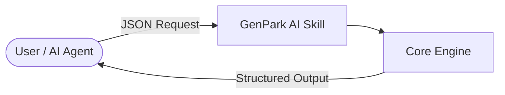

# alphaparkinc/genpark-neural-speech-codec-full-duplex-dialogue-engine-skill
> PDF location (no local copy; no source.pdf fetched): https://github.com/alphaparkinc/genpark-neural-speech-codec-full-duplex-dialogue-engine-skill
Source: https://github.com/alphaparkinc/genpark-neural-speech-codec-full-duplex-dialogue-engine-skill
Kind: repo
Fetched: 2026-09-22T14:10:39.564134+00:00
Tool: git-clone

# alphaparkinc/genpark-neural-speech-codec-full-duplex-dialogue-engine-skill

Commit: 20f1ca0ea7ed7ec3c3ca963fd496671fa243dfc8

## README

# genpark-neural-speech-codec-full-duplex-dialogue-engine-skill

   

> **GenPark AI Agent Skill** -- Neural speech codec full duplex dialogue engine & live audio streamer (Moshi style)

## Quick Start
```python
python example_usage.py
```

## Architecture


## MCP
```bash
python mcp_server.py
```


## Top-level layout

- .gitignore (~7 lines)
- client.py (~11 lines)
- example_usage.py (~12 lines)
- mcp_server.py (~5 lines)
- README.md (~23 lines)
- requirements.txt (~1 lines)
- skill.json (~38 lines)

