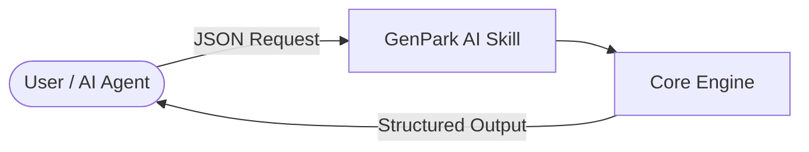

> [[../index|Wiki]] | [[../summary|Summary]] | [[../digest|Digest]]
# Overview
**In one sentence:** This repo packages a GenPark AI Agent Skill that implements a Moshi-style neural speech codec full-duplex dialogue engine and live audio streamer (README.md:11).
## Key points
- The repo is named `genpark-neural-speech-codec-full-duplex-dialogue-engine-skill` (README.md:7).
- It targets Python 3.9+, is MIT-licensed, MCP-compatible, and branded as a GenPark AI Agent Skill (README.md:9).
- Its whole job is neural speech codec full-duplex dialogue plus live audio streaming in the Moshi style (README.md:11).
- The quick-start entry point is `python example_usage.py` (README.md:15).
- Requests flow as JSON from User/AI Agent into the Skill, then to the Core Engine, which returns structured output to the User (README.md:20-24).
- The MCP entry point is `python mcp_server.py` (README.md:28).
- The documented macro component at this level is `top-level-files/` (README.md:33).
---
## Quick Start
```python
python example_usage.py
```
Verbatim from README.md:14-16.

## Architecture

Verbatim from README.md:19-24. The three nodes are `User`, `Skill`, and `CoreEngine`, with edges labeled `JSON Request` and `Structured Output` (README.md:21-23).

## MCP
```bash
python mcp_server.py
```
Verbatim from README.md:27-29.

## Macro Components
- top-level-files/ (README.md:33)

**Covers:** README.md (repo title, badges, purpose, quick start, architecture diagram, MCP entry point, macro-component list)
