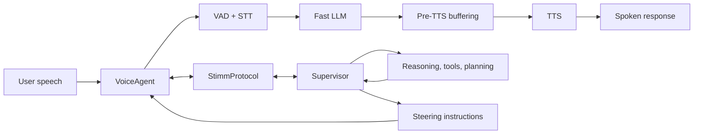

> [[../index|Wiki]] | [[../summary|Summary]] | [[../digest|Digest]]
# Overview
**In one sentence:** Stimm is an Optimistic VUI runtime built on livekit-agents where one agent talks fast and one agent thinks deep, collaborating in real time.
## Key points
- Stimm is an Optimistic VUI runtime built on `livekit-agents` that brings optimistic-UI thinking to voice: acknowledge early, speak early, keep reasoning in parallel (README.md:36-38).
- The conversational loop is a low-latency `VAD -> STT -> fast LLM -> TTS` pipeline with pre-TTS buffering before speech output (README.md:46, README.md:79-84).
- The runtime uses a dual-agent architecture: `VoiceAgent` owns the live turn while `Supervisor` watches the transcript, reasons asynchronously, and steers without blocking the first response (README.md:94-96, README.md:192-198).
- Agents exchange typed protocol messages (`StimmProtocol`) over LiveKit data channels, with a typed protocol for Python and TypeScript supervisors (README.md:48, README.md:197-198).
- Runtime behavior is controlled by mode (`autonomous` / `relay` / `hybrid` default) and pre-TTS buffering level (`NONE` / `LOW` / `MEDIUM` default / `HIGH`) (README.md:207-217).
- Onboarding is wizard-first: the catalog API displays providers and parameters, then extras are derived from the user selection and installed as `stimm[...]` extras, never vendored in the wheel (README.md:50, README.md:114-115, README.md:174-184).
- The local dev contract is `pip install -e ".[dev]"`, `docker compose up -d`, `bash scripts/dev_build.sh`, then `pytest` / `ruff` plus catalog/contract checks (README.md:222-244).
---
## What Stimm is
Stimm is an Optimistic VUI runtime built on [livekit-agents](https://github.com/livekit/agents) (README.md:36). Use it when you want a voice agent that feels immediate without giving up tool use, planning, or deeper supervision (README.md:40-41).
> "Optimistic VUI. One agent talks fast, one agent thinks deep, both collaborate in real-time." (README.md:10)
## Why Stimm
Per the README's feature list (README.md:43-50):
- Optimistic VUI for speech-first products: fast acknowledgement, progressive response, safe supervisor steering (README.md:45).
- Low-latency conversational loop (`VAD -> STT -> fast LLM -> TTS`) (README.md:46).
- Dual-agent runtime: one agent handles the live turn, one agent reasons in the background (README.md:47).
- Typed protocol for Python and TypeScript supervisors (README.md:48).
- Runtime-safe provider contract and generated provider catalog from LiveKit docs (README.md:49).
- Wizard-first onboarding flow: discover providers first, install extras second (README.md:50).
## What Is Optimistic VUI?
Optimistic VUI is the voice equivalent of optimistic UI (README.md:54). Instead of making the user wait for the entire reasoning chain, the system starts behaving usefully as soon as it has enough confidence to move the conversation forward (README.md:56-58):
- Acknowledge the user immediately (README.md:60).
- Start speaking as early as possible (README.md:61).
- Keep the response interruptible and steerable (README.md:62).
- Let deeper reasoning continue in parallel (README.md:63).
Core idea: one agent talks fast, one agent thinks deep (README.md:65-66).
## Use cases
- Customer support voice agents that must answer quickly while deeper retrieval or tool calls continue in the background (README.md:70).
- Phone and SIP assistants that need to feel responsive before business logic fully resolves (README.md:71).
- Realtime copilots where speech should start early, but supervision, correction, and orchestration still matter (README.md:72).
- Embedded or kiosk voice experiences where perceived latency is more important than raw model latency (README.md:73).
## Architecture
Verbatim flow from the README (README.md:77-92):

The `VoiceAgent` owns the live turn. The `Supervisor` watches the transcript, reasons asynchronously, and can steer the conversation without blocking the first response (README.md:94-96).
## Dual-agent architecture
Stimm is fundamentally built around two cooperating agents (README.md:192-198):
- `VoiceAgent`: optimized for low-latency spoken interaction (README.md:194).
- `Supervisor`: optimized for deeper reasoning, planning, and tool orchestration (README.md:195).
- They exchange typed protocol messages over LiveKit data channels, allowing fast turn-by-turn response while retaining high-level control and context (README.md:197-198).
| Component | Role (README.md:200-204) |
|---|---|
| `VoiceAgent` | Handles live turn-by-turn speech interaction |
| `Supervisor` | Watches transcript and steers behavior asynchronously |
| `StimmProtocol` | Structured messages over LiveKit data channels |
## Runtime modes
| Mode | Meaning (README.md:207-210) |
|---|---|
| `autonomous` | The voice agent acts independently. |
| `relay` | The voice agent only speaks supervisor instructions. |
| `hybrid` (default) | Autonomous first response with supervisor steering. |
Exact `VoiceAgent` parameters from the quick-start excerpt (README.md:125-133):
```python
agent = VoiceAgent(
    stt=deepgram.STT(),
    tts=openai.TTS(),
    vad=silero.VAD.load(),
    fast_llm=openai.LLM(model="gpt-4o-mini"),
    buffering_level="MEDIUM",
    mode="hybrid",
    instructions="You are a helpful voice assistant.",
)
```
## Pre-TTS buffering
| Level | Meaning (README.md:212-217) |
|---|---|
| `NONE` | Send tokens immediately. |
| `LOW` | Buffer until word completion. |
| `MEDIUM` (default) | Buffer until 4 words or punctuation. |
| `HIGH` | Buffer until punctuation. |
These levels let you choose where to sit between raw latency and cleaner spoken delivery (README.md:219-220).
## Install
Verbatim (README.md:100-112):
```bash
# 1) Core package only
pip install stimm
# 2) Install only the providers you selected
pip install stimm[deepgram,openai]
# Optional: install all runtime-supported providers
pip install stimm[all]
# TypeScript supervisor client
npm install @stimm/protocol
```
Plugin dependencies are installed in the integrator app environment. Stimm does not vendor provider plugin code inside its wheel (README.md:114-115). Requires Python `>=3.10` and is LiveKit-compatible (README.md:19-24).
## Quick start
Voice agent entrypoint (README.md:121-139):
```python
from stimm import VoiceAgent
from livekit.plugins import deepgram, openai, silero
# ... VoiceAgent(...) as above ...
if __name__ == "__main__":
    from livekit.agents import WorkerOptions, cli
    cli.run_app(WorkerOptions(entrypoint_fnc=agent.entrypoint))
```
Python supervisor (README.md:141-151):
```python
from stimm import Supervisor, TranscriptMessage
class MySupervisor(Supervisor):
    async def on_transcript(self, msg: TranscriptMessage):
        if not msg.partial:
            result = await my_big_llm.process(msg.text)
            await self.instruct(result.text, speak=True)
```
TypeScript supervisor (README.md:154-172):
```typescript
import { StimmSupervisorClient } from "@stimm/protocol";
const client = new StimmSupervisorClient({
  livekitUrl: "ws://localhost:7880",
  token: supervisorToken,
});
client.on("transcript", async (msg) => {
  if (!msg.partial) {
    const result = await myAgent.process(msg.text);
    await client.instruct({ text: result, speak: true, priority: "normal" });
  }
});
await client.connect();
```
## Wizard-first provider flow
For onboarding UIs, use the catalog API to display providers and parameters, then derive extras from the user selection (README.md:176-177):
```python
from stimm import extras_install_command, get_provider_catalog
catalog = get_provider_catalog()
cmd = extras_install_command(stt="deepgram", tts="openai", llm="azure-openai")
print(cmd)  # pip install stimm[deepgram,openai]
```
Exact parameter names are `stt`, `tts`, `llm` (README.md:183). After extras installation, restart the Python process before instantiating LiveKit plugin classes (README.md:187-188).
## Developer workflow
Verbatim (README.md:224-241):
```bash
# Install dev dependencies
pip install -e ".[dev]"
# Local infra
docker compose up -d
# Build local artifacts + sync providers + validate runtime contract
bash scripts/dev_build.sh
# Tests / lint
pytest
ruff check src/ tests/
# Catalog/contract checks (CI-equivalent)
python3 scripts/sync_livekit_plugins.py --check
python3 scripts/validate_runtime_contract.py --import-check
```
`scripts/dev_build.sh` is the single local command to rebuild protocol artifacts and provider metadata from the LiveKit source of truth (README.md:243-244).
## Documentation and license
Docs live under `website` (README.md:248); the chunk lists getting-started overview and quickstart, the providers-catalog reference, wizard integration, and supervisor observability pages (README.md:249-253). License: MIT (README.md:255-257). The chunk notes no truncated files.
**Covers:** README overview (Optimistic VUI concept, dual-agent VoiceAgent + Supervisor architecture, StimmProtocol, runtime modes, pre-TTS buffering, install, quick-start, wizard-first provider flow, dev workflow)
